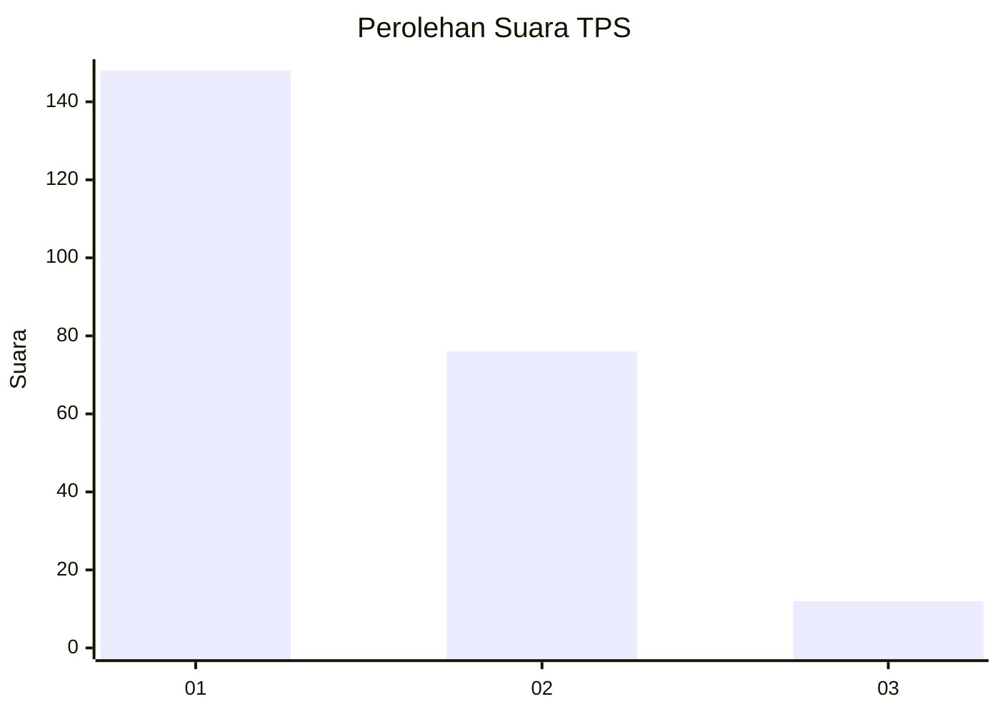
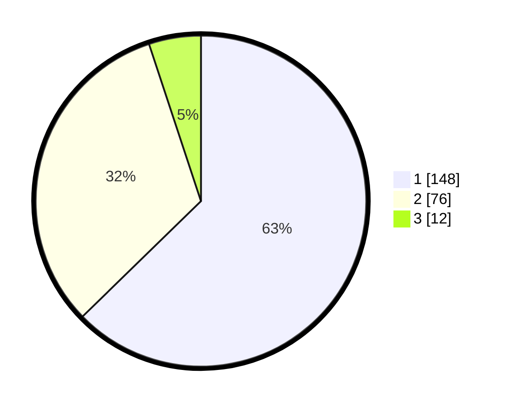

# Hasil

## Grafik

## Tabel

| No. | Nama Paslon    | Suara | Suara (raw) | Persentase |
|:--- |:-------------- | -----:| -----------:| ----------:|
| 1   | ANIES MUHAIMIN | 148   | [148][p-1]  | 62,71      |
| 2   | PRABOWO GIBRAN | 76    | [76][p-2]   | 32,20      |
| 3   | GANJAR MAHFUD  | 12    | [12][p-3]   | 5,08       |

[p-1]: https://github.com/gigit-pemilu/pemilu-2024-61-kalimantan-barat/blob/main/pilpres/hitung-suara/sub/61-kalimantan-barat/sub/01-sambas/sub/01-sambas/sub/2001-dalam-kaum/sub/001-tps/sub/paslon-1.txt
[p-2]: https://github.com/gigit-pemilu/pemilu-2024-61-kalimantan-barat/blob/main/pilpres/hitung-suara/sub/61-kalimantan-barat/sub/01-sambas/sub/01-sambas/sub/2001-dalam-kaum/sub/001-tps/sub/paslon-2.txt
[p-3]: https://github.com/gigit-pemilu/pemilu-2024-61-kalimantan-barat/blob/main/pilpres/hitung-suara/sub/61-kalimantan-barat/sub/01-sambas/sub/01-sambas/sub/2001-dalam-kaum/sub/001-tps/sub/paslon-3.txt

## Foto C Plano

https://sirekap-obj-formc.kpu.go.id/b993/pemilu/ppwp/61/01/01/20/01/6101012001001-20240214-191008--ec9c33f8-f186-4634-862e-cb3ca8873981.jpg

https://sirekap-obj-formc.kpu.go.id/b993/pemilu/ppwp/61/01/01/20/01/6101012001001-20240215-005121--967a20a3-cc14-4ef3-8d4c-5fff6a0056b6.jpg

https://sirekap-obj-formc.kpu.go.id/b993/pemilu/ppwp/61/01/01/20/01/6101012001001-20240217-153423--2be1f4a1-6827-41dd-bafc-92c467b02ad7.jpg

## Metadata

| Key        | Value               |
| ---------- | ------------------- |
| Time Stamp | 2024-02-17 16:00:02 |

## DATA PEMILIH TETAP

Jumlah pemilih dalam DPT: **291**.
 * L: **152**.
 * P: **139**.

## DATA PENGGUNA HAK PILIH

Jumlah pengguna hak pilih dalam DPT: **233**.
 * L: **115**.
 * P: **118**.

Jumlah pengguna hak pilih dalam DPTb: **3**.
 * L: **1**.
 * P: **2**.

Jumlah pengguna hak pilih dalam DPK: **3**.
 * L: **1**.
 * P: **2**.

Jumlah pengguna hak pilih: **239**.
 * L: **117**.
 * P: **122**.

## JUMLAH SUARA SAH DAN TIDAK SAH

JUMLAH SELURUH SUARA SAH: **236**.

JUMLAH SUARA TIDAK SAH: **3**.

JUMLAH SELURUH SUARA SAH DAN SUARA TIDAK SAH: **239**.

