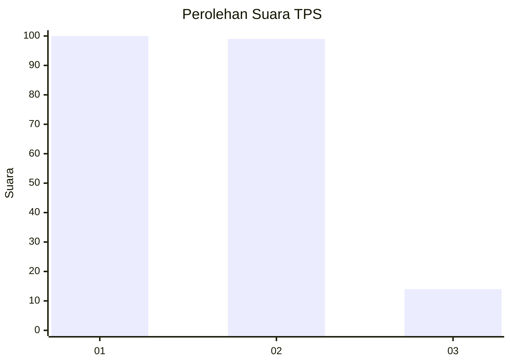
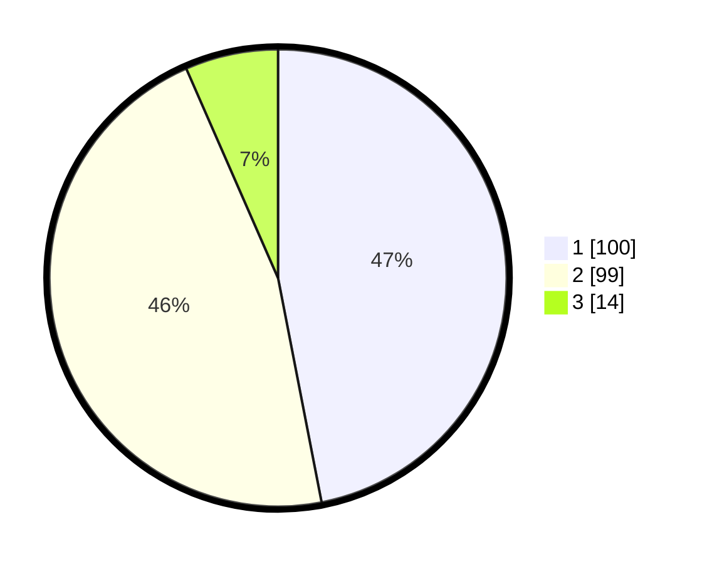

# Hasil

## Grafik

## Tabel

| No. | Nama Paslon    | Suara | Suara (raw) | Persentase |
|:--- |:-------------- | -----:| -----------:| ----------:|
| 1   | ANIES MUHAIMIN | 100   | [100][p-1]  | 46,95      |
| 2   | PRABOWO GIBRAN | 99    | [99][p-2]   | 46,48      |
| 3   | GANJAR MAHFUD  | 14    | [14][p-3]   | 6,57       |

[p-1]: https://github.com/gigit-pemilu/pemilu-2024-61-kalimantan-barat/blob/main/pilpres/hitung-suara/sub/61-kalimantan-barat/sub/01-sambas/sub/01-sambas/sub/2001-dalam-kaum/sub/003-tps/sub/paslon-1.txt
[p-2]: https://github.com/gigit-pemilu/pemilu-2024-61-kalimantan-barat/blob/main/pilpres/hitung-suara/sub/61-kalimantan-barat/sub/01-sambas/sub/01-sambas/sub/2001-dalam-kaum/sub/003-tps/sub/paslon-2.txt
[p-3]: https://github.com/gigit-pemilu/pemilu-2024-61-kalimantan-barat/blob/main/pilpres/hitung-suara/sub/61-kalimantan-barat/sub/01-sambas/sub/01-sambas/sub/2001-dalam-kaum/sub/003-tps/sub/paslon-3.txt

## Foto C Plano

https://sirekap-obj-formc.kpu.go.id/cc74/pemilu/ppwp/61/01/01/20/01/6101012001003-20240218-234608--eebaed03-4d37-43b3-b5be-cfdf204f19eb.jpg

https://sirekap-obj-formc.kpu.go.id/cc74/pemilu/ppwp/61/01/01/20/01/6101012001003-20240218-234610--0adf84d6-0f48-416f-ae3e-71ae0ccce86b.jpg

https://sirekap-obj-formc.kpu.go.id/cc74/pemilu/ppwp/61/01/01/20/01/6101012001003-20240218-234609--b5409051-e656-4a19-b70c-17fa14480c64.jpg

## Metadata

| Key        | Value               |
| ---------- | ------------------- |
| Time Stamp | 2024-02-19 10:00:00 |

## DATA PEMILIH TETAP

Jumlah pemilih dalam DPT: **260**.
 * L: **133**.
 * P: **127**.

## DATA PENGGUNA HAK PILIH

Jumlah pengguna hak pilih dalam DPT: **212**.
 * L: **109**.
 * P: **103**.

Jumlah pengguna hak pilih dalam DPTb: **2**.
 * L: **1**.
 * P: **1**.

Jumlah pengguna hak pilih dalam DPK: **2**.
 * L: **0**.
 * P: **2**.

Jumlah pengguna hak pilih: **216**.
 * L: **110**.
 * P: **106**.

## JUMLAH SUARA SAH DAN TIDAK SAH

JUMLAH SELURUH SUARA SAH: **213**.

JUMLAH SUARA TIDAK SAH: **3**.

JUMLAH SELURUH SUARA SAH DAN SUARA TIDAK SAH: **216**.

