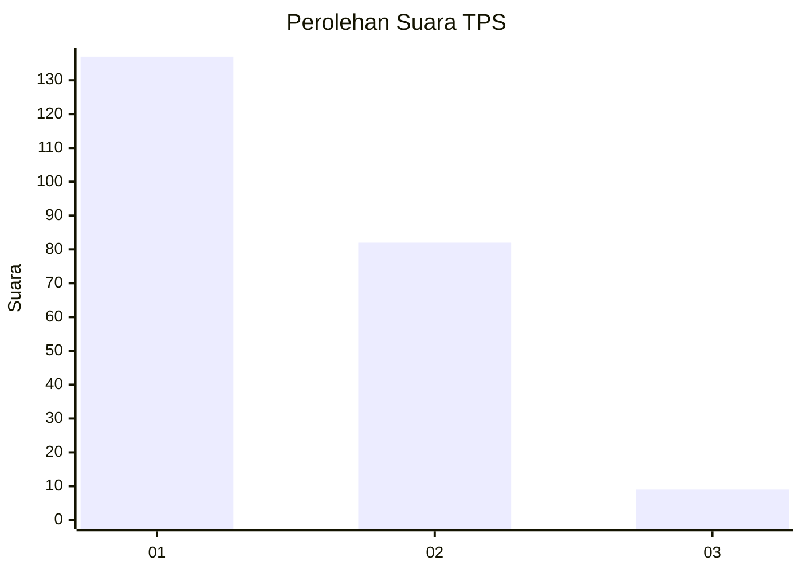
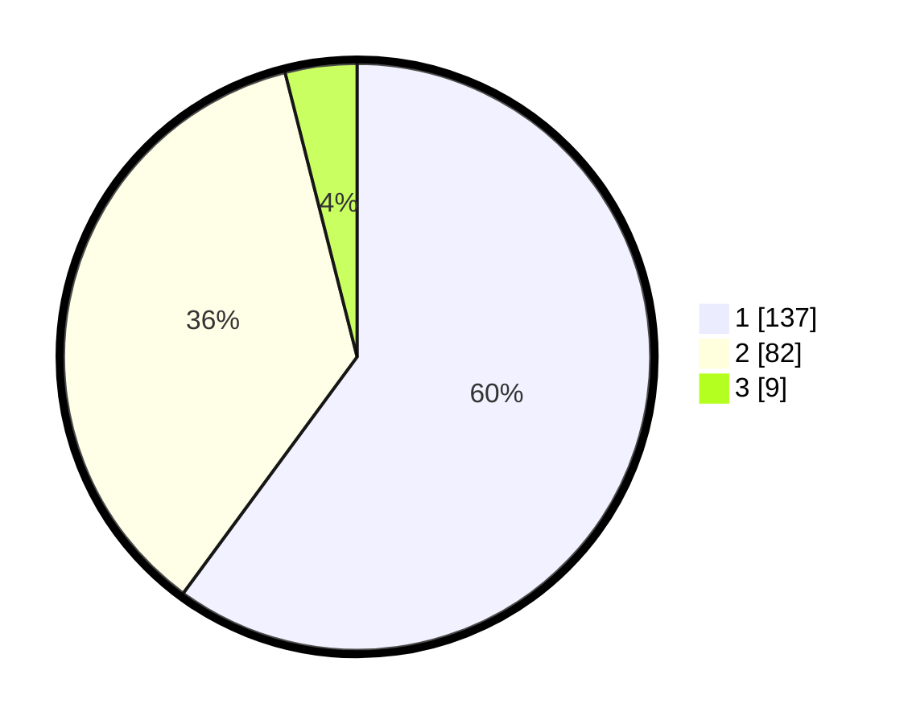

# Hasil

## Grafik

## Tabel

| No. | Nama Paslon    | Suara | Suara (raw) | Persentase |
|:--- |:-------------- | -----:| -----------:| ----------:|
| 1   | ANIES MUHAIMIN | 137   | [137][p-1]  | 60,09      |
| 2   | PRABOWO GIBRAN | 82    | [82][p-2]   | 35,96      |
| 3   | GANJAR MAHFUD  | 9     | [9][p-3]    | 3,95       |

[p-1]: https://github.com/gigit-pemilu/pemilu-2024-61-kalimantan-barat/blob/main/pilpres/hitung-suara/sub/61-kalimantan-barat/sub/01-sambas/sub/01-sambas/sub/2001-dalam-kaum/sub/004-tps/sub/paslon-1.txt
[p-2]: https://github.com/gigit-pemilu/pemilu-2024-61-kalimantan-barat/blob/main/pilpres/hitung-suara/sub/61-kalimantan-barat/sub/01-sambas/sub/01-sambas/sub/2001-dalam-kaum/sub/004-tps/sub/paslon-2.txt
[p-3]: https://github.com/gigit-pemilu/pemilu-2024-61-kalimantan-barat/blob/main/pilpres/hitung-suara/sub/61-kalimantan-barat/sub/01-sambas/sub/01-sambas/sub/2001-dalam-kaum/sub/004-tps/sub/paslon-3.txt

## Foto C Plano

https://sirekap-obj-formc.kpu.go.id/84e2/pemilu/ppwp/61/01/01/20/01/6101012001004-20240215-180453--3d4f2ea9-eca4-458a-a652-17fe33f1efe0.jpg

https://sirekap-obj-formc.kpu.go.id/84e2/pemilu/ppwp/61/01/01/20/01/6101012001004-20240215-180458--de7fe270-7a1f-4644-98d0-047da87a195b.jpg

https://sirekap-obj-formc.kpu.go.id/84e2/pemilu/ppwp/61/01/01/20/01/6101012001004-20240215-180503--a331011c-b84e-4b62-a30a-7d8859446738.jpg

## Metadata

| Key        | Value               |
| ---------- | ------------------- |
| Time Stamp | 2024-02-24 22:31:28 |

## DATA PEMILIH TETAP

Jumlah pemilih dalam DPT: **281**.
 * L: **135**.
 * P: **146**.

## DATA PENGGUNA HAK PILIH

Jumlah pengguna hak pilih dalam DPT: **281**.
 * L: **135**.
 * P: **146**.

Jumlah pengguna hak pilih dalam DPTb: **0**.
 * L: **0**.
 * P: **0**.

Jumlah pengguna hak pilih dalam DPK: **0**.
 * L: **0**.
 * P: **0**.

Jumlah pengguna hak pilih: **231**.
 * L: **108**.
 * P: **123**.

## JUMLAH SUARA SAH DAN TIDAK SAH

JUMLAH SELURUH SUARA SAH: **228**.

JUMLAH SUARA TIDAK SAH: **3**.

JUMLAH SELURUH SUARA SAH DAN SUARA TIDAK SAH: **231**.

