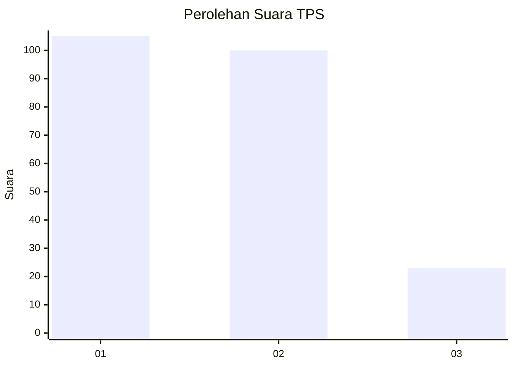
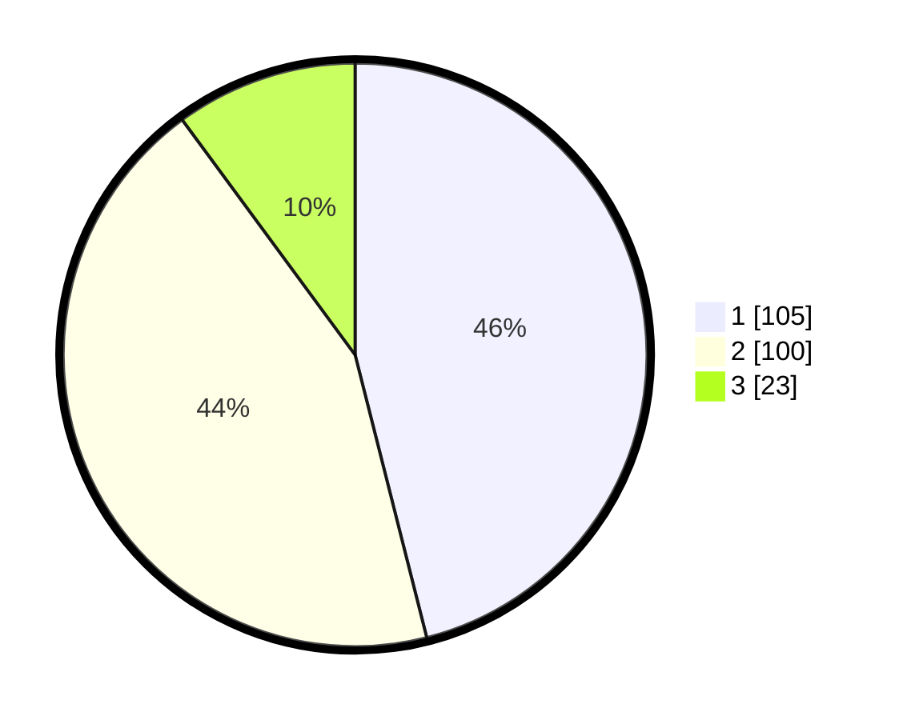

# Hasil

## Grafik

## Tabel

| No. | Nama Paslon    | Suara | Suara (raw) | Persentase |
|:--- |:-------------- | -----:| -----------:| ----------:|
| 1   | ANIES MUHAIMIN | 105   | [105][p-1]  | 46,05      |
| 2   | PRABOWO GIBRAN | 100   | [100][p-2]  | 43,86      |
| 3   | GANJAR MAHFUD  | 23    | [23][p-3]   | 10,09      |

[p-1]: https://github.com/gigit-pemilu/pemilu-2024-61-kalimantan-barat/blob/main/pilpres/hitung-suara/sub/61-kalimantan-barat/sub/01-sambas/sub/01-sambas/sub/2001-dalam-kaum/sub/005-tps/sub/paslon-1.txt
[p-2]: https://github.com/gigit-pemilu/pemilu-2024-61-kalimantan-barat/blob/main/pilpres/hitung-suara/sub/61-kalimantan-barat/sub/01-sambas/sub/01-sambas/sub/2001-dalam-kaum/sub/005-tps/sub/paslon-2.txt
[p-3]: https://github.com/gigit-pemilu/pemilu-2024-61-kalimantan-barat/blob/main/pilpres/hitung-suara/sub/61-kalimantan-barat/sub/01-sambas/sub/01-sambas/sub/2001-dalam-kaum/sub/005-tps/sub/paslon-3.txt

## Foto C Plano

https://sirekap-obj-formc.kpu.go.id/ff6e/pemilu/ppwp/61/01/01/20/01/6101012001005-20240218-150418--e1b2f913-1a83-46d6-94b8-8886b91436b4.jpg

https://sirekap-obj-formc.kpu.go.id/ff6e/pemilu/ppwp/61/01/01/20/01/6101012001005-20240218-151328--04175a0c-64f6-40f7-b8bc-d593cc7f6ed4.jpg

https://sirekap-obj-formc.kpu.go.id/ff6e/pemilu/ppwp/61/01/01/20/01/6101012001005-20240218-151652--29d8e34c-05b9-4986-9782-d6b8e068b0df.jpg

## Metadata

| Key        | Value               |
| ---------- | ------------------- |
| Time Stamp | 2024-02-19 10:00:00 |

## DATA PEMILIH TETAP

Jumlah pemilih dalam DPT: **274**.
 * L: **132**.
 * P: **142**.

## DATA PENGGUNA HAK PILIH

Jumlah pengguna hak pilih dalam DPT: **227**.
 * L: **107**.
 * P: **120**.

Jumlah pengguna hak pilih dalam DPTb: **0**.
 * L: **0**.
 * P: **0**.

Jumlah pengguna hak pilih dalam DPK: **4**.
 * L: **3**.
 * P: **1**.

Jumlah pengguna hak pilih: **231**.
 * L: **110**.
 * P: **121**.

## JUMLAH SUARA SAH DAN TIDAK SAH

JUMLAH SELURUH SUARA SAH: **228**.

JUMLAH SUARA TIDAK SAH: **3**.

JUMLAH SELURUH SUARA SAH DAN SUARA TIDAK SAH: **231**.

