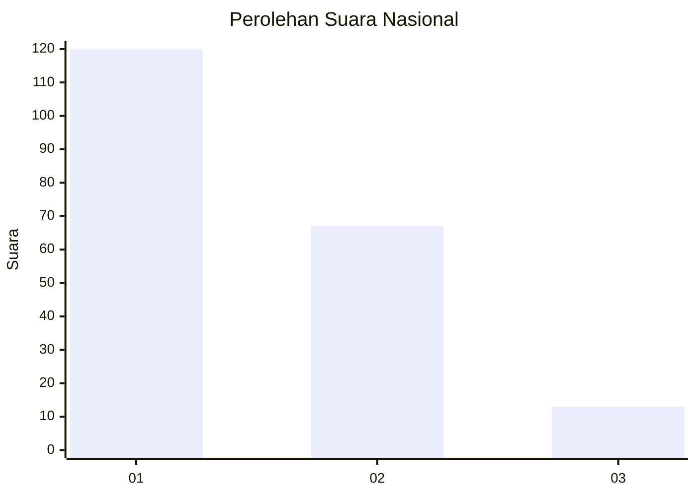
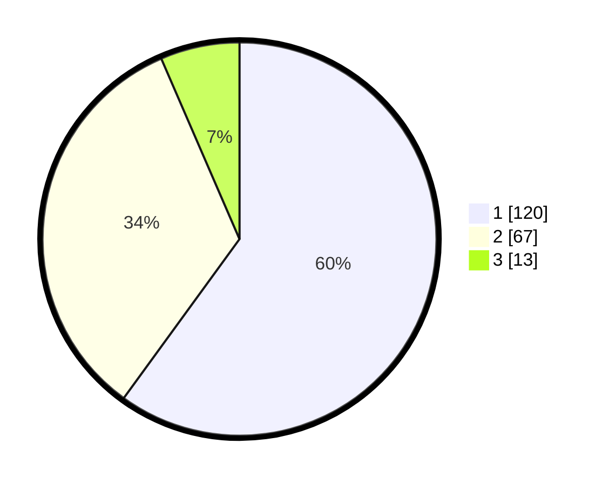

# Hasil

## Grafik

## Tabel

| No. | Nama Paslon    | Suara | Suara (raw) | Persentase |
|:--- |:-------------- | -----:| -----------:| ----------:|
| 1   | ANIES MUHAIMIN | 120   | [120][p-1]  | 60,00      |
| 2   | PRABOWO GIBRAN | 67    | [67][p-2]   | 33,50      |
| 3   | GANJAR MAHFUD  | 13    | [13][p-3]   | 6,50       |

[p-1]: https://github.com/gigit-pemilu/pemilu-2024/blob/main/pilpres/hitung-suara/sub/61-kalimantan-barat/sub/01-sambas/sub/01-sambas/sub/2002-lubuk-dagang/sub/002-tps/sub/paslon-1.txt
[p-2]: https://github.com/gigit-pemilu/pemilu-2024/blob/main/pilpres/hitung-suara/sub/61-kalimantan-barat/sub/01-sambas/sub/01-sambas/sub/2002-lubuk-dagang/sub/002-tps/sub/paslon-2.txt
[p-3]: https://github.com/gigit-pemilu/pemilu-2024/blob/main/pilpres/hitung-suara/sub/61-kalimantan-barat/sub/01-sambas/sub/01-sambas/sub/2002-lubuk-dagang/sub/002-tps/sub/paslon-3.txt

## Foto C Plano

https://sirekap-obj-formc.kpu.go.id/a839/pemilu/ppwp/61/01/01/20/02/6101012002002-20240215-014428--e13b9d44-9101-4b5a-84e6-4bafa4cbabd1.jpg

https://sirekap-obj-formc.kpu.go.id/a839/pemilu/ppwp/61/01/01/20/02/6101012002002-20240215-014602--11599f49-8809-4230-aec4-a1ccd964771c.jpg

https://sirekap-obj-formc.kpu.go.id/a839/pemilu/ppwp/61/01/01/20/02/6101012002002-20240215-014630--47218c7b-9f13-4a90-a4df-7b00c302f33c.jpg

## Metadata

| Key        | Value               |
| ---------- | ------------------- |
| Time Stamp | 2024-02-16 21:01:00 |

