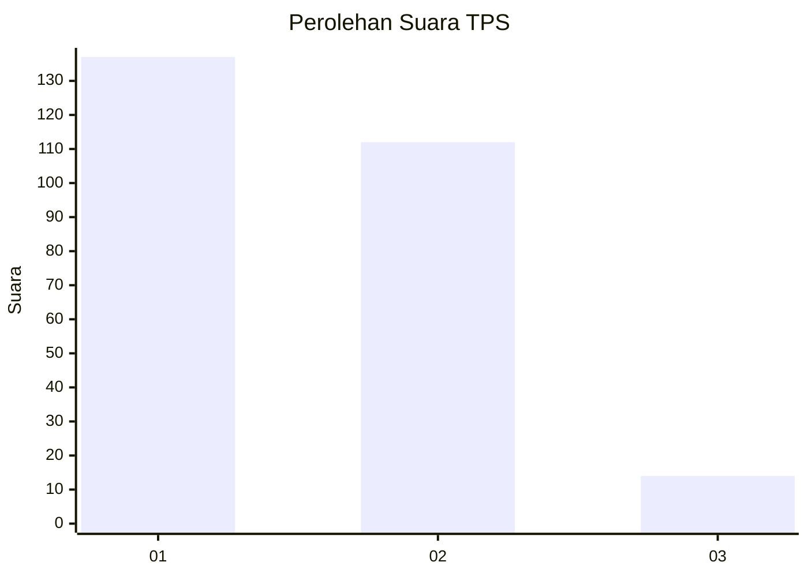
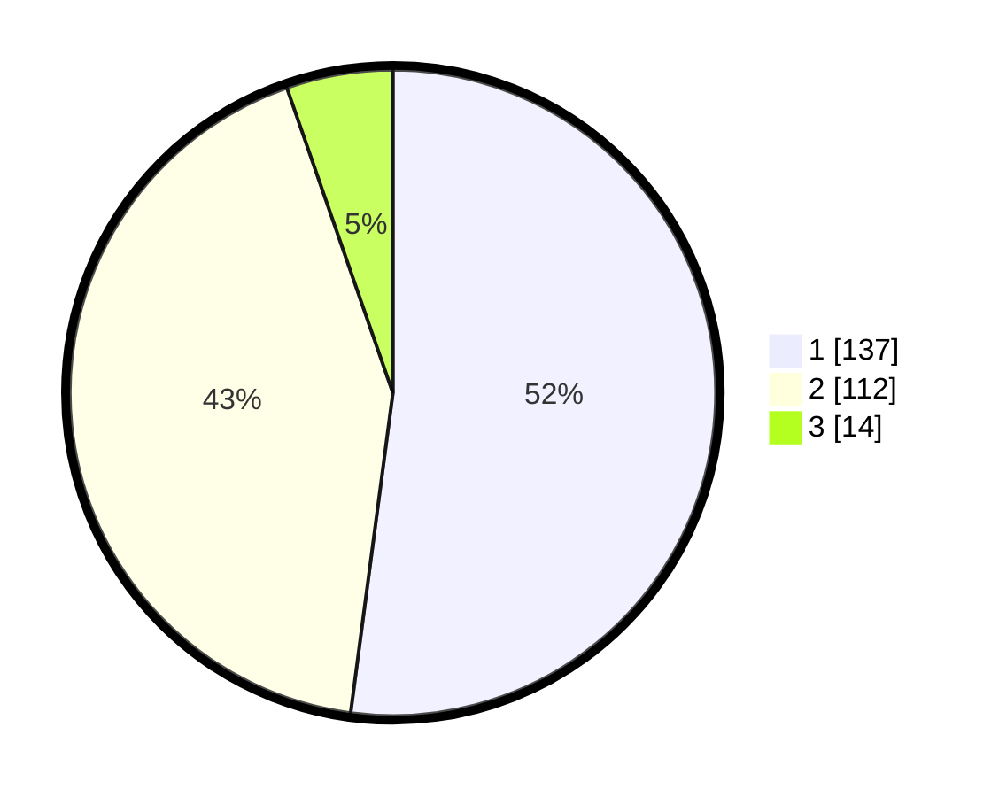

# Hasil

## Grafik

## Tabel

| No. | Nama Paslon    | Suara | Suara (raw) | Persentase |
|:--- |:-------------- | -----:| -----------:| ----------:|
| 1   | ANIES MUHAIMIN | 137   | [137][p-1]  | 52,09      |
| 2   | PRABOWO GIBRAN | 112   | [112][p-2]  | 42,59      |
| 3   | GANJAR MAHFUD  | 14    | [14][p-3]   | 5,32       |

[p-1]: https://github.com/gigit-pemilu/pemilu-2024-61-kalimantan-barat/blob/main/pilpres/hitung-suara/sub/61-kalimantan-barat/sub/01-sambas/sub/01-sambas/sub/2003-tanjung-bugis/sub/003-tps/sub/paslon-1.txt
[p-2]: https://github.com/gigit-pemilu/pemilu-2024-61-kalimantan-barat/blob/main/pilpres/hitung-suara/sub/61-kalimantan-barat/sub/01-sambas/sub/01-sambas/sub/2003-tanjung-bugis/sub/003-tps/sub/paslon-2.txt
[p-3]: https://github.com/gigit-pemilu/pemilu-2024-61-kalimantan-barat/blob/main/pilpres/hitung-suara/sub/61-kalimantan-barat/sub/01-sambas/sub/01-sambas/sub/2003-tanjung-bugis/sub/003-tps/sub/paslon-3.txt

## Foto C Plano

https://sirekap-obj-formc.kpu.go.id/2868/pemilu/ppwp/61/01/01/20/03/6101012003003-20240215-051742--9f82531a-44fd-4df5-ba13-33a53234d747.jpg

https://sirekap-obj-formc.kpu.go.id/2868/pemilu/ppwp/61/01/01/20/03/6101012003003-20240215-051824--2a6f909d-a905-49f4-bb0f-eb35fe3378ee.jpg

https://sirekap-obj-formc.kpu.go.id/2868/pemilu/ppwp/61/01/01/20/03/6101012003003-20240215-051849--82cb93cc-be90-41d5-aba8-f978696eed20.jpg

## Metadata

| Key        | Value               |
| ---------- | ------------------- |
| Time Stamp | 2024-02-16 21:01:00 |

