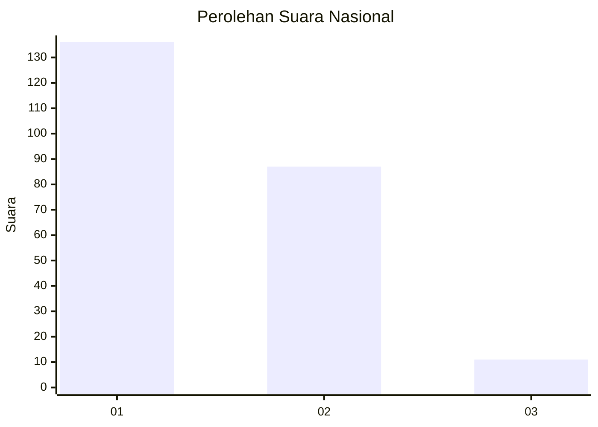
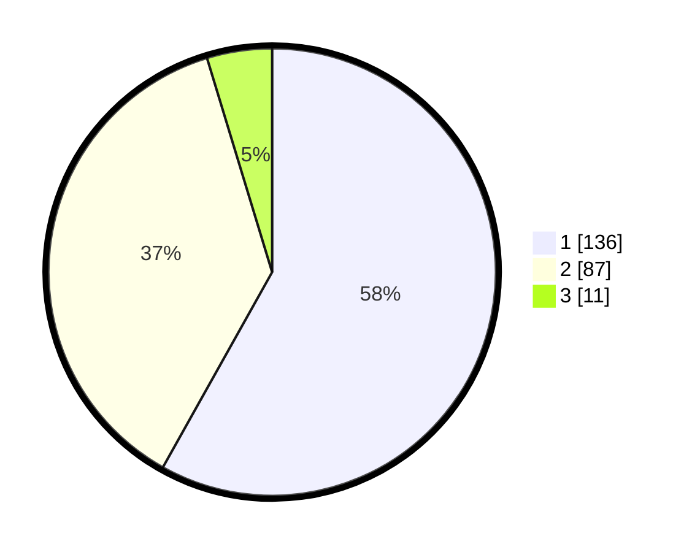

# Hasil

## Grafik

## Tabel

| No. | Nama Paslon    | Suara | Suara (raw) | Persentase |
|:--- |:-------------- | -----:| -----------:| ----------:|
| 1   | ANIES MUHAIMIN | 136   | [136][p-1]  | 58,12      |
| 2   | PRABOWO GIBRAN | 87    | [87][p-2]   | 37,18      |
| 3   | GANJAR MAHFUD  | 11    | [11][p-3]   | 4,70       |

[p-1]: https://github.com/gigit-pemilu/pemilu-2024/blob/main/pilpres/hitung-suara/sub/61-kalimantan-barat/sub/01-sambas/sub/01-sambas/sub/2009-tumuk-manggis/sub/004-tps/sub/paslon-1.txt
[p-2]: https://github.com/gigit-pemilu/pemilu-2024/blob/main/pilpres/hitung-suara/sub/61-kalimantan-barat/sub/01-sambas/sub/01-sambas/sub/2009-tumuk-manggis/sub/004-tps/sub/paslon-2.txt
[p-3]: https://github.com/gigit-pemilu/pemilu-2024/blob/main/pilpres/hitung-suara/sub/61-kalimantan-barat/sub/01-sambas/sub/01-sambas/sub/2009-tumuk-manggis/sub/004-tps/sub/paslon-3.txt

## Foto C Plano

https://sirekap-obj-formc.kpu.go.id/b335/pemilu/ppwp/61/01/01/20/09/6101012009004-20240214-235003--03a35fd6-4c08-46ed-af2e-84cdccebcabf.jpg

https://sirekap-obj-formc.kpu.go.id/b335/pemilu/ppwp/61/01/01/20/09/6101012009004-20240214-235037--ef8d023f-4c3b-41c6-9e5b-b8011a524149.jpg

https://sirekap-obj-formc.kpu.go.id/b335/pemilu/ppwp/61/01/01/20/09/6101012009004-20240214-235142--b5d4dfa5-b90b-476e-b2c3-736c21735476.jpg

## Metadata

| Key        | Value               |
| ---------- | ------------------- |
| Time Stamp | 2024-02-16 22:01:00 |

