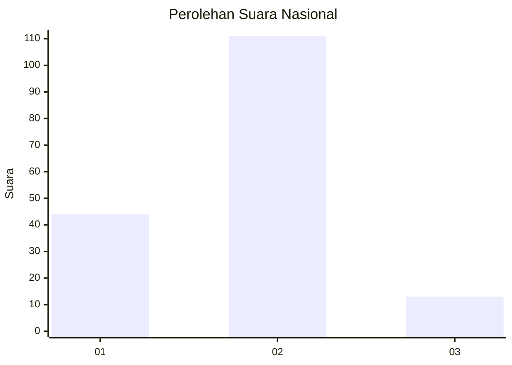
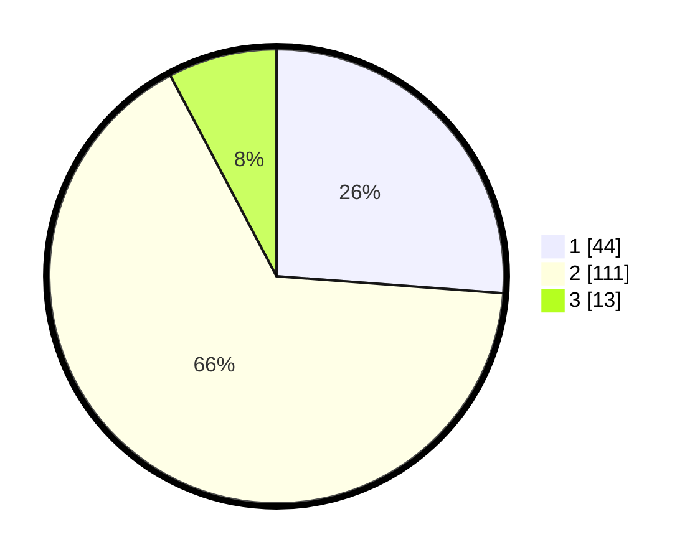

# Hasil

## Grafik

## Tabel

| No. | Nama Paslon    | Suara | Suara (raw) | Persentase |
|:--- |:-------------- | -----:| -----------:| ----------:|
| 1   | ANIES MUHAIMIN | 44    | [44][p-1]   | 26,19      |
| 2   | PRABOWO GIBRAN | 111   | [111][p-2]  | 66,07      |
| 3   | GANJAR MAHFUD  | 13    | [13][p-3]   | 7,74       |

[p-1]: https://github.com/gigit-pemilu/pemilu-2024/blob/main/pilpres/hitung-suara/sub/61-kalimantan-barat/sub/01-sambas/sub/02-teluk-keramat/sub/2001-sungai-kumpai/sub/002-tps/sub/paslon-1.txt
[p-2]: https://github.com/gigit-pemilu/pemilu-2024/blob/main/pilpres/hitung-suara/sub/61-kalimantan-barat/sub/01-sambas/sub/02-teluk-keramat/sub/2001-sungai-kumpai/sub/002-tps/sub/paslon-2.txt
[p-3]: https://github.com/gigit-pemilu/pemilu-2024/blob/main/pilpres/hitung-suara/sub/61-kalimantan-barat/sub/01-sambas/sub/02-teluk-keramat/sub/2001-sungai-kumpai/sub/002-tps/sub/paslon-3.txt

## Foto C Plano

https://sirekap-obj-formc.kpu.go.id/1a22/pemilu/ppwp/61/01/02/20/01/6101022001002-20240215-003118--40998d2a-f22e-49cf-9f52-b3238b74e3b4.jpg

https://sirekap-obj-formc.kpu.go.id/1a22/pemilu/ppwp/61/01/02/20/01/6101022001002-20240215-003309--fd2b6ca7-1173-428d-9699-87c883ec1cbd.jpg

https://sirekap-obj-formc.kpu.go.id/1a22/pemilu/ppwp/61/01/02/20/01/6101022001002-20240215-003449--bc9ead6c-fba7-4b2e-b172-34030f2172f9.jpg

## Metadata

| Key        | Value               |
| ---------- | ------------------- |
| Time Stamp | 2024-02-16 23:00:00 |

