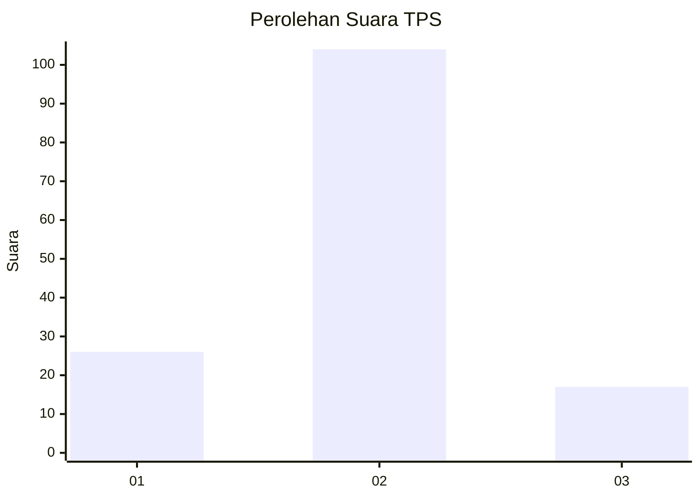
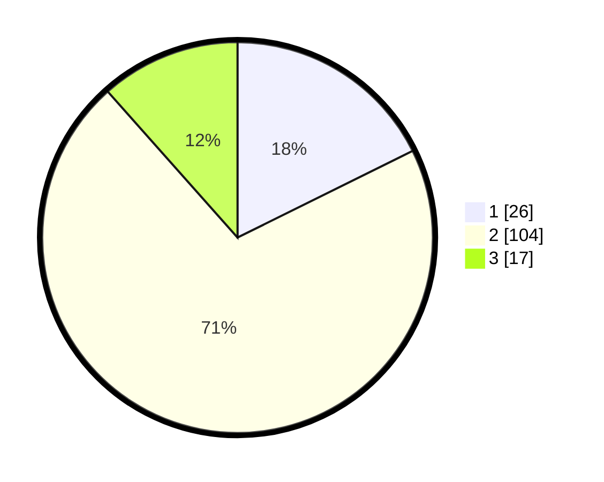

# Hasil

## Grafik

## Tabel

| No. | Nama Paslon    | Suara | Suara (raw) | Persentase |
|:--- |:-------------- | -----:| -----------:| ----------:|
| 1   | ANIES MUHAIMIN | 26    | [26][p-1]   | 17,69      |
| 2   | PRABOWO GIBRAN | 104   | [104][p-2]  | 70,75      |
| 3   | GANJAR MAHFUD  | 17    | [17][p-3]   | 11,56      |

[p-1]: https://github.com/gigit-pemilu/pemilu-2024-61-kalimantan-barat/blob/main/pilpres/hitung-suara/sub/61-kalimantan-barat/sub/01-sambas/sub/02-teluk-keramat/sub/2001-sungai-kumpai/sub/003-tps/sub/paslon-1.txt
[p-2]: https://github.com/gigit-pemilu/pemilu-2024-61-kalimantan-barat/blob/main/pilpres/hitung-suara/sub/61-kalimantan-barat/sub/01-sambas/sub/02-teluk-keramat/sub/2001-sungai-kumpai/sub/003-tps/sub/paslon-2.txt
[p-3]: https://github.com/gigit-pemilu/pemilu-2024-61-kalimantan-barat/blob/main/pilpres/hitung-suara/sub/61-kalimantan-barat/sub/01-sambas/sub/02-teluk-keramat/sub/2001-sungai-kumpai/sub/003-tps/sub/paslon-3.txt

## Foto C Plano

https://sirekap-obj-formc.kpu.go.id/4af0/pemilu/ppwp/61/01/02/20/01/6101022001003-20240215-013924--3cb59041-689d-4913-ab66-1b98a49bedac.jpg

https://sirekap-obj-formc.kpu.go.id/4af0/pemilu/ppwp/61/01/02/20/01/6101022001003-20240215-014220--6903b4b3-b96c-42d2-a803-0cb88536f677.jpg

https://sirekap-obj-formc.kpu.go.id/4af0/pemilu/ppwp/61/01/02/20/01/6101022001003-20240215-014332--94be47ec-0878-49f2-94d3-936d26ae92e0.jpg

## Metadata

| Key        | Value               |
| ---------- | ------------------- |
| Time Stamp | 2024-02-16 23:00:00 |

