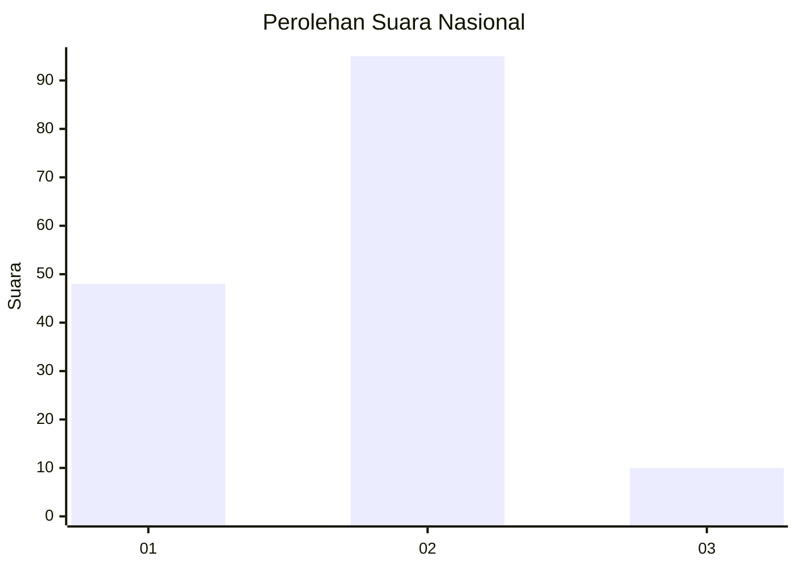
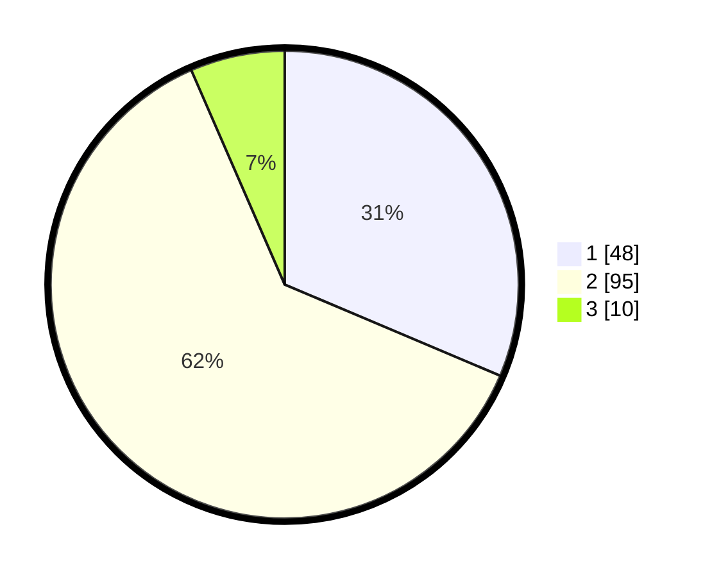

# Hasil

## Grafik

## Tabel

| No. | Nama Paslon    | Suara | Suara (raw) | Persentase |
|:--- |:-------------- | -----:| -----------:| ----------:|
| 1   | ANIES MUHAIMIN | 48    | [48][p-1]   | 31,37      |
| 2   | PRABOWO GIBRAN | 95    | [95][p-2]   | 62,09      |
| 3   | GANJAR MAHFUD  | 10    | [10][p-3]   | 6,54       |

[p-1]: https://github.com/gigit-pemilu/pemilu-2024/blob/main/pilpres/hitung-suara/sub/61-kalimantan-barat/sub/01-sambas/sub/02-teluk-keramat/sub/2001-sungai-kumpai/sub/004-tps/sub/paslon-1.txt
[p-2]: https://github.com/gigit-pemilu/pemilu-2024/blob/main/pilpres/hitung-suara/sub/61-kalimantan-barat/sub/01-sambas/sub/02-teluk-keramat/sub/2001-sungai-kumpai/sub/004-tps/sub/paslon-2.txt
[p-3]: https://github.com/gigit-pemilu/pemilu-2024/blob/main/pilpres/hitung-suara/sub/61-kalimantan-barat/sub/01-sambas/sub/02-teluk-keramat/sub/2001-sungai-kumpai/sub/004-tps/sub/paslon-3.txt

## Foto C Plano

https://sirekap-obj-formc.kpu.go.id/0775/pemilu/ppwp/61/01/02/20/01/6101022001004-20240215-034920--cff3d324-391f-47ee-ab0c-605557bef8f3.jpg

https://sirekap-obj-formc.kpu.go.id/0775/pemilu/ppwp/61/01/02/20/01/6101022001004-20240215-071851--e7b68672-eae3-4658-bd72-e9c419f22bf4.jpg

https://sirekap-obj-formc.kpu.go.id/0775/pemilu/ppwp/61/01/02/20/01/6101022001004-20240215-035603--7a5bf71f-b747-40ee-8eb2-2e50f59747f9.jpg

## Metadata

| Key        | Value               |
| ---------- | ------------------- |
| Time Stamp | 2024-02-16 23:00:00 |

