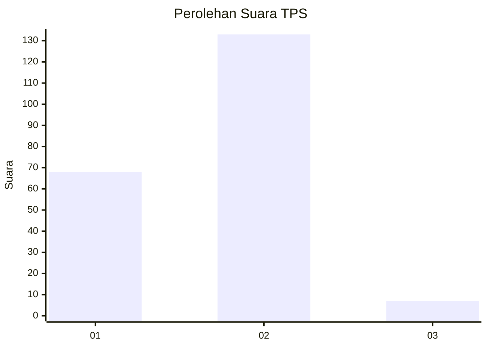
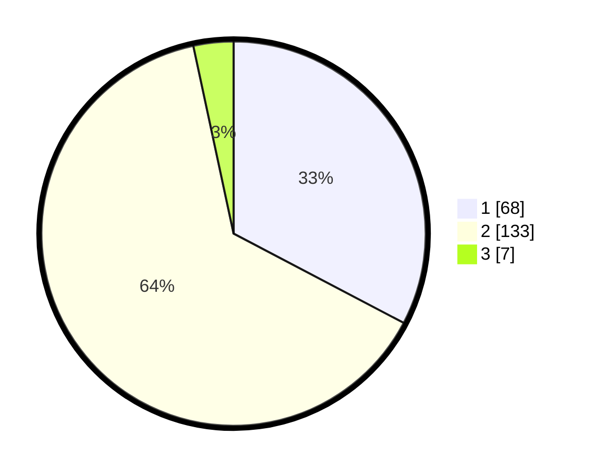

# Hasil

## Grafik

## Tabel

| No. | Nama Paslon    | Suara | Suara (raw) | Persentase |
|:--- |:-------------- | -----:| -----------:| ----------:|
| 1   | ANIES MUHAIMIN | 68    | [68][p-1]   | 32,69      |
| 2   | PRABOWO GIBRAN | 133   | [133][p-2]  | 63,94      |
| 3   | GANJAR MAHFUD  | 7     | [7][p-3]    | 3,37       |

[p-1]: https://github.com/gigit-pemilu/pemilu-2024-61-kalimantan-barat/blob/main/pilpres/hitung-suara/sub/61-kalimantan-barat/sub/01-sambas/sub/02-teluk-keramat/sub/2001-sungai-kumpai/sub/005-tps/sub/paslon-1.txt
[p-2]: https://github.com/gigit-pemilu/pemilu-2024-61-kalimantan-barat/blob/main/pilpres/hitung-suara/sub/61-kalimantan-barat/sub/01-sambas/sub/02-teluk-keramat/sub/2001-sungai-kumpai/sub/005-tps/sub/paslon-2.txt
[p-3]: https://github.com/gigit-pemilu/pemilu-2024-61-kalimantan-barat/blob/main/pilpres/hitung-suara/sub/61-kalimantan-barat/sub/01-sambas/sub/02-teluk-keramat/sub/2001-sungai-kumpai/sub/005-tps/sub/paslon-3.txt

## Foto C Plano

https://sirekap-obj-formc.kpu.go.id/d9c7/pemilu/ppwp/61/01/02/20/01/6101022001005-20240219-101133--6b4c7d9c-2496-4161-a4b1-ebc1622fbe44.jpg

https://sirekap-obj-formc.kpu.go.id/d9c7/pemilu/ppwp/61/01/02/20/01/6101022001005-20240219-101214--20c90ad4-45ff-489d-9249-32933866f0eb.jpg

https://sirekap-obj-formc.kpu.go.id/d9c7/pemilu/ppwp/61/01/02/20/01/6101022001005-20240219-101327--ea33eb4c-b483-49ff-93e8-f8bc52fb9705.jpg

## Metadata

| Key        | Value               |
| ---------- | ------------------- |
| Time Stamp | 2024-02-21 01:00:00 |

