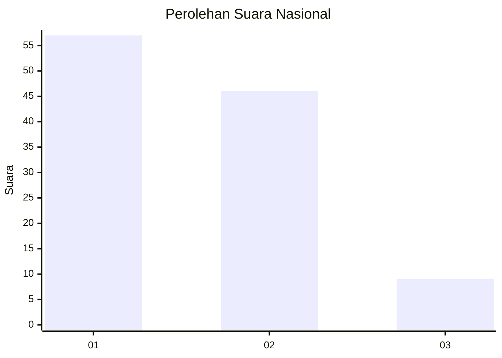
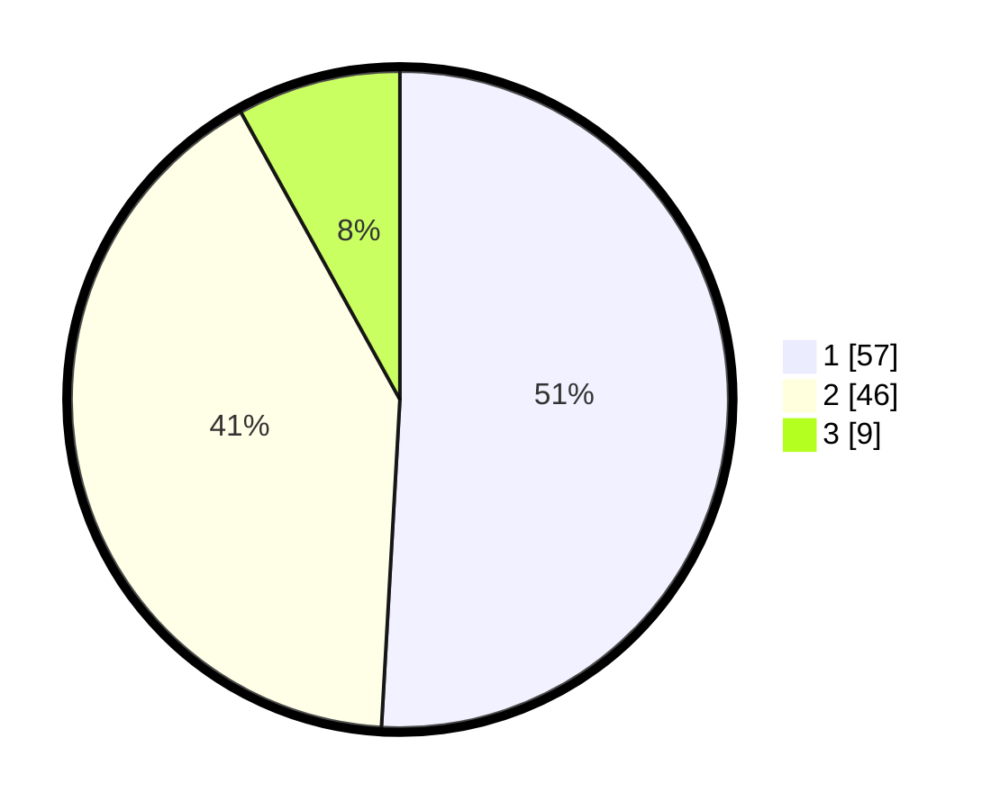

# Hasil

## Grafik

## Tabel

| No. | Nama Paslon    | Suara | Suara (raw) | Persentase |
|:--- |:-------------- | -----:| -----------:| ----------:|
| 1   | ANIES MUHAIMIN | 57    | [57][p-1]   | 50,89      |
| 2   | PRABOWO GIBRAN | 46    | [46][p-2]   | 41,07      |
| 3   | GANJAR MAHFUD  | 9     | [9][p-3]    | 8,04       |

[p-1]: https://github.com/gigit-pemilu/pemilu-2024/blob/main/pilpres/hitung-suara/sub/61-kalimantan-barat/sub/01-sambas/sub/02-teluk-keramat/sub/2005-lela/sub/006-tps/sub/paslon-1.txt
[p-2]: https://github.com/gigit-pemilu/pemilu-2024/blob/main/pilpres/hitung-suara/sub/61-kalimantan-barat/sub/01-sambas/sub/02-teluk-keramat/sub/2005-lela/sub/006-tps/sub/paslon-2.txt
[p-3]: https://github.com/gigit-pemilu/pemilu-2024/blob/main/pilpres/hitung-suara/sub/61-kalimantan-barat/sub/01-sambas/sub/02-teluk-keramat/sub/2005-lela/sub/006-tps/sub/paslon-3.txt

## Foto C Plano

https://sirekap-obj-formc.kpu.go.id/8aad/pemilu/ppwp/61/01/02/20/05/6101022005006-20240219-093658--7028cc0d-70c8-4c98-a8d0-ec5986044a1e.jpg

https://sirekap-obj-formc.kpu.go.id/8aad/pemilu/ppwp/61/01/02/20/05/6101022005006-20240219-093747--8c4dc7c2-6ddd-4de8-8213-5991204def93.jpg

https://sirekap-obj-formc.kpu.go.id/8aad/pemilu/ppwp/61/01/02/20/05/6101022005006-20240219-093834--a25d06d9-70c0-4cfa-9f0e-0cbc2ab9946a.jpg

## Metadata

| Key        | Value               |
| ---------- | ------------------- |
| Time Stamp | 2024-02-21 01:00:00 |

