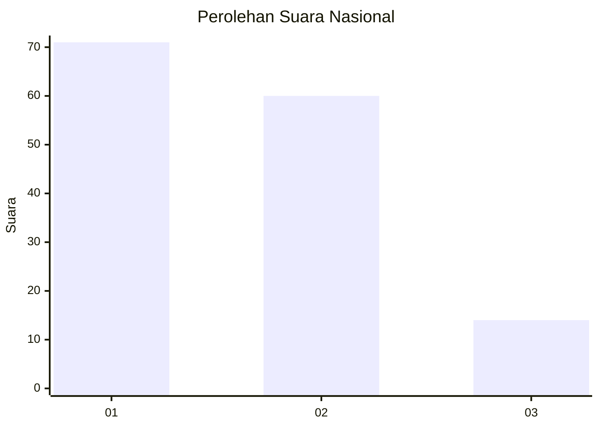
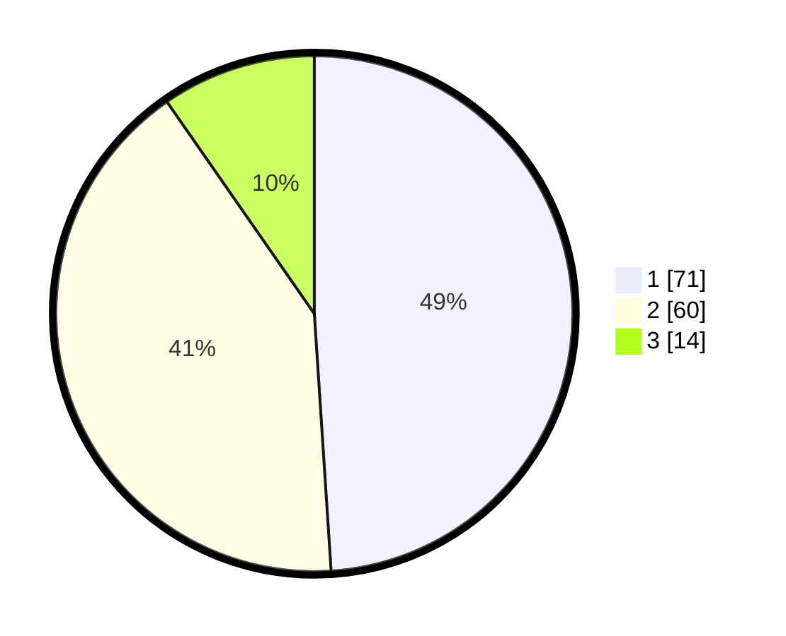

# Hasil

## Grafik

## Tabel

| No. | Nama Paslon    | Suara | Suara (raw) | Persentase |
|:--- |:-------------- | -----:| -----------:| ----------:|
| 1   | ANIES MUHAIMIN | 71    | [71][p-1]   | 48,97      |
| 2   | PRABOWO GIBRAN | 60    | [60][p-2]   | 41,38      |
| 3   | GANJAR MAHFUD  | 14    | [14][p-3]   | 9,66       |

[p-1]: https://github.com/gigit-pemilu/pemilu-2024/blob/main/pilpres/hitung-suara/sub/61-kalimantan-barat/sub/01-sambas/sub/02-teluk-keramat/sub/2009-sengawang/sub/003-tps/sub/paslon-1.txt
[p-2]: https://github.com/gigit-pemilu/pemilu-2024/blob/main/pilpres/hitung-suara/sub/61-kalimantan-barat/sub/01-sambas/sub/02-teluk-keramat/sub/2009-sengawang/sub/003-tps/sub/paslon-2.txt
[p-3]: https://github.com/gigit-pemilu/pemilu-2024/blob/main/pilpres/hitung-suara/sub/61-kalimantan-barat/sub/01-sambas/sub/02-teluk-keramat/sub/2009-sengawang/sub/003-tps/sub/paslon-3.txt

## Foto C Plano

https://sirekap-obj-formc.kpu.go.id/ebbe/pemilu/ppwp/61/01/02/20/09/6101022009003-20240215-085901--5dd50013-20ae-4636-afb7-a4e213962286.jpg

https://sirekap-obj-formc.kpu.go.id/ebbe/pemilu/ppwp/61/01/02/20/09/6101022009003-20240215-090132--a9677857-52d1-4ff8-9e66-64948c65f145.jpg

https://sirekap-obj-formc.kpu.go.id/ebbe/pemilu/ppwp/61/01/02/20/09/6101022009003-20240215-090329--8f4eb0af-0d09-4aba-a71b-391633121311.jpg

## Metadata

| Key        | Value               |
| ---------- | ------------------- |
| Time Stamp | 2024-02-16 10:30:29 |

