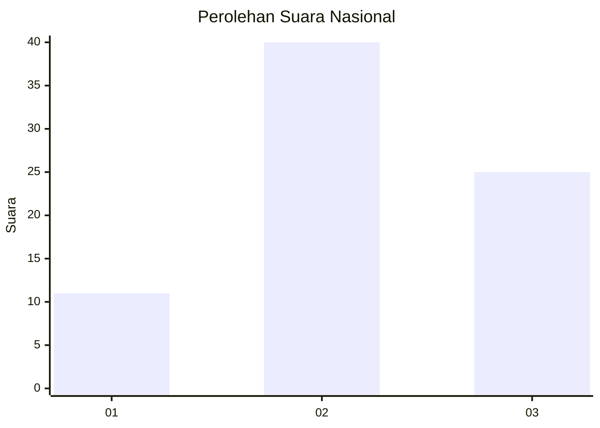
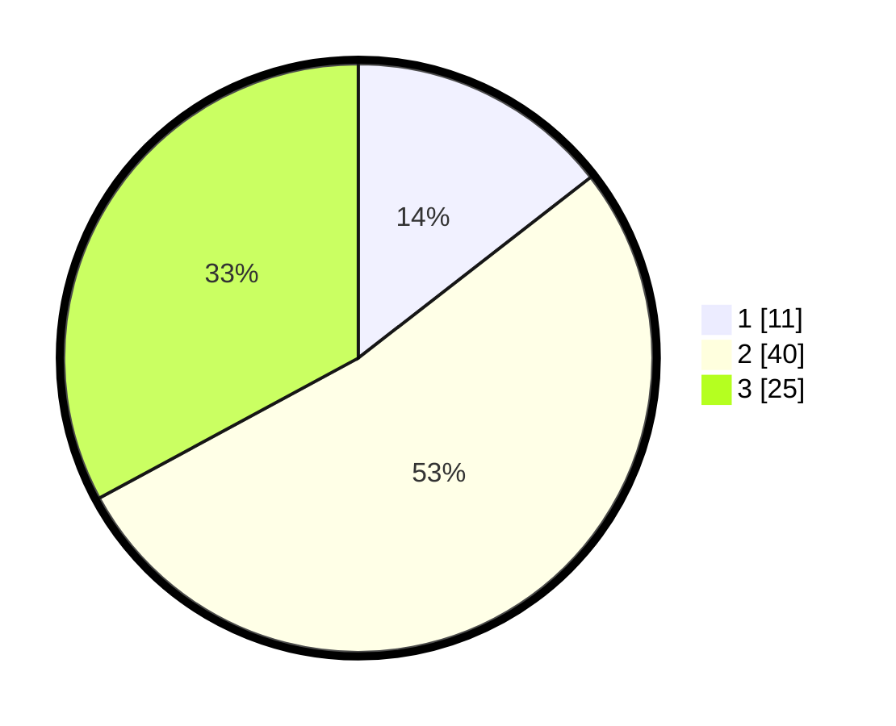

# Hasil

## Grafik

## Tabel

| No. | Nama Paslon    | Suara | Suara (raw) | Persentase |
|:--- |:-------------- | -----:| -----------:| ----------:|
| 1   | ANIES MUHAIMIN | 11    | [11][p-1]   | 14,47      |
| 2   | PRABOWO GIBRAN | 40    | [40][p-2]   | 52,63      |
| 3   | GANJAR MAHFUD  | 25    | [25][p-3]   | 32,89      |

[p-1]: https://github.com/gigit-pemilu/pemilu-2024/blob/main/pilpres/hitung-suara/sub/61-kalimantan-barat/sub/01-sambas/sub/02-teluk-keramat/sub/2009-sengawang/sub/005-tps/sub/paslon-1.txt
[p-2]: https://github.com/gigit-pemilu/pemilu-2024/blob/main/pilpres/hitung-suara/sub/61-kalimantan-barat/sub/01-sambas/sub/02-teluk-keramat/sub/2009-sengawang/sub/005-tps/sub/paslon-2.txt
[p-3]: https://github.com/gigit-pemilu/pemilu-2024/blob/main/pilpres/hitung-suara/sub/61-kalimantan-barat/sub/01-sambas/sub/02-teluk-keramat/sub/2009-sengawang/sub/005-tps/sub/paslon-3.txt

## Foto C Plano

https://sirekap-obj-formc.kpu.go.id/6178/pemilu/ppwp/61/01/02/20/09/6101022009005-20240214-141601--de520a8d-07fe-434c-b999-78321a5ac5da.jpg

https://sirekap-obj-formc.kpu.go.id/6178/pemilu/ppwp/61/01/02/20/09/6101022009005-20240214-141622--2576c7db-c58a-4b9d-88d9-a68f8fc15367.jpg

https://sirekap-obj-formc.kpu.go.id/6178/pemilu/ppwp/61/01/02/20/09/6101022009005-20240214-141626--54c3b9b8-2b22-43a9-b9f6-f2e5588c7347.jpg

## Metadata

| Key        | Value               |
| ---------- | ------------------- |
| Time Stamp | 2024-02-17 14:45:18 |

