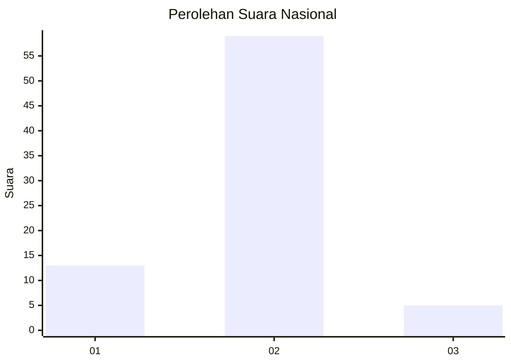
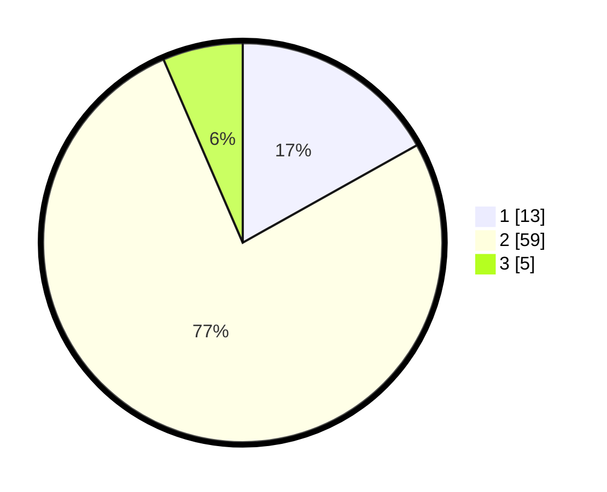

# Hasil

## Grafik

## Tabel

| No. | Nama Paslon    | Suara | Suara (raw) | Persentase |
|:--- |:-------------- | -----:| -----------:| ----------:|
| 1   | ANIES MUHAIMIN | 13    | [13][p-1]   | 16,88      |
| 2   | PRABOWO GIBRAN | 59    | [59][p-2]   | 76,62      |
| 3   | GANJAR MAHFUD  | 5     | [5][p-3]    | 6,49       |

[p-1]: https://github.com/gigit-pemilu/pemilu-2024/blob/main/pilpres/hitung-suara/sub/61-kalimantan-barat/sub/01-sambas/sub/02-teluk-keramat/sub/2012-tambatan/sub/002-tps/sub/paslon-1.txt
[p-2]: https://github.com/gigit-pemilu/pemilu-2024/blob/main/pilpres/hitung-suara/sub/61-kalimantan-barat/sub/01-sambas/sub/02-teluk-keramat/sub/2012-tambatan/sub/002-tps/sub/paslon-2.txt
[p-3]: https://github.com/gigit-pemilu/pemilu-2024/blob/main/pilpres/hitung-suara/sub/61-kalimantan-barat/sub/01-sambas/sub/02-teluk-keramat/sub/2012-tambatan/sub/002-tps/sub/paslon-3.txt

## Foto C Plano

https://sirekap-obj-formc.kpu.go.id/89b5/pemilu/ppwp/61/01/02/20/12/6101022012002-20240220-092932--7a4f3b8f-6af6-4366-8ad5-e00823e32bb0.jpg

https://sirekap-obj-formc.kpu.go.id/89b5/pemilu/ppwp/61/01/02/20/12/6101022012002-20240220-093030--216050bd-d817-4e08-a41a-c735066fcc5e.jpg

https://sirekap-obj-formc.kpu.go.id/89b5/pemilu/ppwp/61/01/02/20/12/6101022012002-20240220-093138--f98d8642-98bc-4483-90fd-63819eb11314.jpg

## Metadata

| Key        | Value               |
| ---------- | ------------------- |
| Time Stamp | 2024-02-21 01:00:00 |

