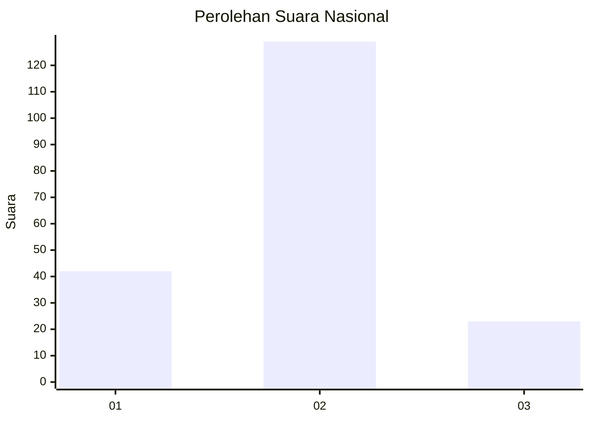
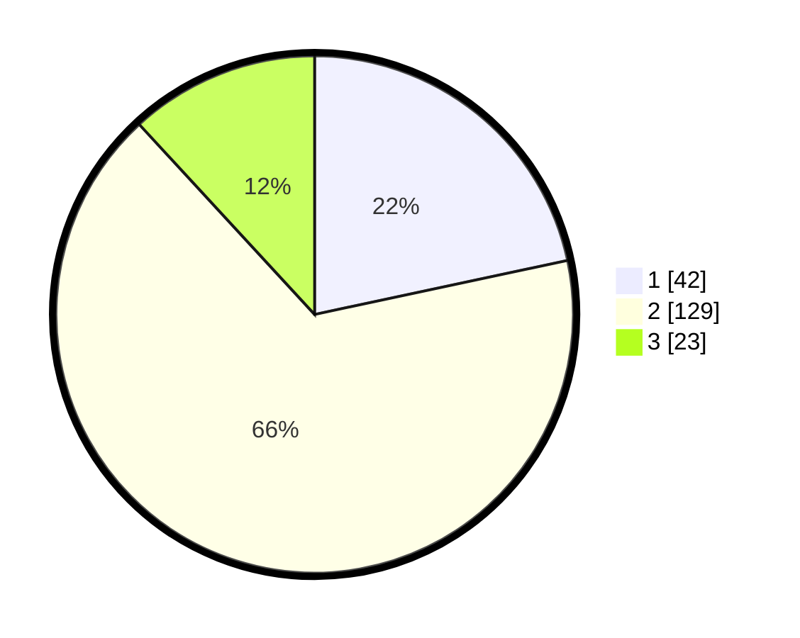

# Hasil

## Grafik

## Tabel

| No. | Nama Paslon    | Suara | Suara (raw) | Persentase |
|:--- |:-------------- | -----:| -----------:| ----------:|
| 1   | ANIES MUHAIMIN | 42    | [42][p-1]   | 21,65      |
| 2   | PRABOWO GIBRAN | 129   | [129][p-2]  | 66,49      |
| 3   | GANJAR MAHFUD  | 23    | [23][p-3]   | 11,86      |

[p-1]: https://github.com/gigit-pemilu/pemilu-2024/blob/main/pilpres/hitung-suara/sub/61-kalimantan-barat/sub/01-sambas/sub/03-jawai/sub/2001-sarang-burung-danau/sub/001-tps/sub/paslon-1.txt
[p-2]: https://github.com/gigit-pemilu/pemilu-2024/blob/main/pilpres/hitung-suara/sub/61-kalimantan-barat/sub/01-sambas/sub/03-jawai/sub/2001-sarang-burung-danau/sub/001-tps/sub/paslon-2.txt
[p-3]: https://github.com/gigit-pemilu/pemilu-2024/blob/main/pilpres/hitung-suara/sub/61-kalimantan-barat/sub/01-sambas/sub/03-jawai/sub/2001-sarang-burung-danau/sub/001-tps/sub/paslon-3.txt

## Foto C Plano

https://sirekap-obj-formc.kpu.go.id/4946/pemilu/ppwp/61/01/03/20/01/6101032001001-20240221-100453--82e71981-8c80-488a-ba13-d68f53d4a5cf.jpg

https://sirekap-obj-formc.kpu.go.id/4946/pemilu/ppwp/61/01/03/20/01/6101032001001-20240214-224222--1e581518-1a47-4c54-83c7-9a2b76761634.jpg

https://sirekap-obj-formc.kpu.go.id/4946/pemilu/ppwp/61/01/03/20/01/6101032001001-20240221-100657--b0c1918b-ab27-40d9-bdb6-29131b2665b2.jpg

## Metadata

| Key        | Value               |
| ---------- | ------------------- |
| Time Stamp | 2024-02-21 11:00:00 |

