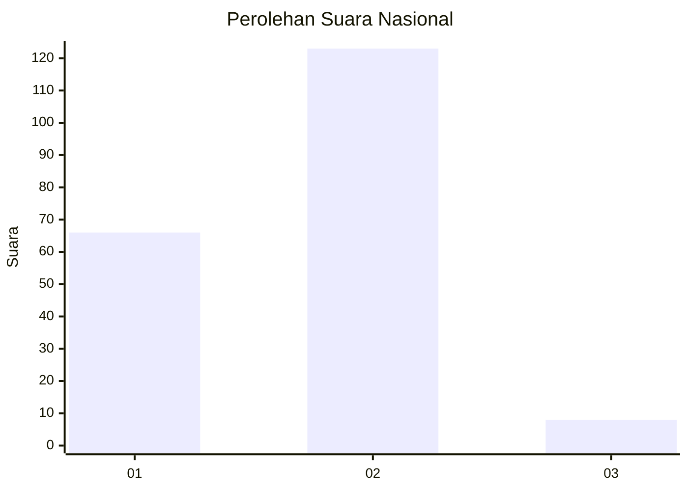
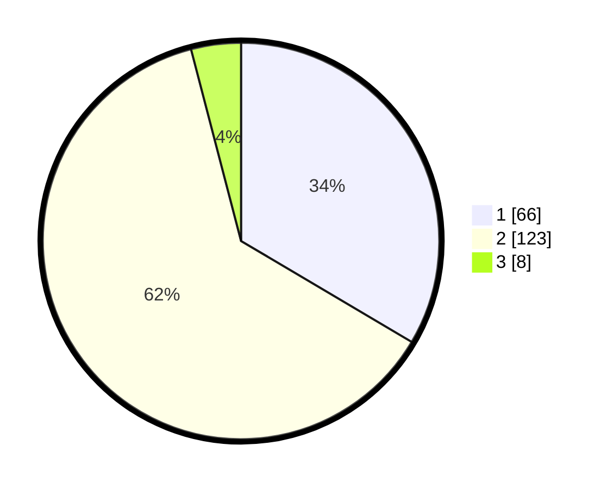

# Hasil

## Grafik

## Tabel

| No. | Nama Paslon    | Suara | Suara (raw) | Persentase |
|:--- |:-------------- | -----:| -----------:| ----------:|
| 1   | ANIES MUHAIMIN | 66    | [66][p-1]   | 33,50      |
| 2   | PRABOWO GIBRAN | 123   | [123][p-2]  | 62,44      |
| 3   | GANJAR MAHFUD  | 8     | [8][p-3]    | 4,06       |

[p-1]: https://github.com/gigit-pemilu/pemilu-2024/blob/main/pilpres/hitung-suara/sub/61-kalimantan-barat/sub/01-sambas/sub/03-jawai/sub/2001-sarang-burung-danau/sub/004-tps/sub/paslon-1.txt
[p-2]: https://github.com/gigit-pemilu/pemilu-2024/blob/main/pilpres/hitung-suara/sub/61-kalimantan-barat/sub/01-sambas/sub/03-jawai/sub/2001-sarang-burung-danau/sub/004-tps/sub/paslon-2.txt
[p-3]: https://github.com/gigit-pemilu/pemilu-2024/blob/main/pilpres/hitung-suara/sub/61-kalimantan-barat/sub/01-sambas/sub/03-jawai/sub/2001-sarang-burung-danau/sub/004-tps/sub/paslon-3.txt

## Foto C Plano

https://sirekap-obj-formc.kpu.go.id/2cf4/pemilu/ppwp/61/01/03/20/01/6101032001004-20240214-141705--1342391b-f820-430d-aedc-f0f6fe35adb7.jpg

https://sirekap-obj-formc.kpu.go.id/2cf4/pemilu/ppwp/61/01/03/20/01/6101032001004-20240214-141819--df69b590-b658-415c-a484-1c318b05981d.jpg

https://sirekap-obj-formc.kpu.go.id/2cf4/pemilu/ppwp/61/01/03/20/01/6101032001004-20240214-142229--6ac46789-917d-4965-94ef-d734d2662c9b.jpg

## Metadata

| Key        | Value               |
| ---------- | ------------------- |
| Time Stamp | 2024-02-15 23:29:50 |

