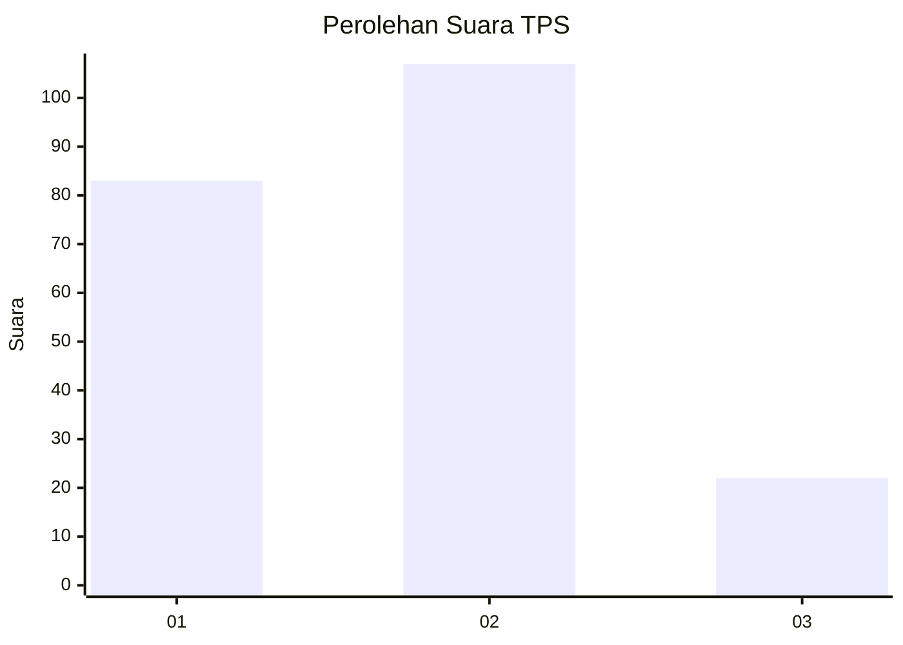
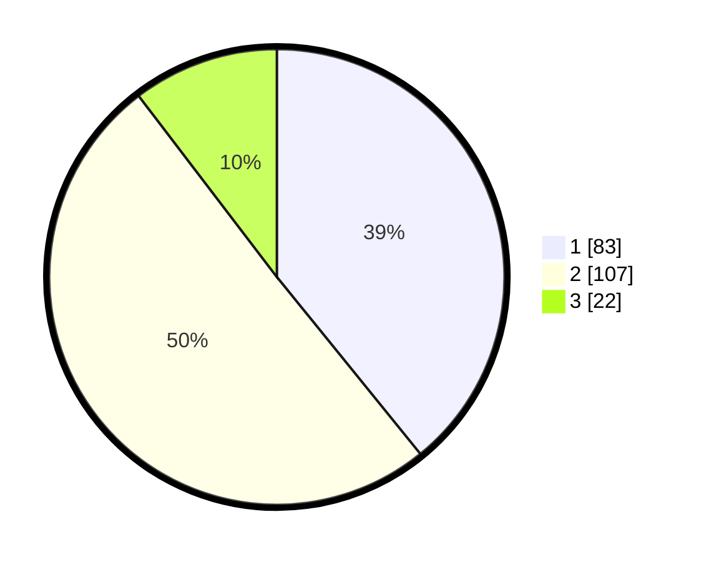

# Hasil

## Grafik

## Tabel

| No. | Nama Paslon    | Suara | Suara (raw) | Persentase |
|:--- |:-------------- | -----:| -----------:| ----------:|
| 1   | ANIES MUHAIMIN | 83    | [83][p-1]   | 39,15      |
| 2   | PRABOWO GIBRAN | 107   | [107][p-2]  | 50,47      |
| 3   | GANJAR MAHFUD  | 22    | [22][p-3]   | 10,38      |

[p-1]: https://github.com/gigit-pemilu/pemilu-2024-61-kalimantan-barat/blob/main/pilpres/hitung-suara/sub/61-kalimantan-barat/sub/01-sambas/sub/03-jawai/sub/2001-sarang-burung-danau/sub/006-tps/sub/paslon-1.txt
[p-2]: https://github.com/gigit-pemilu/pemilu-2024-61-kalimantan-barat/blob/main/pilpres/hitung-suara/sub/61-kalimantan-barat/sub/01-sambas/sub/03-jawai/sub/2001-sarang-burung-danau/sub/006-tps/sub/paslon-2.txt
[p-3]: https://github.com/gigit-pemilu/pemilu-2024-61-kalimantan-barat/blob/main/pilpres/hitung-suara/sub/61-kalimantan-barat/sub/01-sambas/sub/03-jawai/sub/2001-sarang-burung-danau/sub/006-tps/sub/paslon-3.txt

## Foto C Plano

https://sirekap-obj-formc.kpu.go.id/1750/pemilu/ppwp/61/01/03/20/01/6101032001006-20240221-155736--8e137045-e799-440e-829a-b0c64e3edfe5.jpg

https://sirekap-obj-formc.kpu.go.id/1750/pemilu/ppwp/61/01/03/20/01/6101032001006-20240221-155655--26182f4b-5c79-4cce-9cfd-a08b5ffce133.jpg

https://sirekap-obj-formc.kpu.go.id/1750/pemilu/ppwp/61/01/03/20/01/6101032001006-20240221-134336--6b48e2da-e75e-4014-9af0-c4646d656b54.jpg

## Metadata

| Key        | Value               |
| ---------- | ------------------- |
| Time Stamp | 2024-02-22 19:00:00 |

