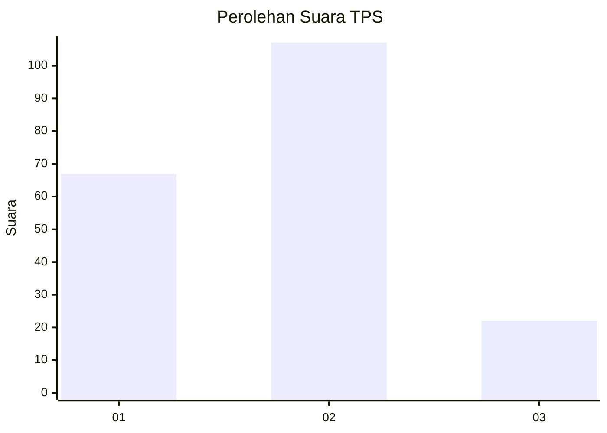
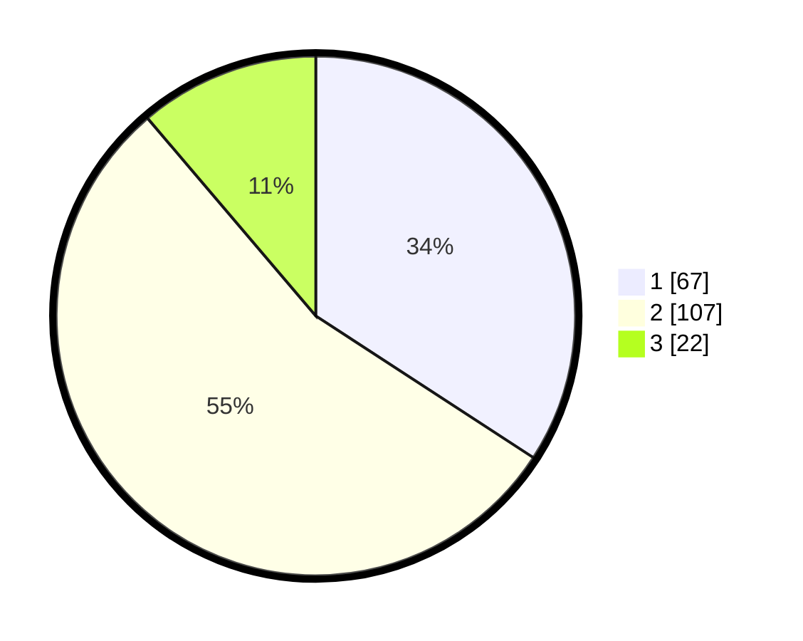

# Hasil

## Grafik

## Tabel

| No. | Nama Paslon    | Suara | Suara (raw) | Persentase |
|:--- |:-------------- | -----:| -----------:| ----------:|
| 1   | ANIES MUHAIMIN | 67    | [67][p-1]   | 34,18      |
| 2   | PRABOWO GIBRAN | 107   | [107][p-2]  | 54,59      |
| 3   | GANJAR MAHFUD  | 22    | [22][p-3]   | 11,22      |

[p-1]: https://github.com/gigit-pemilu/pemilu-2024-61-kalimantan-barat/blob/main/pilpres/hitung-suara/sub/61-kalimantan-barat/sub/01-sambas/sub/03-jawai/sub/2005-sarang-burung-kuala/sub/004-tps/sub/paslon-1.txt
[p-2]: https://github.com/gigit-pemilu/pemilu-2024-61-kalimantan-barat/blob/main/pilpres/hitung-suara/sub/61-kalimantan-barat/sub/01-sambas/sub/03-jawai/sub/2005-sarang-burung-kuala/sub/004-tps/sub/paslon-2.txt
[p-3]: https://github.com/gigit-pemilu/pemilu-2024-61-kalimantan-barat/blob/main/pilpres/hitung-suara/sub/61-kalimantan-barat/sub/01-sambas/sub/03-jawai/sub/2005-sarang-burung-kuala/sub/004-tps/sub/paslon-3.txt

## Foto C Plano

https://sirekap-obj-formc.kpu.go.id/361b/pemilu/ppwp/61/01/03/20/05/6101032005004-20240215-094624--6f911ee5-bdda-45ad-8cc6-ab44a3a52209.jpg

https://sirekap-obj-formc.kpu.go.id/361b/pemilu/ppwp/61/01/03/20/05/6101032005004-20240215-094742--a2b23ee8-20ee-4f1b-a347-8a6dd8b0a821.jpg

https://sirekap-obj-formc.kpu.go.id/361b/pemilu/ppwp/61/01/03/20/05/6101032005004-20240215-094832--d46b3ac6-a411-465a-8d72-83436b25f1c7.jpg

## Metadata

| Key        | Value               |
| ---------- | ------------------- |
| Time Stamp | 2024-02-19 06:16:00 |

