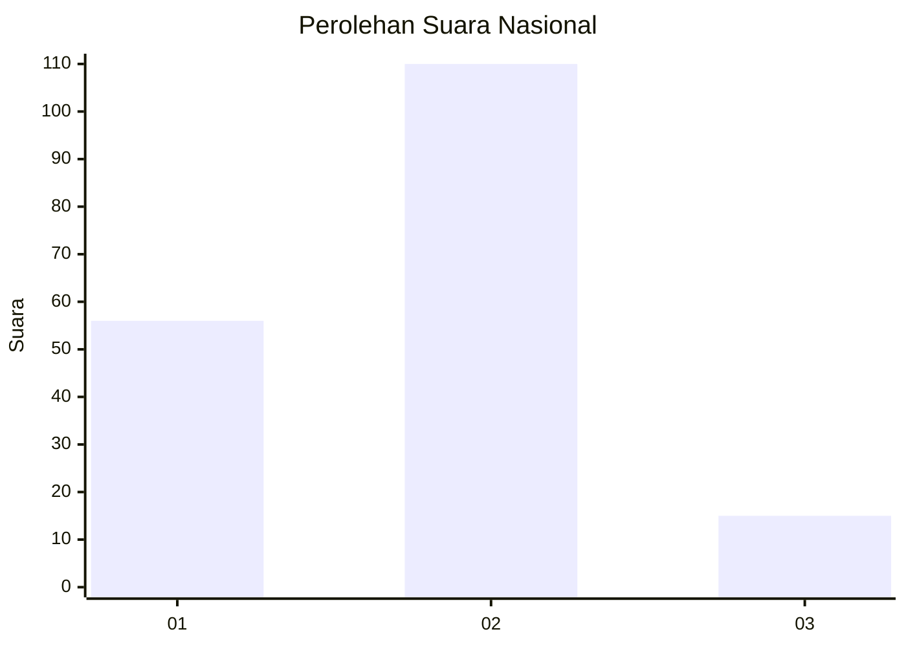
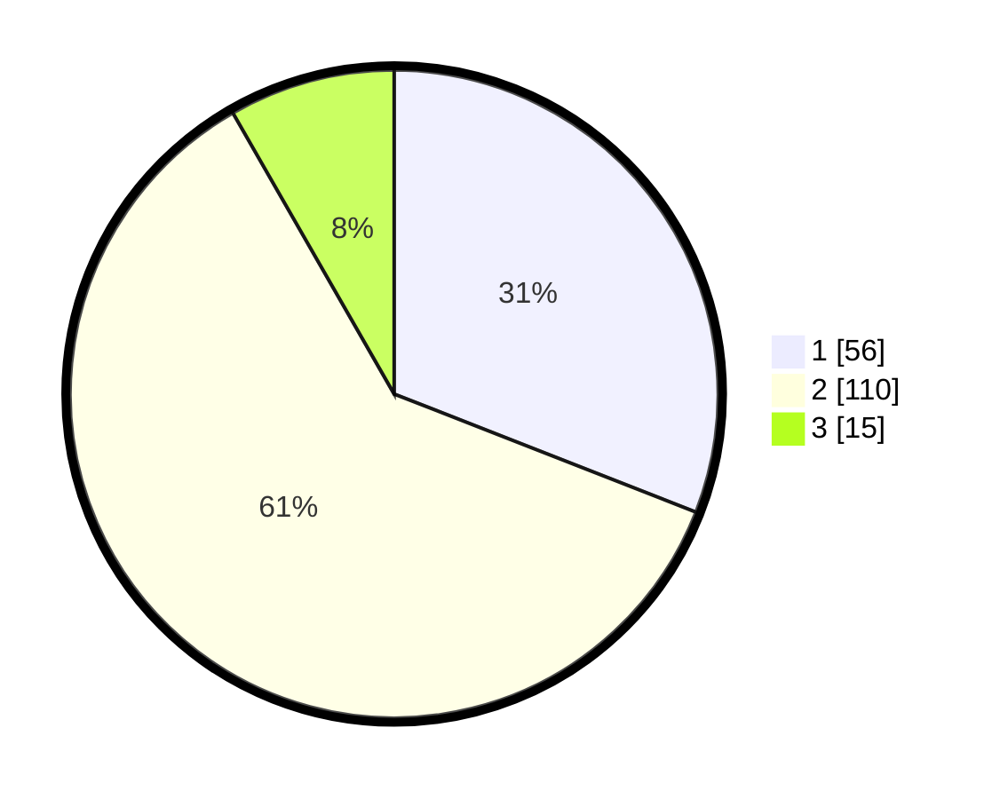

# Hasil

## Grafik

## Tabel

| No. | Nama Paslon    | Suara | Suara (raw) | Persentase |
|:--- |:-------------- | -----:| -----------:| ----------:|
| 1   | ANIES MUHAIMIN | 56    | [56][p-1]   | 30,94      |
| 2   | PRABOWO GIBRAN | 110   | [110][p-2]  | 60,77      |
| 3   | GANJAR MAHFUD  | 15    | [15][p-3]   | 8,29       |

[p-1]: https://github.com/gigit-pemilu/pemilu-2024/blob/main/pilpres/hitung-suara/sub/61-kalimantan-barat/sub/01-sambas/sub/03-jawai/sub/2005-sarang-burung-kuala/sub/005-tps/sub/paslon-1.txt
[p-2]: https://github.com/gigit-pemilu/pemilu-2024/blob/main/pilpres/hitung-suara/sub/61-kalimantan-barat/sub/01-sambas/sub/03-jawai/sub/2005-sarang-burung-kuala/sub/005-tps/sub/paslon-2.txt
[p-3]: https://github.com/gigit-pemilu/pemilu-2024/blob/main/pilpres/hitung-suara/sub/61-kalimantan-barat/sub/01-sambas/sub/03-jawai/sub/2005-sarang-burung-kuala/sub/005-tps/sub/paslon-3.txt

## Foto C Plano

https://sirekap-obj-formc.kpu.go.id/f8cf/pemilu/ppwp/61/01/03/20/05/6101032005005-20240214-214950--ee0beb24-e082-41ac-9e7c-85273a8b2042.jpg

https://sirekap-obj-formc.kpu.go.id/f8cf/pemilu/ppwp/61/01/03/20/05/6101032005005-20240214-214549--123767e2-a3b2-443f-b8c9-2b16c71f8808.jpg

https://sirekap-obj-formc.kpu.go.id/f8cf/pemilu/ppwp/61/01/03/20/05/6101032005005-20240215-093507--ba582333-4ec0-400d-bbfe-0dd096eb93b0.jpg

## Metadata

| Key        | Value               |
| ---------- | ------------------- |
| Time Stamp | 2024-02-15 15:00:29 |

