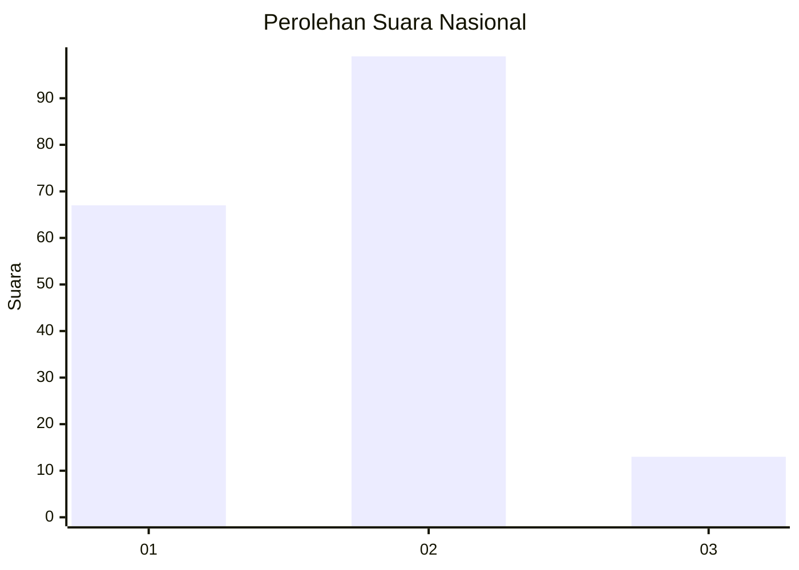
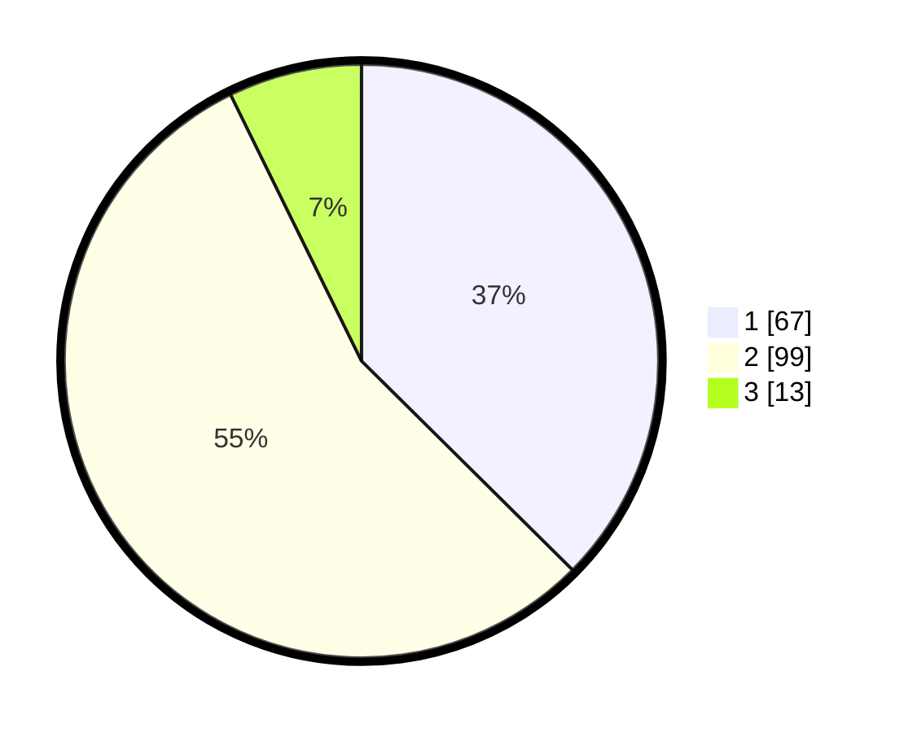

# Hasil

## Grafik

## Tabel

| No. | Nama Paslon    | Suara | Suara (raw) | Persentase |
|:--- |:-------------- | -----:| -----------:| ----------:|
| 1   | ANIES MUHAIMIN | 67    | [67][p-1]   | 37,43      |
| 2   | PRABOWO GIBRAN | 99    | [99][p-2]   | 55,31      |
| 3   | GANJAR MAHFUD  | 13    | [13][p-3]   | 7,26       |

[p-1]: https://github.com/gigit-pemilu/pemilu-2024/blob/main/pilpres/hitung-suara/sub/61-kalimantan-barat/sub/01-sambas/sub/03-jawai/sub/2006-pelimpaan/sub/004-tps/sub/paslon-1.txt
[p-2]: https://github.com/gigit-pemilu/pemilu-2024/blob/main/pilpres/hitung-suara/sub/61-kalimantan-barat/sub/01-sambas/sub/03-jawai/sub/2006-pelimpaan/sub/004-tps/sub/paslon-2.txt
[p-3]: https://github.com/gigit-pemilu/pemilu-2024/blob/main/pilpres/hitung-suara/sub/61-kalimantan-barat/sub/01-sambas/sub/03-jawai/sub/2006-pelimpaan/sub/004-tps/sub/paslon-3.txt

## Foto C Plano

https://sirekap-obj-formc.kpu.go.id/fa2a/pemilu/ppwp/61/01/03/20/06/6101032006004-20240215-074157--bbea4f68-ec52-42c2-92ed-bdd7cff8ad7e.jpg

https://sirekap-obj-formc.kpu.go.id/fa2a/pemilu/ppwp/61/01/03/20/06/6101032006004-20240215-074246--659439c4-48b5-4185-ab38-774943d6b4a9.jpg

https://sirekap-obj-formc.kpu.go.id/fa2a/pemilu/ppwp/61/01/03/20/06/6101032006004-20240219-213955--8d786b88-e327-4cfc-865e-410ab87bdb20.jpg

## Metadata

| Key        | Value               |
| ---------- | ------------------- |
| Time Stamp | 2024-02-19 22:00:00 |

