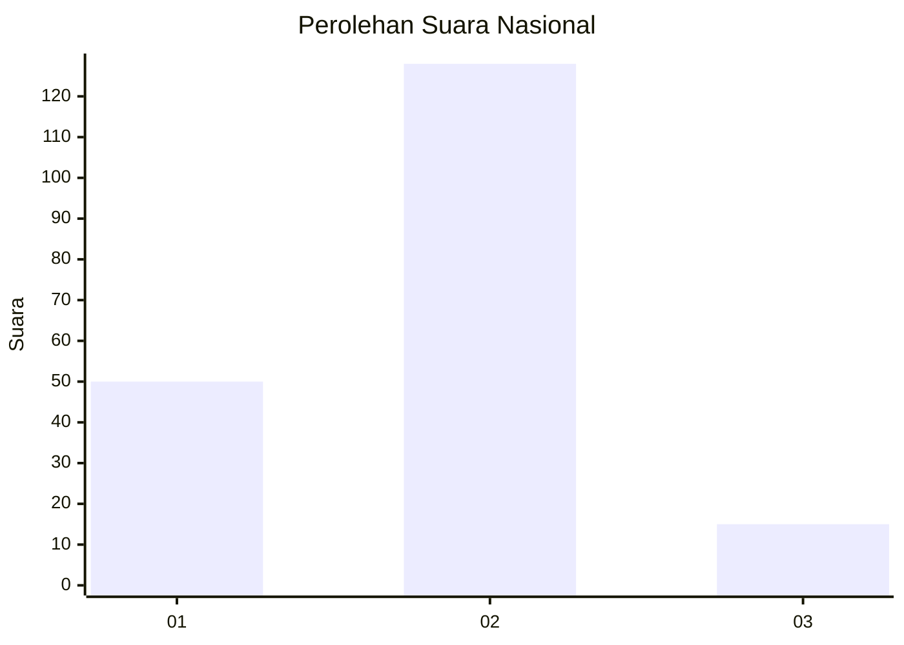
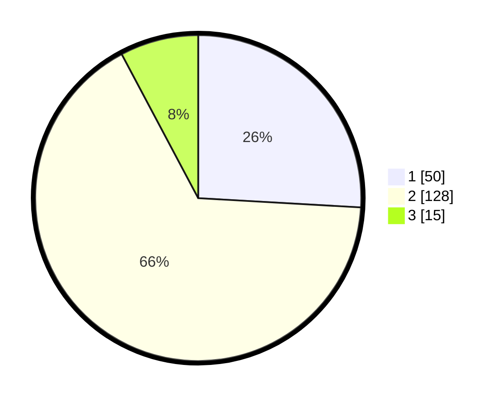

# Hasil

## Grafik

## Tabel

| No. | Nama Paslon    | Suara | Suara (raw) | Persentase |
|:--- |:-------------- | -----:| -----------:| ----------:|
| 1   | ANIES MUHAIMIN | 50    | [50][p-1]   | 25,91      |
| 2   | PRABOWO GIBRAN | 128   | [128][p-2]  | 66,32      |
| 3   | GANJAR MAHFUD  | 15    | [15][p-3]   | 7,77       |

[p-1]: https://github.com/gigit-pemilu/pemilu-2024/blob/main/pilpres/hitung-suara/sub/61-kalimantan-barat/sub/01-sambas/sub/03-jawai/sub/2007-parit-setia/sub/003-tps/sub/paslon-1.txt
[p-2]: https://github.com/gigit-pemilu/pemilu-2024/blob/main/pilpres/hitung-suara/sub/61-kalimantan-barat/sub/01-sambas/sub/03-jawai/sub/2007-parit-setia/sub/003-tps/sub/paslon-2.txt
[p-3]: https://github.com/gigit-pemilu/pemilu-2024/blob/main/pilpres/hitung-suara/sub/61-kalimantan-barat/sub/01-sambas/sub/03-jawai/sub/2007-parit-setia/sub/003-tps/sub/paslon-3.txt

## Foto C Plano

https://sirekap-obj-formc.kpu.go.id/0e4e/pemilu/ppwp/61/01/03/20/07/6101032007003-20240215-094731--b662052f-5d08-44b1-ac7d-4bfdc30b4cdd.jpg

https://sirekap-obj-formc.kpu.go.id/0e4e/pemilu/ppwp/61/01/03/20/07/6101032007003-20240215-094935--45e3d85f-88fe-47a2-87da-9dc0c19ad296.jpg

https://sirekap-obj-formc.kpu.go.id/0e4e/pemilu/ppwp/61/01/03/20/07/6101032007003-20240215-095040--7b6be8b7-37f5-445b-acad-6385b1d81583.jpg

## Metadata

| Key        | Value               |
| ---------- | ------------------- |
| Time Stamp | 2024-02-19 06:16:00 |

