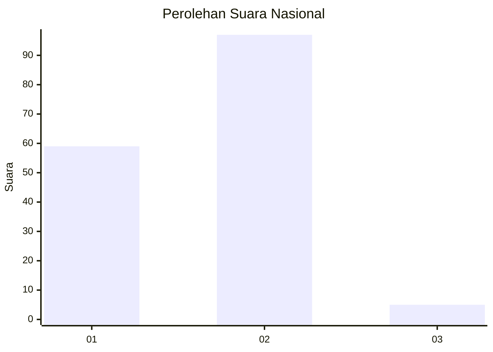
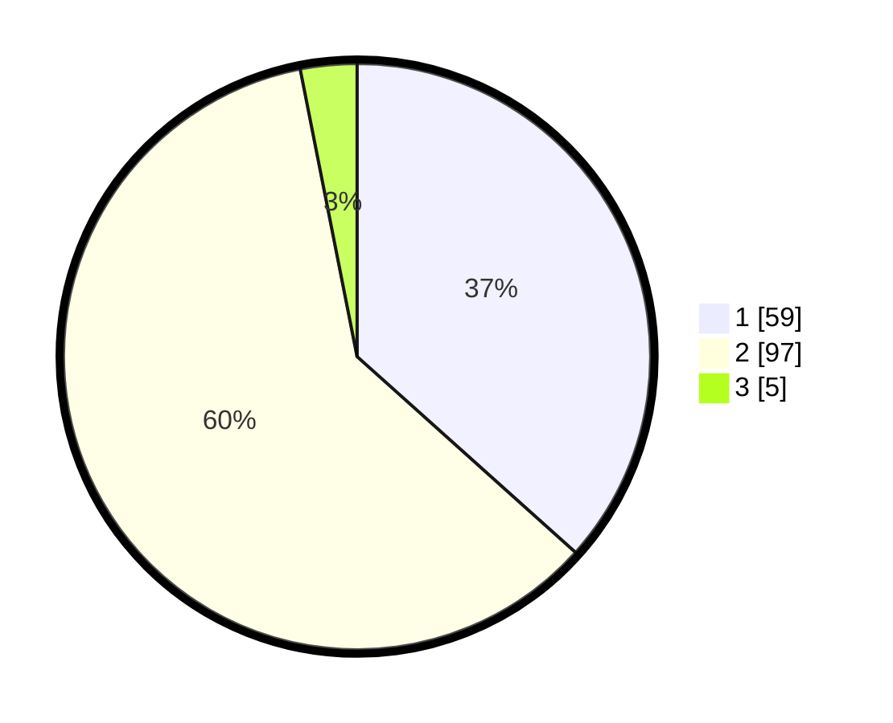

# Hasil

## Grafik

## Tabel

| No. | Nama Paslon    | Suara | Suara (raw) | Persentase |
|:--- |:-------------- | -----:| -----------:| ----------:|
| 1   | ANIES MUHAIMIN | 59    | [59][p-1]   | 36,65      |
| 2   | PRABOWO GIBRAN | 97    | [97][p-2]   | 60,25      |
| 3   | GANJAR MAHFUD  | 5     | [5][p-3]    | 3,11       |

[p-1]: https://github.com/gigit-pemilu/pemilu-2024/blob/main/pilpres/hitung-suara/sub/61-kalimantan-barat/sub/01-sambas/sub/03-jawai/sub/2009-sungai-nyirih/sub/003-tps/sub/paslon-1.txt
[p-2]: https://github.com/gigit-pemilu/pemilu-2024/blob/main/pilpres/hitung-suara/sub/61-kalimantan-barat/sub/01-sambas/sub/03-jawai/sub/2009-sungai-nyirih/sub/003-tps/sub/paslon-2.txt
[p-3]: https://github.com/gigit-pemilu/pemilu-2024/blob/main/pilpres/hitung-suara/sub/61-kalimantan-barat/sub/01-sambas/sub/03-jawai/sub/2009-sungai-nyirih/sub/003-tps/sub/paslon-3.txt

## Foto C Plano

https://sirekap-obj-formc.kpu.go.id/f9fc/pemilu/ppwp/61/01/03/20/09/6101032009003-20240215-043203--a6ee5397-fd95-4b97-9b09-fffe2c5bb4ad.jpg

https://sirekap-obj-formc.kpu.go.id/f9fc/pemilu/ppwp/61/01/03/20/09/6101032009003-20240215-025238--ba3e3863-969a-44ba-9348-f6f1d2356e11.jpg

https://sirekap-obj-formc.kpu.go.id/f9fc/pemilu/ppwp/61/01/03/20/09/6101032009003-20240215-025413--c05c8522-6165-4569-920b-8c59eac0bc53.jpg

## Metadata

| Key        | Value               |
| ---------- | ------------------- |
| Time Stamp | 2024-02-15 20:00:44 |

