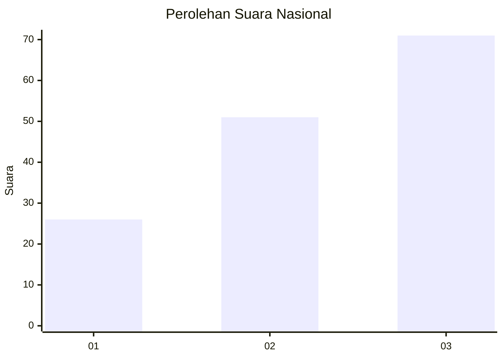
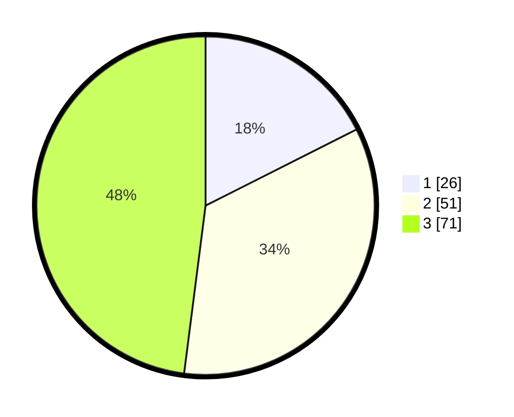

# Hasil

## Grafik

## Tabel

| No. | Nama Paslon    | Suara | Suara (raw) | Persentase |
|:--- |:-------------- | -----:| -----------:| ----------:|
| 1   | ANIES MUHAIMIN | 26    | [26][p-1]   | 17,57      |
| 2   | PRABOWO GIBRAN | 51    | [51][p-2]   | 34,46      |
| 3   | GANJAR MAHFUD  | 71    | [71][p-3]   | 47,97      |

[p-1]: https://github.com/gigit-pemilu/pemilu-2024/blob/main/pilpres/hitung-suara/sub/61-kalimantan-barat/sub/01-sambas/sub/03-jawai/sub/2011-dungun-laut/sub/009-tps/sub/paslon-1.txt
[p-2]: https://github.com/gigit-pemilu/pemilu-2024/blob/main/pilpres/hitung-suara/sub/61-kalimantan-barat/sub/01-sambas/sub/03-jawai/sub/2011-dungun-laut/sub/009-tps/sub/paslon-2.txt
[p-3]: https://github.com/gigit-pemilu/pemilu-2024/blob/main/pilpres/hitung-suara/sub/61-kalimantan-barat/sub/01-sambas/sub/03-jawai/sub/2011-dungun-laut/sub/009-tps/sub/paslon-3.txt

## Foto C Plano

https://sirekap-obj-formc.kpu.go.id/d7e1/pemilu/ppwp/61/01/03/20/11/6101032011009-20240215-000203--ebffde9c-6d09-4dfd-bdb1-b603c47f261c.jpg

https://sirekap-obj-formc.kpu.go.id/d7e1/pemilu/ppwp/61/01/03/20/11/6101032011009-20240215-100127--4fdbe148-2466-40a2-a39e-236cea915e82.jpg

https://sirekap-obj-formc.kpu.go.id/d7e1/pemilu/ppwp/61/01/03/20/11/6101032011009-20240214-154813--d6d5fbc4-7eaa-4882-a39b-d1155e978ede.jpg

## Metadata

| Key        | Value               |
| ---------- | ------------------- |
| Time Stamp | 2024-02-16 22:01:00 |

