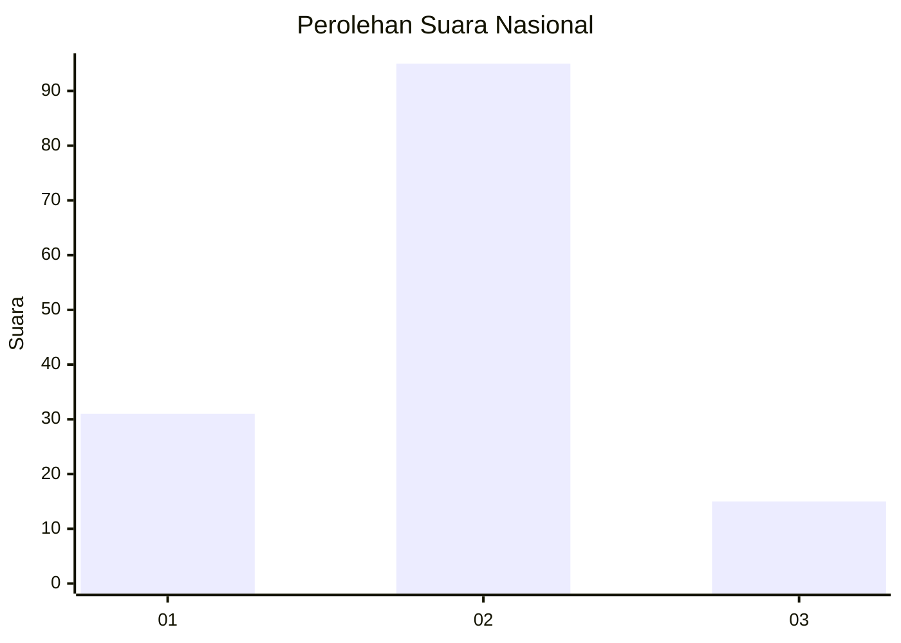

# Hasil

## Grafik

## Tabel

| No. | Nama Paslon    | Suara | Suara (raw) | Persentase |
|:--- |:-------------- | -----:| -----------:| ----------:|
| 1   | ANIES MUHAIMIN | 31    | [31][p-1]   | 21,99      |
| 2   | PRABOWO GIBRAN | 95    | [95][p-2]   | 67,38      |
| 3   | GANJAR MAHFUD  | 15    | [15][p-3]   | 10,64      |

[p-1]: https://github.com/gigit-pemilu/pemilu-2024/blob/main/pilpres/hitung-suara/sub/61-kalimantan-barat/sub/01-sambas/sub/03-jawai/sub/2022-mutus-darussalam/sub/005-tps/sub/paslon-1.txt
[p-2]: https://github.com/gigit-pemilu/pemilu-2024/blob/main/pilpres/hitung-suara/sub/61-kalimantan-barat/sub/01-sambas/sub/03-jawai/sub/2022-mutus-darussalam/sub/005-tps/sub/paslon-2.txt
[p-3]: https://github.com/gigit-pemilu/pemilu-2024/blob/main/pilpres/hitung-suara/sub/61-kalimantan-barat/sub/01-sambas/sub/03-jawai/sub/2022-mutus-darussalam/sub/005-tps/sub/paslon-3.txt

## Foto C Plano

https://sirekap-obj-formc.kpu.go.id/1708/pemilu/ppwp/61/01/03/20/22/6101032022005-20240215-112259--b2052ca0-01df-4962-814f-20dc592d76ec.jpg

https://sirekap-obj-formc.kpu.go.id/1708/pemilu/ppwp/61/01/03/20/22/6101032022005-20240215-070702--aaea88cc-84e9-4aac-9d7f-5219e1d42b6d.jpg

https://sirekap-obj-formc.kpu.go.id/1708/pemilu/ppwp/61/01/03/20/22/6101032022005-20240214-141339--d6111228-e8db-4cc5-ba66-fd4c7a93d43b.jpg

## Metadata

| Key        | Value               |
| ---------- | ------------------- |
| Time Stamp | 2024-02-17 14:45:18 |

