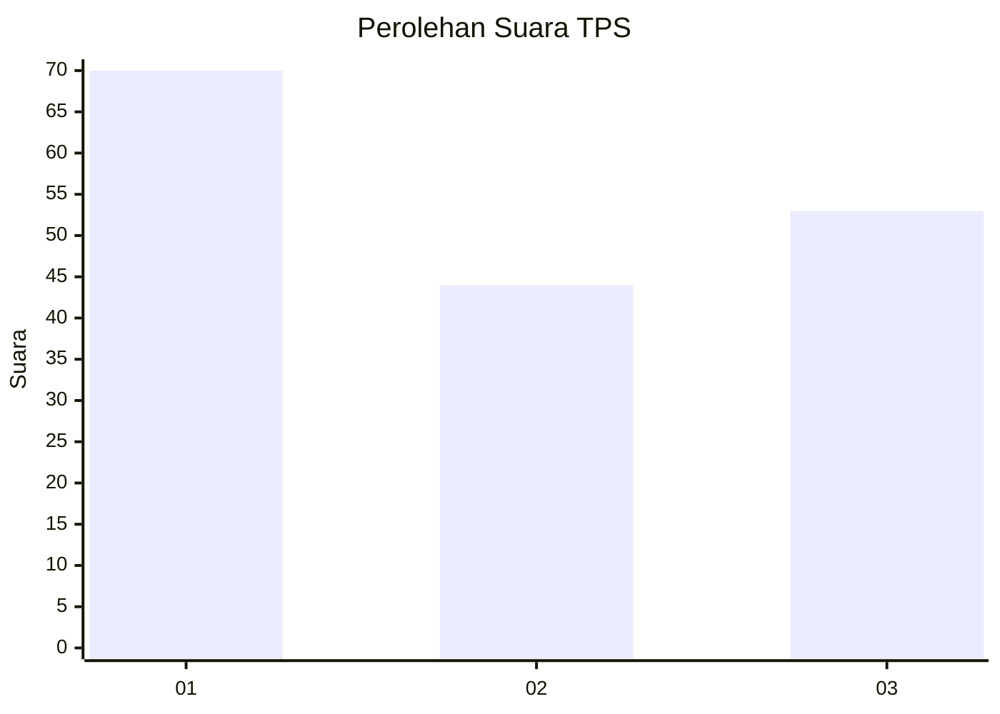
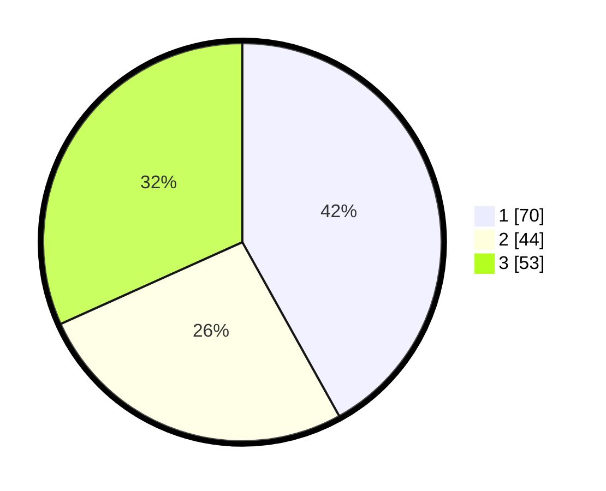

# Hasil

## Grafik

## Tabel

| No. | Nama Paslon    | Suara | Suara (raw) | Persentase |
|:--- |:-------------- | -----:| -----------:| ----------:|
| 1   | ANIES MUHAIMIN | 70    | [70][p-1]   | 41,92      |
| 2   | PRABOWO GIBRAN | 44    | [44][p-2]   | 26,35      |
| 3   | GANJAR MAHFUD  | 53    | [53][p-3]   | 31,74      |

[p-1]: https://github.com/gigit-pemilu/pemilu-2024-61-kalimantan-barat/blob/main/pilpres/hitung-suara/sub/61-kalimantan-barat/sub/01-sambas/sub/04-tebas/sub/2006-sejiram/sub/003-tps/sub/paslon-1.txt
[p-2]: https://github.com/gigit-pemilu/pemilu-2024-61-kalimantan-barat/blob/main/pilpres/hitung-suara/sub/61-kalimantan-barat/sub/01-sambas/sub/04-tebas/sub/2006-sejiram/sub/003-tps/sub/paslon-2.txt
[p-3]: https://github.com/gigit-pemilu/pemilu-2024-61-kalimantan-barat/blob/main/pilpres/hitung-suara/sub/61-kalimantan-barat/sub/01-sambas/sub/04-tebas/sub/2006-sejiram/sub/003-tps/sub/paslon-3.txt

## Foto C Plano

https://sirekap-obj-formc.kpu.go.id/1b89/pemilu/ppwp/61/01/04/20/06/6101042006003-20240214-221725--19754183-e22d-497c-87aa-4b3fd647a461.jpg

https://sirekap-obj-formc.kpu.go.id/1b89/pemilu/ppwp/61/01/04/20/06/6101042006003-20240214-221812--83d4938b-6b0a-4959-ae36-818cc3b85f7e.jpg

https://sirekap-obj-formc.kpu.go.id/1b89/pemilu/ppwp/61/01/04/20/06/6101042006003-20240219-201433--1e95f87d-6c1c-40ea-9fc3-d41314510b4d.jpg

## Metadata

| Key        | Value               |
| ---------- | ------------------- |
| Time Stamp | 2024-02-19 21:00:00 |

