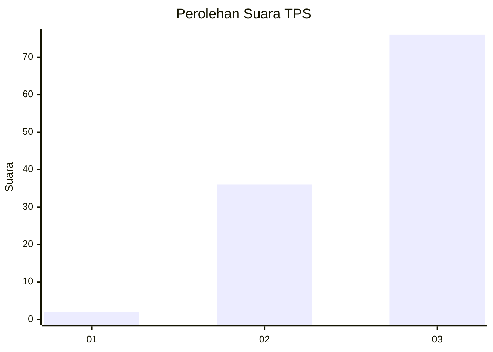
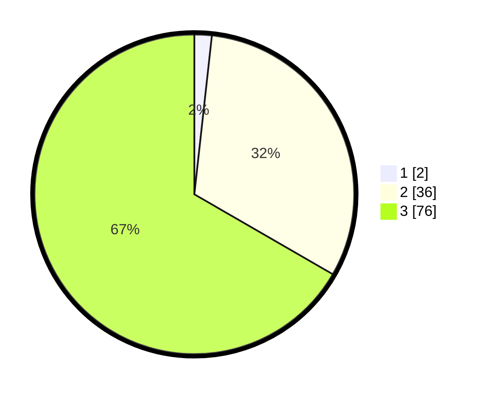

# Hasil

## Grafik

## Tabel

| No. | Nama Paslon    | Suara | Suara (raw) | Persentase |
|:--- |:-------------- | -----:| -----------:| ----------:|
| 1   | ANIES MUHAIMIN | 2     | [2][p-1]    | 1,75       |
| 2   | PRABOWO GIBRAN | 36    | [36][p-2]   | 31,58      |
| 3   | GANJAR MAHFUD  | 76    | [76][p-3]   | 66,67      |

[p-1]: https://github.com/gigit-pemilu/pemilu-2024-61-kalimantan-barat/blob/main/pilpres/hitung-suara/sub/61-kalimantan-barat/sub/01-sambas/sub/05-pemangkat/sub/2001-pemangkat-kota/sub/010-tps/sub/paslon-1.txt
[p-2]: https://github.com/gigit-pemilu/pemilu-2024-61-kalimantan-barat/blob/main/pilpres/hitung-suara/sub/61-kalimantan-barat/sub/01-sambas/sub/05-pemangkat/sub/2001-pemangkat-kota/sub/010-tps/sub/paslon-2.txt
[p-3]: https://github.com/gigit-pemilu/pemilu-2024-61-kalimantan-barat/blob/main/pilpres/hitung-suara/sub/61-kalimantan-barat/sub/01-sambas/sub/05-pemangkat/sub/2001-pemangkat-kota/sub/010-tps/sub/paslon-3.txt

## Foto C Plano

https://sirekap-obj-formc.kpu.go.id/8fad/pemilu/ppwp/61/01/05/20/01/6101052001010-20240215-195659--2e4115f4-2bbd-48cb-886d-00496f16e342.jpg

https://sirekap-obj-formc.kpu.go.id/8fad/pemilu/ppwp/61/01/05/20/01/6101052001010-20240215-195930--a5e178b6-0c65-4bc0-8e0a-388768ec18fb.jpg

https://sirekap-obj-formc.kpu.go.id/8fad/pemilu/ppwp/61/01/05/20/01/6101052001010-20240216-074314--8a0e4c72-dd63-4e72-928e-fb1c93aec94f.jpg

## Metadata

| Key        | Value               |
| ---------- | ------------------- |
| Time Stamp | 2024-02-16 22:01:00 |

