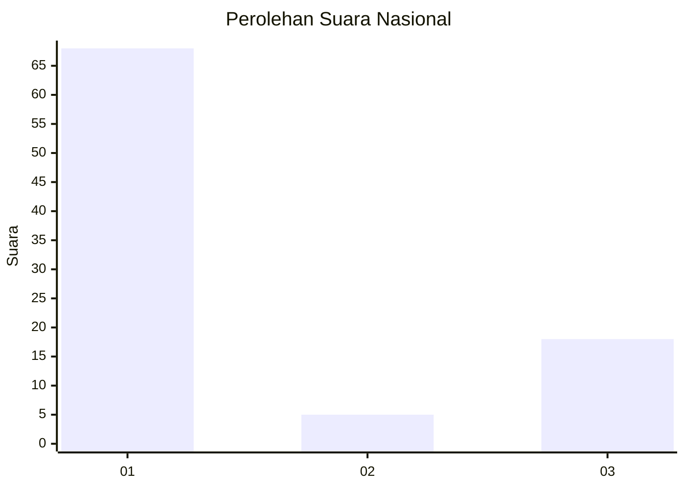
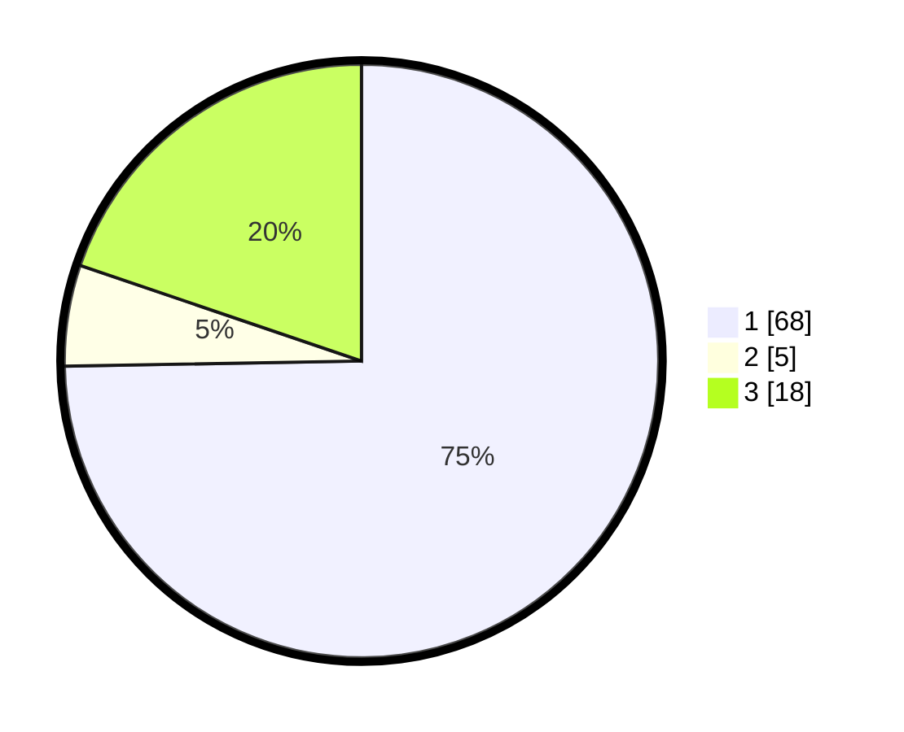

# Hasil

## Grafik

## Tabel

| No. | Nama Paslon    | Suara | Suara (raw) | Persentase |
|:--- |:-------------- | -----:| -----------:| ----------:|
| 1   | ANIES MUHAIMIN | 68    | [68][p-1]   | 74,73      |
| 2   | PRABOWO GIBRAN | 5     | [5][p-2]    | 5,49       |
| 3   | GANJAR MAHFUD  | 18    | [18][p-3]   | 19,78      |

[p-1]: https://github.com/gigit-pemilu/pemilu-2024/blob/main/pilpres/hitung-suara/sub/61-kalimantan-barat/sub/01-sambas/sub/05-pemangkat/sub/2013-perapakan/sub/003-tps/sub/paslon-1.txt
[p-2]: https://github.com/gigit-pemilu/pemilu-2024/blob/main/pilpres/hitung-suara/sub/61-kalimantan-barat/sub/01-sambas/sub/05-pemangkat/sub/2013-perapakan/sub/003-tps/sub/paslon-2.txt
[p-3]: https://github.com/gigit-pemilu/pemilu-2024/blob/main/pilpres/hitung-suara/sub/61-kalimantan-barat/sub/01-sambas/sub/05-pemangkat/sub/2013-perapakan/sub/003-tps/sub/paslon-3.txt

## Foto C Plano

https://sirekap-obj-formc.kpu.go.id/96bd/pemilu/ppwp/61/01/05/20/13/6101052013003-20240215-092018--62b2c191-b188-4ffe-8365-051eca1fa922.jpg

https://sirekap-obj-formc.kpu.go.id/96bd/pemilu/ppwp/61/01/05/20/13/6101052013003-20240222-145605--7e91b14c-1b18-4a63-9e66-45caedb8de3a.jpg

https://sirekap-obj-formc.kpu.go.id/96bd/pemilu/ppwp/61/01/05/20/13/6101052013003-20240215-092445--42151ee2-e2d4-4198-a3a5-da600c967142.jpg

## Metadata

| Key        | Value               |
| ---------- | ------------------- |
| Time Stamp | 2024-02-22 16:00:00 |

