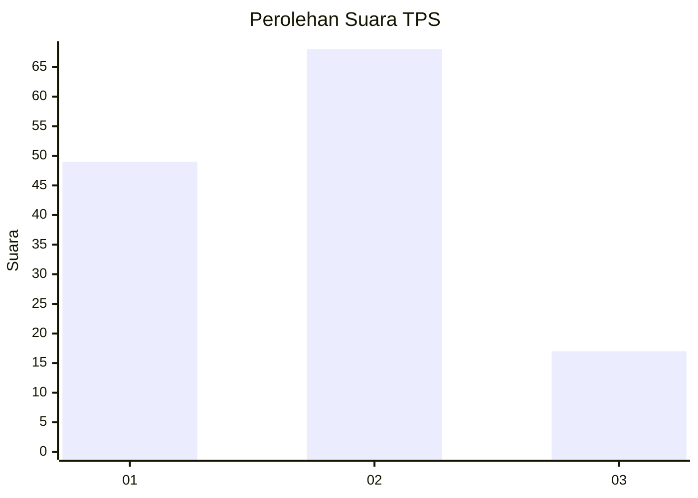
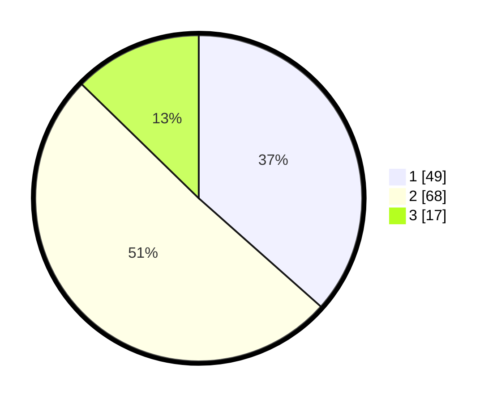

# Hasil

## Grafik

## Tabel

| No. | Nama Paslon    | Suara | Suara (raw) | Persentase |
|:--- |:-------------- | -----:| -----------:| ----------:|
| 1   | ANIES MUHAIMIN | 49    | [49][p-1]   | 36,57      |
| 2   | PRABOWO GIBRAN | 68    | [68][p-2]   | 50,75      |
| 3   | GANJAR MAHFUD  | 17    | [17][p-3]   | 12,69      |

[p-1]: https://github.com/gigit-pemilu/pemilu-2024-61-kalimantan-barat/blob/main/pilpres/hitung-suara/sub/61-kalimantan-barat/sub/01-sambas/sub/05-pemangkat/sub/2013-perapakan/sub/007-tps/sub/paslon-1.txt
[p-2]: https://github.com/gigit-pemilu/pemilu-2024-61-kalimantan-barat/blob/main/pilpres/hitung-suara/sub/61-kalimantan-barat/sub/01-sambas/sub/05-pemangkat/sub/2013-perapakan/sub/007-tps/sub/paslon-2.txt
[p-3]: https://github.com/gigit-pemilu/pemilu-2024-61-kalimantan-barat/blob/main/pilpres/hitung-suara/sub/61-kalimantan-barat/sub/01-sambas/sub/05-pemangkat/sub/2013-perapakan/sub/007-tps/sub/paslon-3.txt

## Foto C Plano

https://sirekap-obj-formc.kpu.go.id/0dc2/pemilu/ppwp/61/01/05/20/13/6101052013007-20240222-145803--69e0b637-276b-4c61-8b6a-9b9be1be8ebc.jpg

https://sirekap-obj-formc.kpu.go.id/0dc2/pemilu/ppwp/61/01/05/20/13/6101052013007-20240222-150650--b2740d06-b0c1-4cb0-8d9c-502aef3936dd.jpg

https://sirekap-obj-formc.kpu.go.id/0dc2/pemilu/ppwp/61/01/05/20/13/6101052013007-20240222-150812--cb863a4d-a6f6-492c-afa9-2a2cb272fc93.jpg

## Metadata

| Key        | Value               |
| ---------- | ------------------- |
| Time Stamp | 2024-02-24 22:31:28 |

