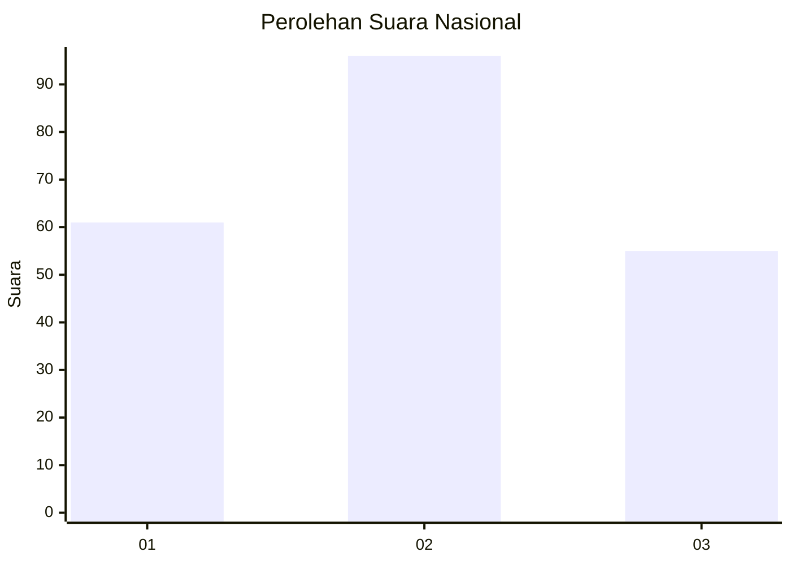
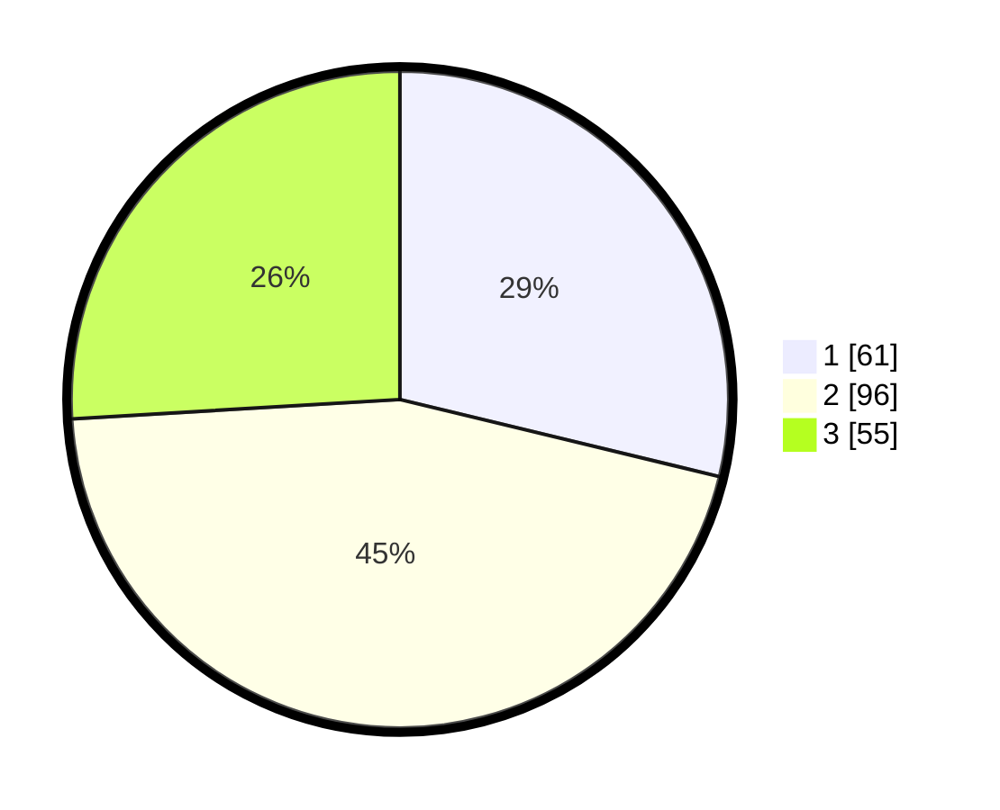

# Hasil

## Grafik

## Tabel

| No. | Nama Paslon    | Suara | Suara (raw) | Persentase |
|:--- |:-------------- | -----:| -----------:| ----------:|
| 1   | ANIES MUHAIMIN | 61    | [61][p-1]   | 28,77      |
| 2   | PRABOWO GIBRAN | 96    | [96][p-2]   | 45,28      |
| 3   | GANJAR MAHFUD  | 55    | [55][p-3]   | 25,94      |

[p-1]: https://github.com/gigit-pemilu/pemilu-2024/blob/main/pilpres/hitung-suara/sub/61-kalimantan-barat/sub/01-sambas/sub/08-paloh/sub/2001-sebubus/sub/001-tps/sub/paslon-1.txt
[p-2]: https://github.com/gigit-pemilu/pemilu-2024/blob/main/pilpres/hitung-suara/sub/61-kalimantan-barat/sub/01-sambas/sub/08-paloh/sub/2001-sebubus/sub/001-tps/sub/paslon-2.txt
[p-3]: https://github.com/gigit-pemilu/pemilu-2024/blob/main/pilpres/hitung-suara/sub/61-kalimantan-barat/sub/01-sambas/sub/08-paloh/sub/2001-sebubus/sub/001-tps/sub/paslon-3.txt

## Foto C Plano

https://sirekap-obj-formc.kpu.go.id/ca90/pemilu/ppwp/61/01/08/20/01/6101082001001-20240215-145114--87525068-29d8-4f1c-87c1-da263f75a4a4.jpg

https://sirekap-obj-formc.kpu.go.id/ca90/pemilu/ppwp/61/01/08/20/01/6101082001001-20240214-212241--4078b10a-c368-4018-b6aa-fa5817a7641f.jpg

https://sirekap-obj-formc.kpu.go.id/ca90/pemilu/ppwp/61/01/08/20/01/6101082001001-20240214-212324--4a553640-05b0-4a42-bde4-88f2b8f07390.jpg

## Metadata

| Key        | Value               |
| ---------- | ------------------- |
| Time Stamp | 2024-02-16 12:51:22 |

