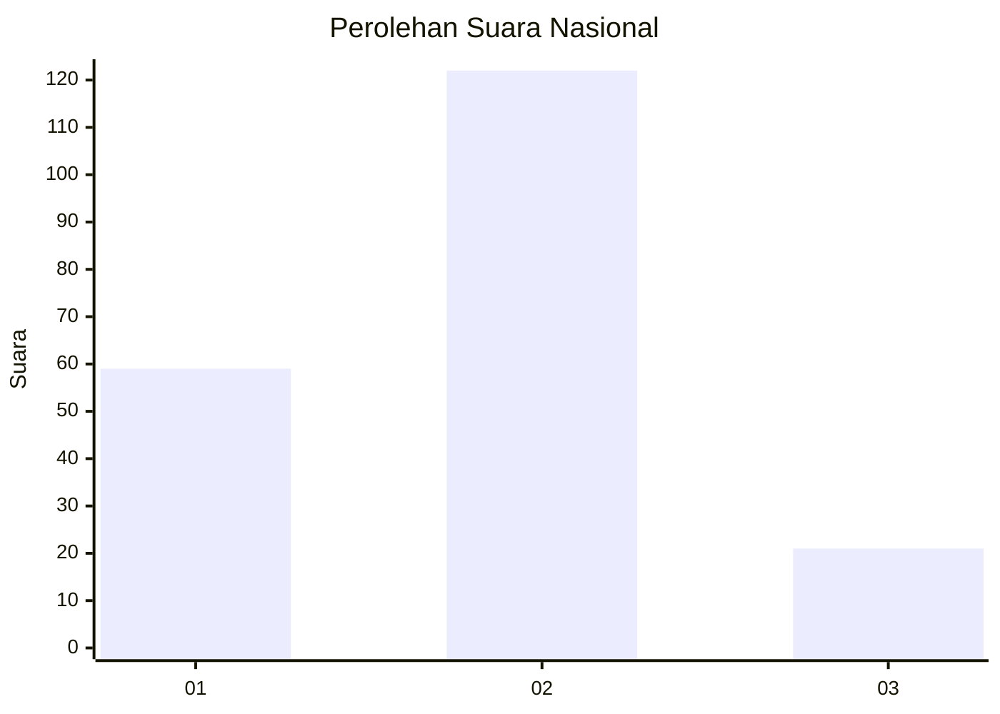
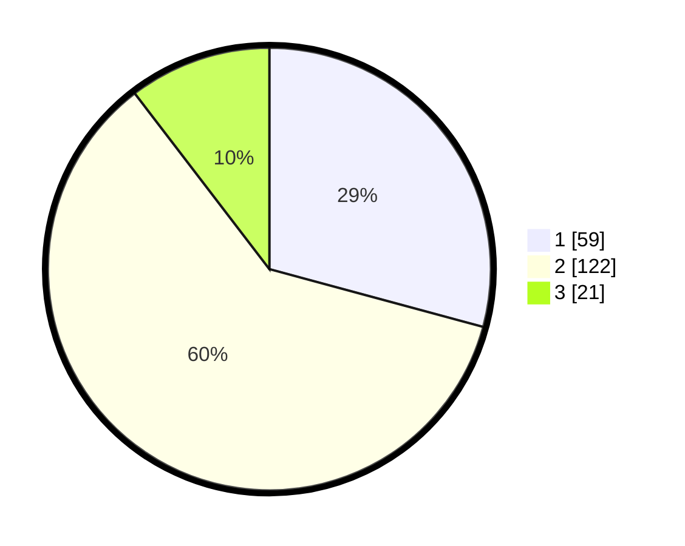

# Hasil

## Grafik

## Tabel

| No. | Nama Paslon    | Suara | Suara (raw) | Persentase |
|:--- |:-------------- | -----:| -----------:| ----------:|
| 1   | ANIES MUHAIMIN | 59    | [59][p-1]   | 29,21      |
| 2   | PRABOWO GIBRAN | 122   | [122][p-2]  | 60,40      |
| 3   | GANJAR MAHFUD  | 21    | [21][p-3]   | 10,40      |

[p-1]: https://github.com/gigit-pemilu/pemilu-2024/blob/main/pilpres/hitung-suara/sub/61-kalimantan-barat/sub/01-sambas/sub/08-paloh/sub/2001-sebubus/sub/005-tps/sub/paslon-1.txt
[p-2]: https://github.com/gigit-pemilu/pemilu-2024/blob/main/pilpres/hitung-suara/sub/61-kalimantan-barat/sub/01-sambas/sub/08-paloh/sub/2001-sebubus/sub/005-tps/sub/paslon-2.txt
[p-3]: https://github.com/gigit-pemilu/pemilu-2024/blob/main/pilpres/hitung-suara/sub/61-kalimantan-barat/sub/01-sambas/sub/08-paloh/sub/2001-sebubus/sub/005-tps/sub/paslon-3.txt

## Foto C Plano

https://sirekap-obj-formc.kpu.go.id/d930/pemilu/ppwp/61/01/08/20/01/6101082001005-20240214-212038--aaf25128-4bb3-4a3c-afa4-f223f3dd3bfc.jpg

https://sirekap-obj-formc.kpu.go.id/d930/pemilu/ppwp/61/01/08/20/01/6101082001005-20240214-212207--c083b86a-39e2-4f6a-bb6e-c6c6d44af41e.jpg

https://sirekap-obj-formc.kpu.go.id/d930/pemilu/ppwp/61/01/08/20/01/6101082001005-20240217-140755--42962d83-5030-46b3-88fc-80458b9cc5f7.jpg

## Metadata

| Key        | Value               |
| ---------- | ------------------- |
| Time Stamp | 2024-02-17 14:45:18 |

