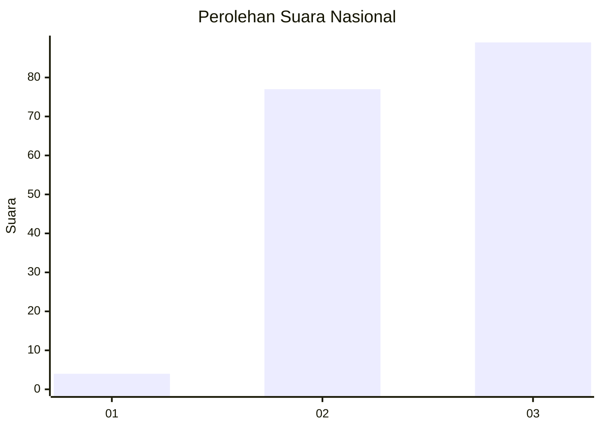
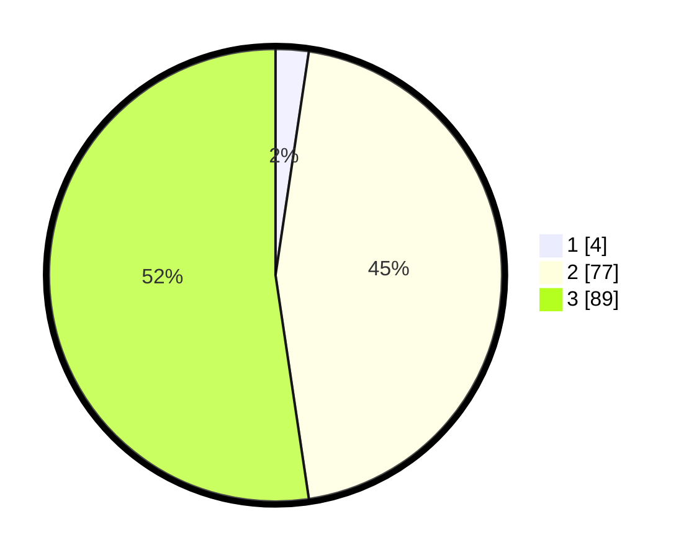

# Hasil

## Grafik

## Tabel

| No. | Nama Paslon    | Suara | Suara (raw) | Persentase |
|:--- |:-------------- | -----:| -----------:| ----------:|
| 1   | ANIES MUHAIMIN | 4     | [4][p-1]    | 2,35       |
| 2   | PRABOWO GIBRAN | 77    | [77][p-2]   | 45,29      |
| 3   | GANJAR MAHFUD  | 89    | [89][p-3]   | 52,35      |

[p-1]: https://github.com/gigit-pemilu/pemilu-2024/blob/main/pilpres/hitung-suara/sub/61-kalimantan-barat/sub/01-sambas/sub/08-paloh/sub/2004-tanah-hitam/sub/002-tps/sub/paslon-1.txt
[p-2]: https://github.com/gigit-pemilu/pemilu-2024/blob/main/pilpres/hitung-suara/sub/61-kalimantan-barat/sub/01-sambas/sub/08-paloh/sub/2004-tanah-hitam/sub/002-tps/sub/paslon-2.txt
[p-3]: https://github.com/gigit-pemilu/pemilu-2024/blob/main/pilpres/hitung-suara/sub/61-kalimantan-barat/sub/01-sambas/sub/08-paloh/sub/2004-tanah-hitam/sub/002-tps/sub/paslon-3.txt

## Foto C Plano

https://sirekap-obj-formc.kpu.go.id/ab34/pemilu/ppwp/61/01/08/20/04/6101082004002-20240217-101719--e5ed78f9-b7e9-43e1-9602-05661a4ad9e1.jpg

https://sirekap-obj-formc.kpu.go.id/ab34/pemilu/ppwp/61/01/08/20/04/6101082004002-20240214-160059--081bd597-1d6e-4b71-bc08-4a32cf065219.jpg

https://sirekap-obj-formc.kpu.go.id/ab34/pemilu/ppwp/61/01/08/20/04/6101082004002-20240214-155350--8e0e3421-85e6-48a7-bbca-ea9384314828.jpg

## Metadata

| Key        | Value               |
| ---------- | ------------------- |
| Time Stamp | 2024-02-17 10:30:03 |

