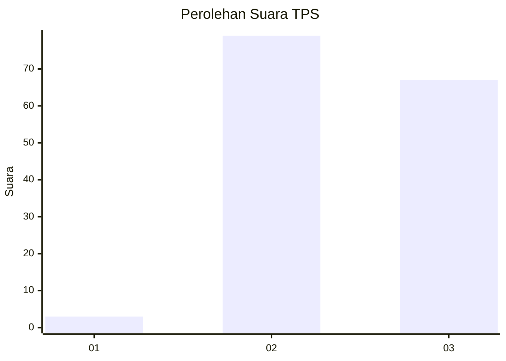
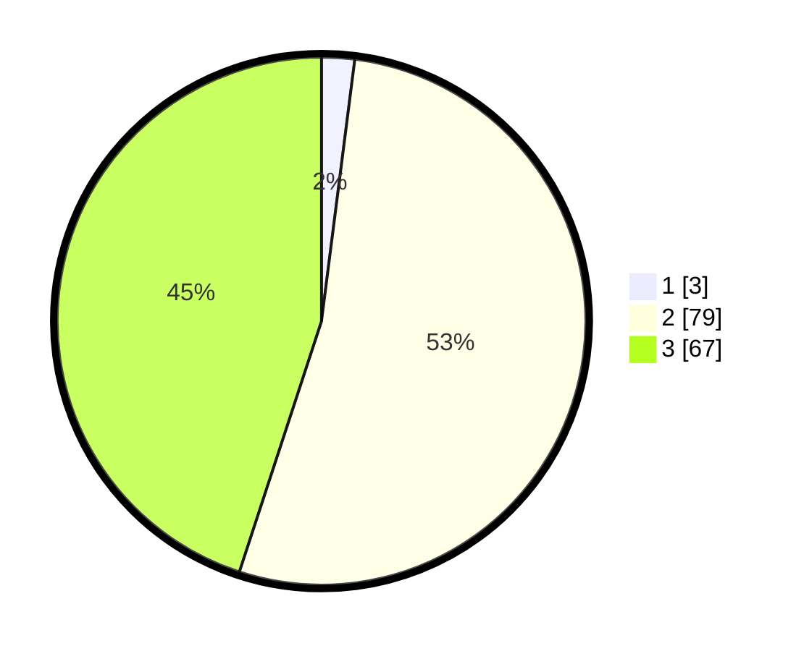

# Hasil

## Grafik

## Tabel

| No. | Nama Paslon    | Suara | Suara (raw) | Persentase |
|:--- |:-------------- | -----:| -----------:| ----------:|
| 1   | ANIES MUHAIMIN | 3     | [3][p-1]    | 2,01       |
| 2   | PRABOWO GIBRAN | 79    | [79][p-2]   | 53,02      |
| 3   | GANJAR MAHFUD  | 67    | [67][p-3]   | 44,97      |

[p-1]: https://github.com/gigit-pemilu/pemilu-2024-61-kalimantan-barat/blob/main/pilpres/hitung-suara/sub/61-kalimantan-barat/sub/01-sambas/sub/10-subah/sub/2001-balai-gemuruh/sub/005-tps/sub/paslon-1.txt
[p-2]: https://github.com/gigit-pemilu/pemilu-2024-61-kalimantan-barat/blob/main/pilpres/hitung-suara/sub/61-kalimantan-barat/sub/01-sambas/sub/10-subah/sub/2001-balai-gemuruh/sub/005-tps/sub/paslon-2.txt
[p-3]: https://github.com/gigit-pemilu/pemilu-2024-61-kalimantan-barat/blob/main/pilpres/hitung-suara/sub/61-kalimantan-barat/sub/01-sambas/sub/10-subah/sub/2001-balai-gemuruh/sub/005-tps/sub/paslon-3.txt

## Foto C Plano

https://sirekap-obj-formc.kpu.go.id/808d/pemilu/ppwp/61/01/10/20/01/6101102001005-20240215-002303--8e1b185b-53e1-408f-9c4b-12f182e9bdeb.jpg

https://sirekap-obj-formc.kpu.go.id/808d/pemilu/ppwp/61/01/10/20/01/6101102001005-20240215-002410--16df494b-1c7e-4150-8ab5-7b8bc9c5c6a7.jpg

https://sirekap-obj-formc.kpu.go.id/808d/pemilu/ppwp/61/01/10/20/01/6101102001005-20240215-002614--29cd133f-63ce-4c99-9346-a8a3d15898d3.jpg

## Metadata

| Key        | Value               |
| ---------- | ------------------- |
| Time Stamp | 2024-02-22 17:00:00 |

