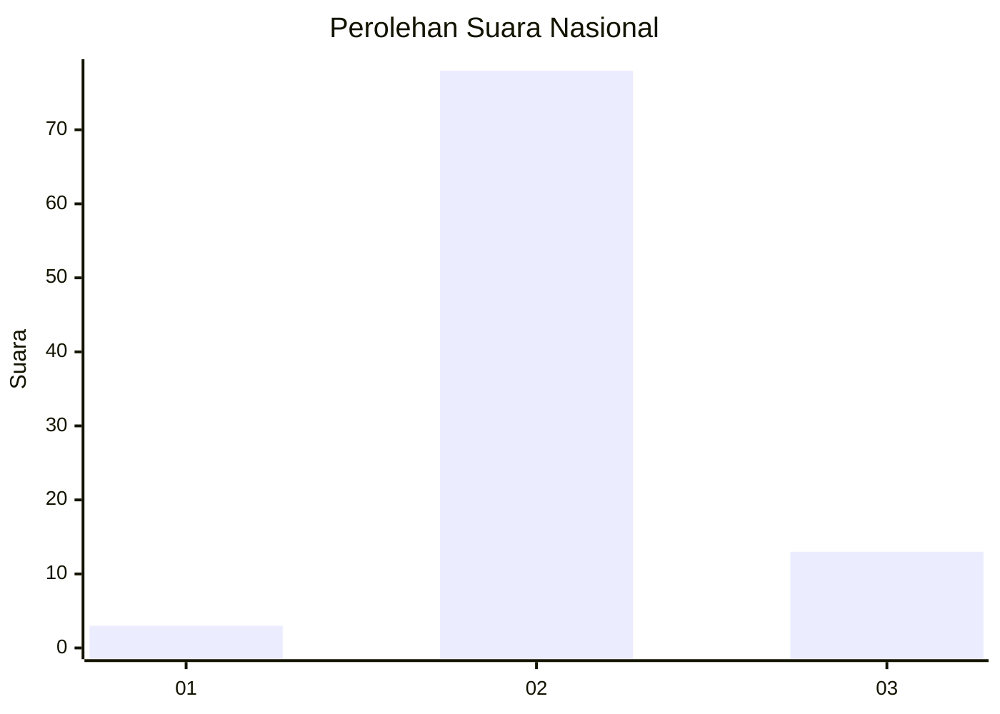
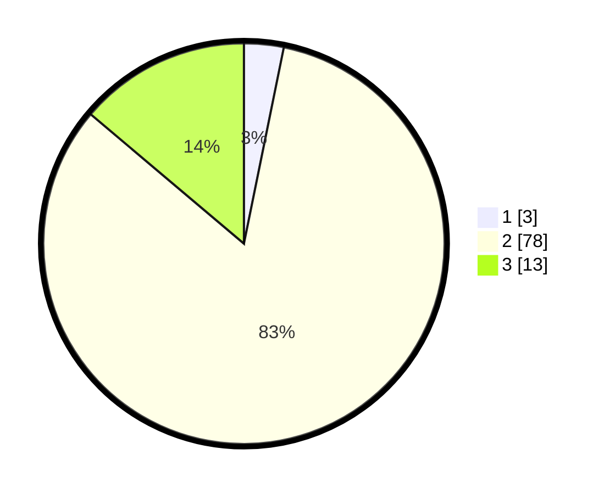

# Hasil

## Grafik

## Tabel

| No. | Nama Paslon    | Suara | Suara (raw) | Persentase |
|:--- |:-------------- | -----:| -----------:| ----------:|
| 1   | ANIES MUHAIMIN | 3     | [3][p-1]    | 3,19       |
| 2   | PRABOWO GIBRAN | 78    | [78][p-2]   | 82,98      |
| 3   | GANJAR MAHFUD  | 13    | [13][p-3]   | 13,83      |

[p-1]: https://github.com/gigit-pemilu/pemilu-2024/blob/main/pilpres/hitung-suara/sub/61-kalimantan-barat/sub/01-sambas/sub/10-subah/sub/2002-sungai-sapa'/sub/003-tps/sub/paslon-1.txt
[p-2]: https://github.com/gigit-pemilu/pemilu-2024/blob/main/pilpres/hitung-suara/sub/61-kalimantan-barat/sub/01-sambas/sub/10-subah/sub/2002-sungai-sapa'/sub/003-tps/sub/paslon-2.txt
[p-3]: https://github.com/gigit-pemilu/pemilu-2024/blob/main/pilpres/hitung-suara/sub/61-kalimantan-barat/sub/01-sambas/sub/10-subah/sub/2002-sungai-sapa'/sub/003-tps/sub/paslon-3.txt

## Foto C Plano

https://sirekap-obj-formc.kpu.go.id/3b8e/pemilu/ppwp/61/01/10/20/02/6101102002003-20240215-012053--cab5b4dd-197a-41f5-bf6c-efed3cc2c848.jpg

https://sirekap-obj-formc.kpu.go.id/3b8e/pemilu/ppwp/61/01/10/20/02/6101102002003-20240215-012241--91b55e54-d3f8-4ba0-a364-43b2dabada29.jpg

https://sirekap-obj-formc.kpu.go.id/3b8e/pemilu/ppwp/61/01/10/20/02/6101102002003-20240215-012412--99badf7d-1aa0-4cb8-98ff-eee0ace5acc0.jpg

## Metadata

| Key        | Value               |
| ---------- | ------------------- |
| Time Stamp | 2024-02-19 06:16:00 |

