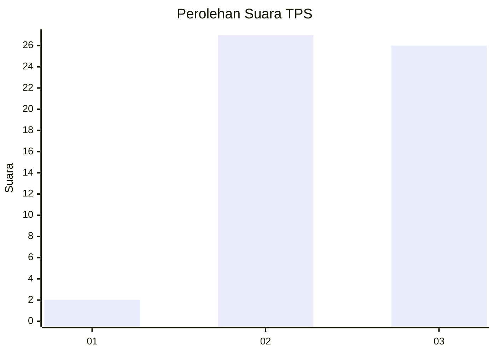
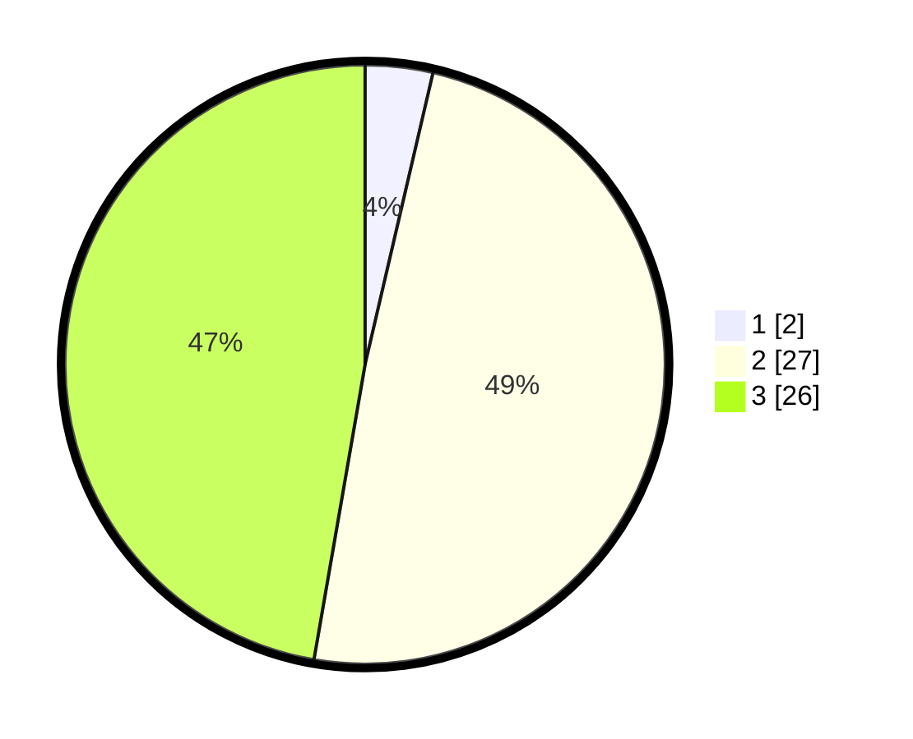

# Hasil

## Grafik

## Tabel

| No. | Nama Paslon    | Suara | Suara (raw) | Persentase |
|:--- |:-------------- | -----:| -----------:| ----------:|
| 1   | ANIES MUHAIMIN | 2     | [2][p-1]    | 3,64       |
| 2   | PRABOWO GIBRAN | 27    | [27][p-2]   | 49,09      |
| 3   | GANJAR MAHFUD  | 26    | [26][p-3]   | 47,27      |

[p-1]: https://github.com/gigit-pemilu/pemilu-2024-61-kalimantan-barat/blob/main/pilpres/hitung-suara/sub/61-kalimantan-barat/sub/01-sambas/sub/10-subah/sub/2002-sungai-sapa'/sub/007-tps/sub/paslon-1.txt
[p-2]: https://github.com/gigit-pemilu/pemilu-2024-61-kalimantan-barat/blob/main/pilpres/hitung-suara/sub/61-kalimantan-barat/sub/01-sambas/sub/10-subah/sub/2002-sungai-sapa'/sub/007-tps/sub/paslon-2.txt
[p-3]: https://github.com/gigit-pemilu/pemilu-2024-61-kalimantan-barat/blob/main/pilpres/hitung-suara/sub/61-kalimantan-barat/sub/01-sambas/sub/10-subah/sub/2002-sungai-sapa'/sub/007-tps/sub/paslon-3.txt

## Foto C Plano

https://sirekap-obj-formc.kpu.go.id/7516/pemilu/ppwp/61/01/10/20/02/6101102002007-20240215-083531--cb50a4cd-8ee4-4f5a-ba22-a6b81838e4b6.jpg

https://sirekap-obj-formc.kpu.go.id/7516/pemilu/ppwp/61/01/10/20/02/6101102002007-20240215-085004--b46f9b80-d78d-415c-b0a7-9077224eb796.jpg

https://sirekap-obj-formc.kpu.go.id/7516/pemilu/ppwp/61/01/10/20/02/6101102002007-20240215-085251--45d750e5-48b7-43cc-9e39-2be0c6a26dd4.jpg

## Metadata

| Key        | Value               |
| ---------- | ------------------- |
| Time Stamp | 2024-02-19 06:16:00 |

