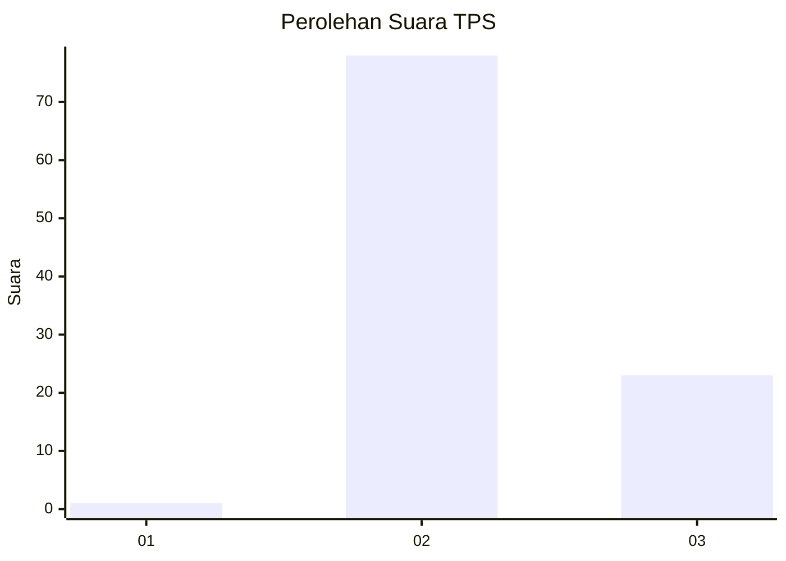
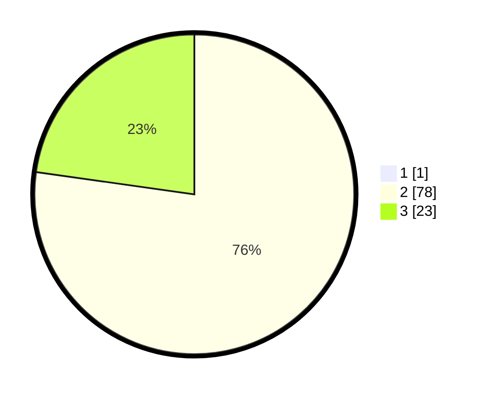

# Hasil

## Grafik

## Tabel

| No. | Nama Paslon    | Suara | Suara (raw) | Persentase |
|:--- |:-------------- | -----:| -----------:| ----------:|
| 1   | ANIES MUHAIMIN | 1     | [1][p-1]    | 0,98       |
| 2   | PRABOWO GIBRAN | 78    | [78][p-2]   | 76,47      |
| 3   | GANJAR MAHFUD  | 23    | [23][p-3]   | 22,55      |

[p-1]: https://github.com/gigit-pemilu/pemilu-2024-61-kalimantan-barat/blob/main/pilpres/hitung-suara/sub/61-kalimantan-barat/sub/01-sambas/sub/10-subah/sub/2005-tebuah-elok/sub/005-tps/sub/paslon-1.txt
[p-2]: https://github.com/gigit-pemilu/pemilu-2024-61-kalimantan-barat/blob/main/pilpres/hitung-suara/sub/61-kalimantan-barat/sub/01-sambas/sub/10-subah/sub/2005-tebuah-elok/sub/005-tps/sub/paslon-2.txt
[p-3]: https://github.com/gigit-pemilu/pemilu-2024-61-kalimantan-barat/blob/main/pilpres/hitung-suara/sub/61-kalimantan-barat/sub/01-sambas/sub/10-subah/sub/2005-tebuah-elok/sub/005-tps/sub/paslon-3.txt

## Foto C Plano

https://sirekap-obj-formc.kpu.go.id/3b6a/pemilu/ppwp/61/01/10/20/05/6101102005005-20240215-053120--e3a62f93-b47b-489b-b53d-21e11fe06373.jpg

https://sirekap-obj-formc.kpu.go.id/3b6a/pemilu/ppwp/61/01/10/20/05/6101102005005-20240215-032202--50830da8-7c7f-41b2-8693-03aefb596503.jpg

https://sirekap-obj-formc.kpu.go.id/3b6a/pemilu/ppwp/61/01/10/20/05/6101102005005-20240215-032532--dd76cc5c-b36a-4c32-9277-eafb309fae9b.jpg

## Metadata

| Key        | Value               |
| ---------- | ------------------- |
| Time Stamp | 2024-02-19 06:16:00 |

