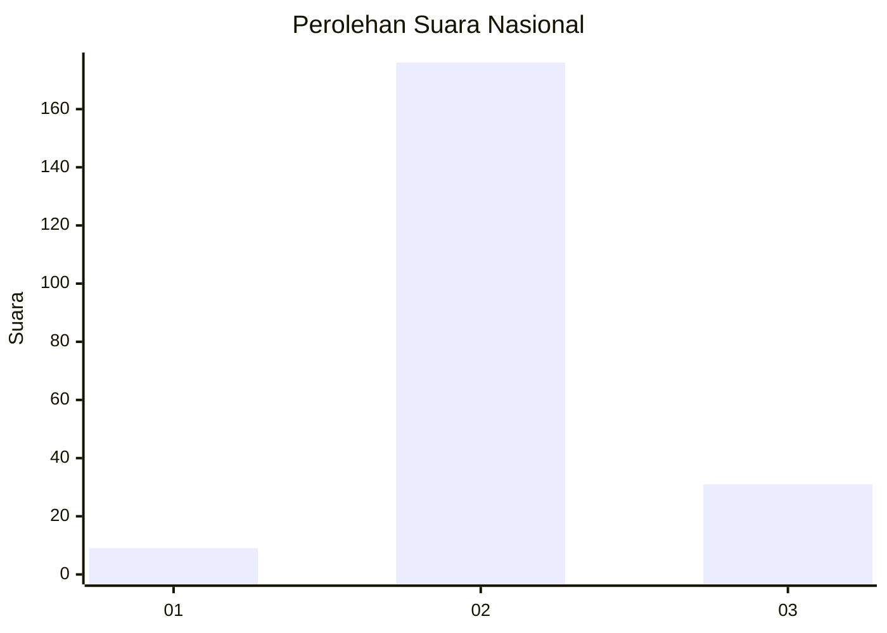
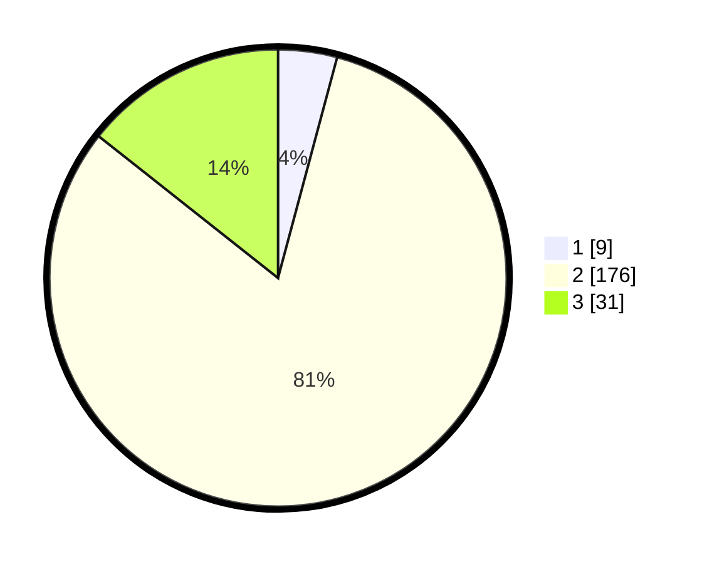

# Hasil

## Grafik

## Tabel

| No. | Nama Paslon    | Suara | Suara (raw) | Persentase |
|:--- |:-------------- | -----:| -----------:| ----------:|
| 1   | ANIES MUHAIMIN | 9     | [9][p-1]    | 4,17       |
| 2   | PRABOWO GIBRAN | 176   | [176][p-2]  | 81,48      |
| 3   | GANJAR MAHFUD  | 31    | [31][p-3]   | 14,35      |

[p-1]: https://github.com/gigit-pemilu/pemilu-2024/blob/main/pilpres/hitung-suara/sub/61-kalimantan-barat/sub/01-sambas/sub/10-subah/sub/2006-sungai-deden/sub/003-tps/sub/paslon-1.txt
[p-2]: https://github.com/gigit-pemilu/pemilu-2024/blob/main/pilpres/hitung-suara/sub/61-kalimantan-barat/sub/01-sambas/sub/10-subah/sub/2006-sungai-deden/sub/003-tps/sub/paslon-2.txt
[p-3]: https://github.com/gigit-pemilu/pemilu-2024/blob/main/pilpres/hitung-suara/sub/61-kalimantan-barat/sub/01-sambas/sub/10-subah/sub/2006-sungai-deden/sub/003-tps/sub/paslon-3.txt

## Foto C Plano

https://sirekap-obj-formc.kpu.go.id/1ada/pemilu/ppwp/61/01/10/20/06/6101102006003-20240214-191835--bf015fbb-8ef4-49e8-bd1f-8777df38b515.jpg

https://sirekap-obj-formc.kpu.go.id/1ada/pemilu/ppwp/61/01/10/20/06/6101102006003-20240214-191948--5fb1a74d-26cb-4b31-b2a0-ba5fc25ebc80.jpg

https://sirekap-obj-formc.kpu.go.id/1ada/pemilu/ppwp/61/01/10/20/06/6101102006003-20240214-192041--fe400a6e-909f-47df-8402-10b6f6b10db6.jpg

## Metadata

| Key        | Value               |
| ---------- | ------------------- |
| Time Stamp | 2024-02-19 06:16:00 |

