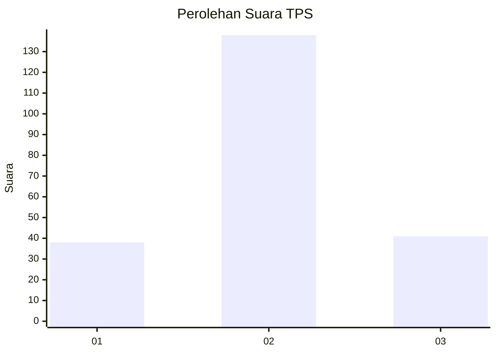
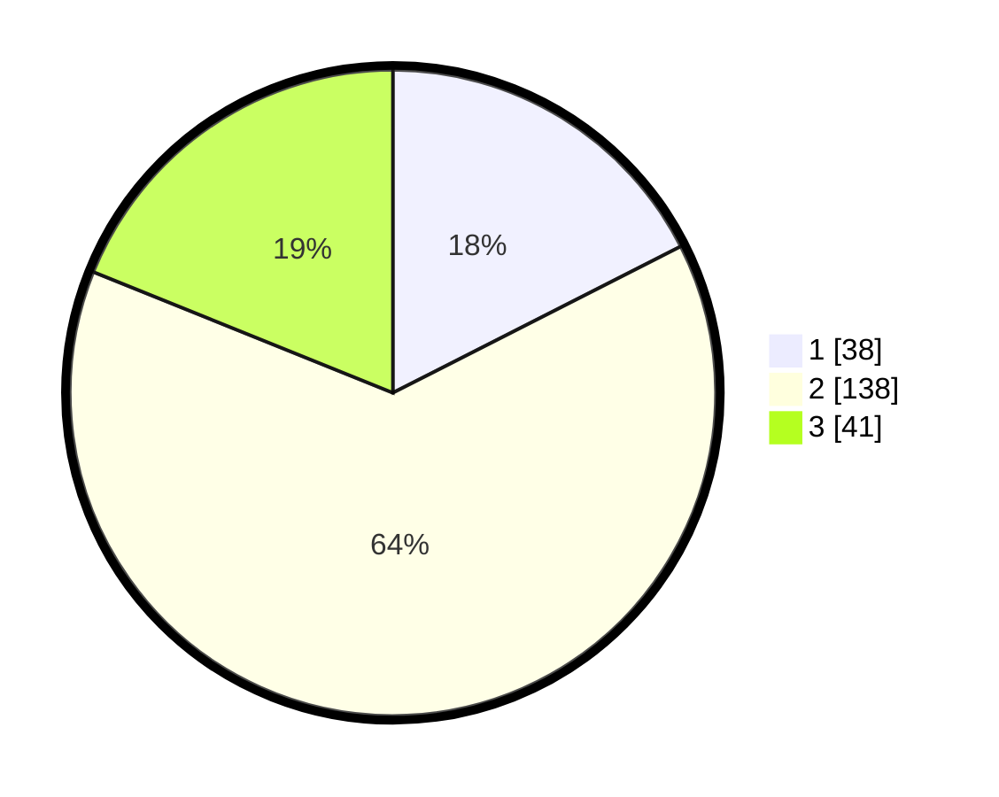

# Hasil

## Grafik

## Tabel

| No. | Nama Paslon    | Suara | Suara (raw) | Persentase |
|:--- |:-------------- | -----:| -----------:| ----------:|
| 1   | ANIES MUHAIMIN | 38    | [38][p-1]   | 17,51      |
| 2   | PRABOWO GIBRAN | 138   | [138][p-2]  | 63,59      |
| 3   | GANJAR MAHFUD  | 41    | [41][p-3]   | 18,89      |

[p-1]: https://github.com/gigit-pemilu/pemilu-2024-61-kalimantan-barat/blob/main/pilpres/hitung-suara/sub/61-kalimantan-barat/sub/01-sambas/sub/10-subah/sub/2013-sapak-hulu-trans/sub/003-tps/sub/paslon-1.txt
[p-2]: https://github.com/gigit-pemilu/pemilu-2024-61-kalimantan-barat/blob/main/pilpres/hitung-suara/sub/61-kalimantan-barat/sub/01-sambas/sub/10-subah/sub/2013-sapak-hulu-trans/sub/003-tps/sub/paslon-2.txt
[p-3]: https://github.com/gigit-pemilu/pemilu-2024-61-kalimantan-barat/blob/main/pilpres/hitung-suara/sub/61-kalimantan-barat/sub/01-sambas/sub/10-subah/sub/2013-sapak-hulu-trans/sub/003-tps/sub/paslon-3.txt

## Foto C Plano

https://sirekap-obj-formc.kpu.go.id/8335/pemilu/ppwp/61/01/10/20/13/6101102013003-20240215-044233--ab8e4fe5-56cd-4377-ae79-1543fa86a25a.jpg

https://sirekap-obj-formc.kpu.go.id/8335/pemilu/ppwp/61/01/10/20/13/6101102013003-20240215-044352--efea41aa-cb35-4356-8c2c-00e7a946d8d4.jpg

https://sirekap-obj-formc.kpu.go.id/8335/pemilu/ppwp/61/01/10/20/13/6101102013003-20240215-044454--64a4585a-0aa0-41da-a160-4fa3b7dd13ce.jpg

## Metadata

| Key        | Value               |
| ---------- | ------------------- |
| Time Stamp | 2024-02-19 06:16:00 |

