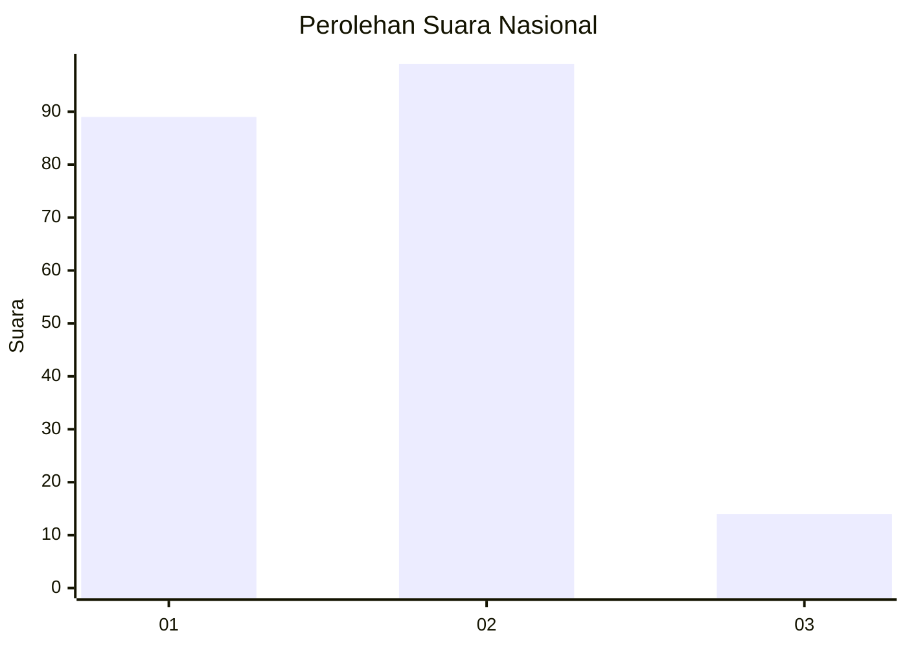
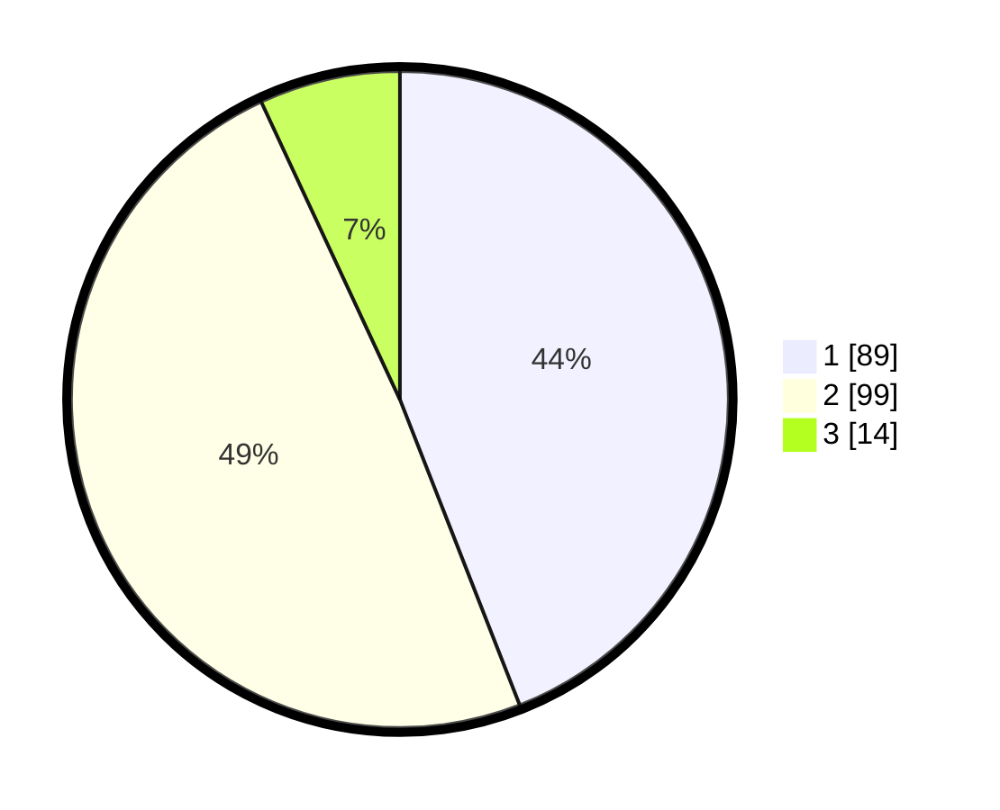

# Hasil

## Grafik

## Tabel

| No. | Nama Paslon    | Suara | Suara (raw) | Persentase |
|:--- |:-------------- | -----:| -----------:| ----------:|
| 1   | ANIES MUHAIMIN | 89    | [89][p-1]   | 44,06      |
| 2   | PRABOWO GIBRAN | 99    | [99][p-2]   | 49,01      |
| 3   | GANJAR MAHFUD  | 14    | [14][p-3]   | 6,93       |

[p-1]: https://github.com/gigit-pemilu/pemilu-2024/blob/main/pilpres/hitung-suara/sub/61-kalimantan-barat/sub/01-sambas/sub/11-galing/sub/2001-sagu/sub/003-tps/sub/paslon-1.txt
[p-2]: https://github.com/gigit-pemilu/pemilu-2024/blob/main/pilpres/hitung-suara/sub/61-kalimantan-barat/sub/01-sambas/sub/11-galing/sub/2001-sagu/sub/003-tps/sub/paslon-2.txt
[p-3]: https://github.com/gigit-pemilu/pemilu-2024/blob/main/pilpres/hitung-suara/sub/61-kalimantan-barat/sub/01-sambas/sub/11-galing/sub/2001-sagu/sub/003-tps/sub/paslon-3.txt

## Foto C Plano

https://sirekap-obj-formc.kpu.go.id/4d83/pemilu/ppwp/61/01/11/20/01/6101112001003-20240217-110742--a68d8c70-c3fc-4a30-8d4b-aa862127f789.jpg

https://sirekap-obj-formc.kpu.go.id/4d83/pemilu/ppwp/61/01/11/20/01/6101112001003-20240217-110642--e54b2322-7125-42fe-abc8-7728159ab736.jpg

https://sirekap-obj-formc.kpu.go.id/4d83/pemilu/ppwp/61/01/11/20/01/6101112001003-20240217-110707--1eb26e0c-2ca9-4309-9fc2-c82b584190ca.jpg

## Metadata

| Key        | Value               |
| ---------- | ------------------- |
| Time Stamp | 2024-02-22 20:00:00 |

