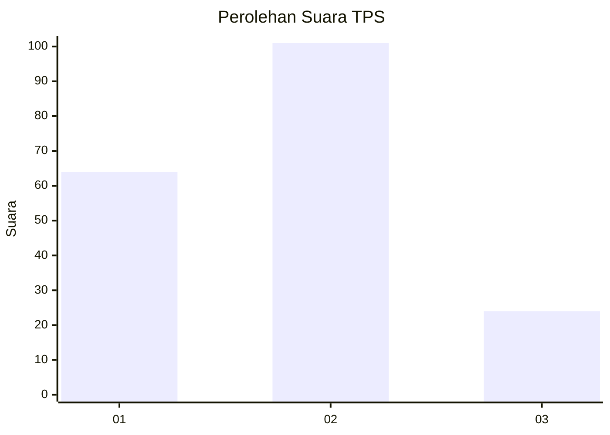
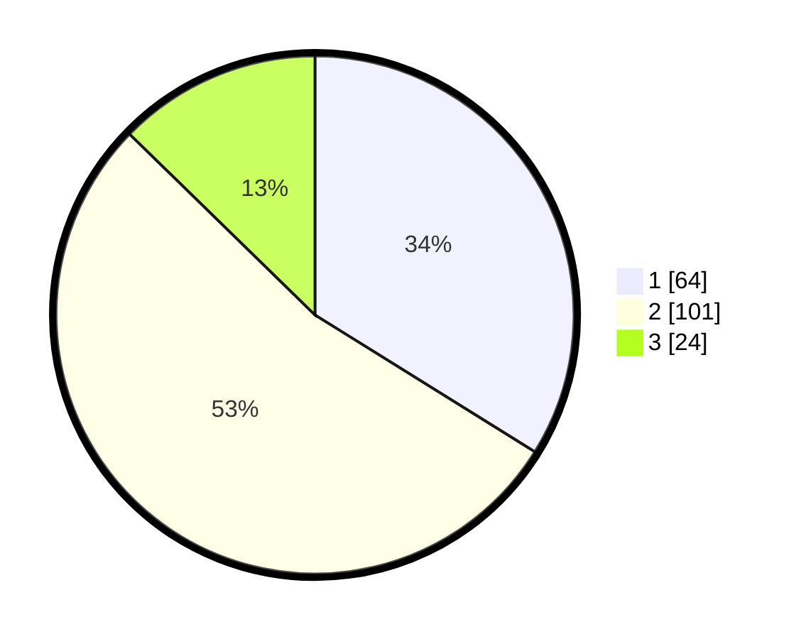

# Hasil

## Grafik

## Tabel

| No. | Nama Paslon    | Suara | Suara (raw) | Persentase |
|:--- |:-------------- | -----:| -----------:| ----------:|
| 1   | ANIES MUHAIMIN | 64    | [64][p-1]   | 33,86      |
| 2   | PRABOWO GIBRAN | 101   | [101][p-2]  | 53,44      |
| 3   | GANJAR MAHFUD  | 24    | [24][p-3]   | 12,70      |

[p-1]: https://github.com/gigit-pemilu/pemilu-2024-61-kalimantan-barat/blob/main/pilpres/hitung-suara/sub/61-kalimantan-barat/sub/01-sambas/sub/11-galing/sub/2001-sagu/sub/005-tps/sub/paslon-1.txt
[p-2]: https://github.com/gigit-pemilu/pemilu-2024-61-kalimantan-barat/blob/main/pilpres/hitung-suara/sub/61-kalimantan-barat/sub/01-sambas/sub/11-galing/sub/2001-sagu/sub/005-tps/sub/paslon-2.txt
[p-3]: https://github.com/gigit-pemilu/pemilu-2024-61-kalimantan-barat/blob/main/pilpres/hitung-suara/sub/61-kalimantan-barat/sub/01-sambas/sub/11-galing/sub/2001-sagu/sub/005-tps/sub/paslon-3.txt

## Foto C Plano

https://sirekap-obj-formc.kpu.go.id/ebeb/pemilu/ppwp/61/01/11/20/01/6101112001005-20240217-112656--cffbb228-42d9-4a73-9f6d-8b582eb8b605.jpg

https://sirekap-obj-formc.kpu.go.id/ebeb/pemilu/ppwp/61/01/11/20/01/6101112001005-20240217-112703--f83efcf9-b94a-4abc-ab0b-ff8b2de0bf59.jpg

https://sirekap-obj-formc.kpu.go.id/ebeb/pemilu/ppwp/61/01/11/20/01/6101112001005-20240217-112722--8ee8881f-1416-47fe-be47-27e3fc769954.jpg

## Metadata

| Key        | Value               |
| ---------- | ------------------- |
| Time Stamp | 2024-02-22 20:00:00 |

