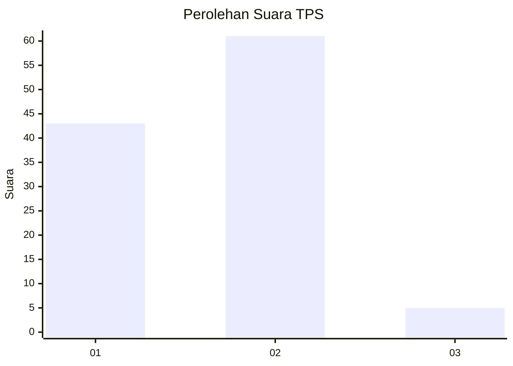
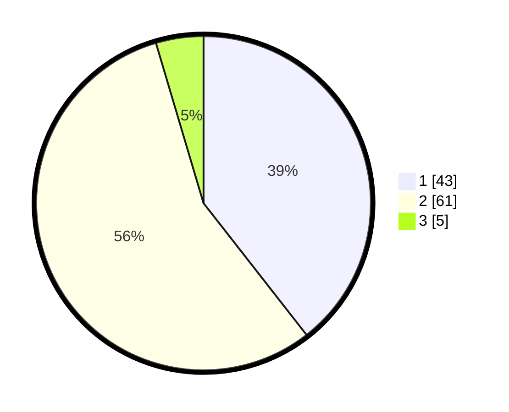

# Hasil

## Grafik

## Tabel

| No. | Nama Paslon    | Suara | Suara (raw) | Persentase |
|:--- |:-------------- | -----:| -----------:| ----------:|
| 1   | ANIES MUHAIMIN | 43    | [43][p-1]   | 39,45      |
| 2   | PRABOWO GIBRAN | 61    | [61][p-2]   | 55,96      |
| 3   | GANJAR MAHFUD  | 5     | [5][p-3]    | 4,59       |

[p-1]: https://github.com/gigit-pemilu/pemilu-2024-61-kalimantan-barat/blob/main/pilpres/hitung-suara/sub/61-kalimantan-barat/sub/01-sambas/sub/11-galing/sub/2004-tempapan-kuala/sub/004-tps/sub/paslon-1.txt
[p-2]: https://github.com/gigit-pemilu/pemilu-2024-61-kalimantan-barat/blob/main/pilpres/hitung-suara/sub/61-kalimantan-barat/sub/01-sambas/sub/11-galing/sub/2004-tempapan-kuala/sub/004-tps/sub/paslon-2.txt
[p-3]: https://github.com/gigit-pemilu/pemilu-2024-61-kalimantan-barat/blob/main/pilpres/hitung-suara/sub/61-kalimantan-barat/sub/01-sambas/sub/11-galing/sub/2004-tempapan-kuala/sub/004-tps/sub/paslon-3.txt

## Foto C Plano

https://sirekap-obj-formc.kpu.go.id/433b/pemilu/ppwp/61/01/11/20/04/6101112004004-20240214-150514--0981437e-9868-4aa2-a8ea-5ae3a9ad3f7e.jpg

https://sirekap-obj-formc.kpu.go.id/433b/pemilu/ppwp/61/01/11/20/04/6101112004004-20240214-145631--c7e74ab8-917e-4e2f-9ee3-11348c81db3a.jpg

https://sirekap-obj-formc.kpu.go.id/433b/pemilu/ppwp/61/01/11/20/04/6101112004004-20240214-150550--6ac42e44-f8a7-446d-921f-17846f3b934d.jpg

## Metadata

| Key        | Value               |
| ---------- | ------------------- |
| Time Stamp | 2024-02-24 22:31:28 |

