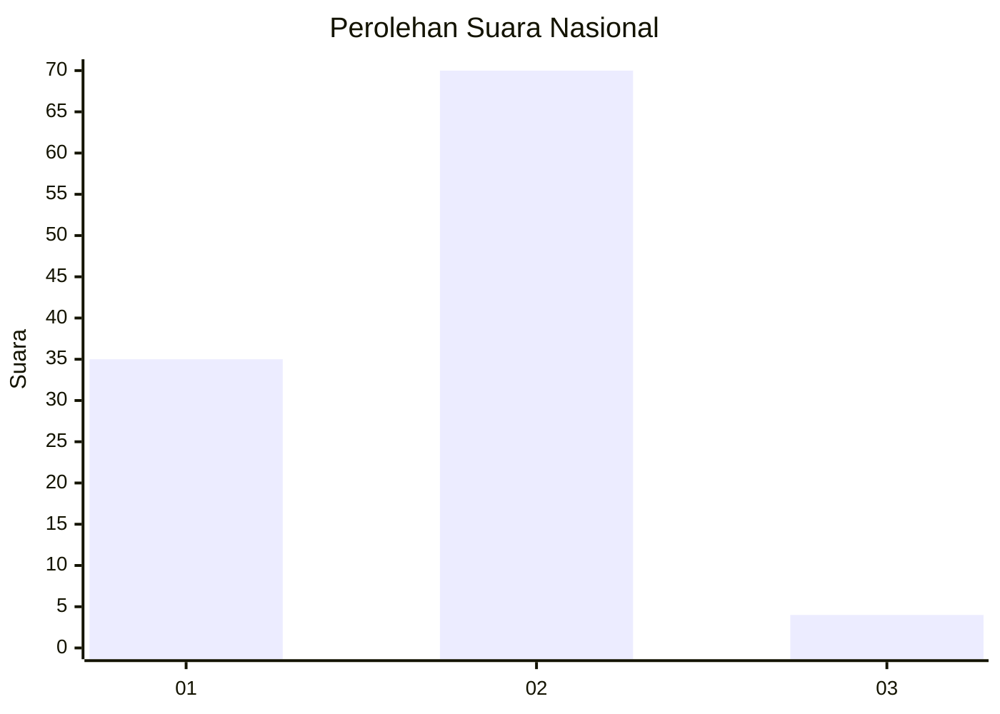
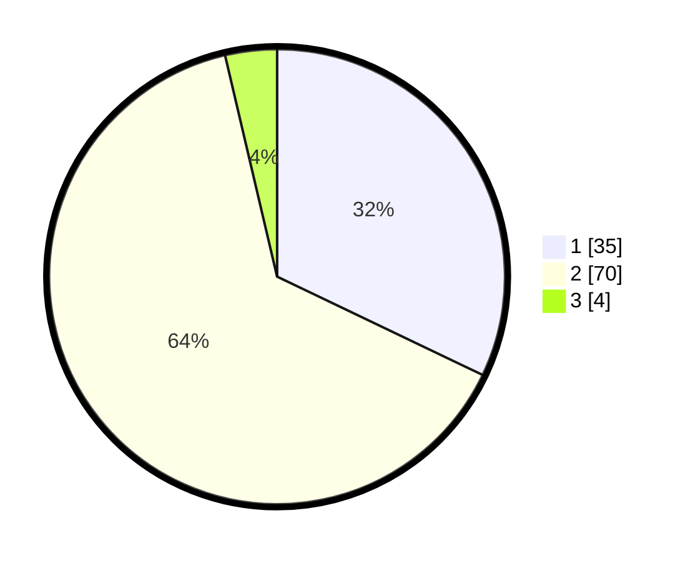

# Hasil

## Grafik

## Tabel

| No. | Nama Paslon    | Suara | Suara (raw) | Persentase |
|:--- |:-------------- | -----:| -----------:| ----------:|
| 1   | ANIES MUHAIMIN | 35    | [35][p-1]   | 32,11      |
| 2   | PRABOWO GIBRAN | 70    | [70][p-2]   | 64,22      |
| 3   | GANJAR MAHFUD  | 4     | [4][p-3]    | 3,67       |

[p-1]: https://github.com/gigit-pemilu/pemilu-2024/blob/main/pilpres/hitung-suara/sub/61-kalimantan-barat/sub/01-sambas/sub/11-galing/sub/2008-tri-gadu/sub/004-tps/sub/paslon-1.txt
[p-2]: https://github.com/gigit-pemilu/pemilu-2024/blob/main/pilpres/hitung-suara/sub/61-kalimantan-barat/sub/01-sambas/sub/11-galing/sub/2008-tri-gadu/sub/004-tps/sub/paslon-2.txt
[p-3]: https://github.com/gigit-pemilu/pemilu-2024/blob/main/pilpres/hitung-suara/sub/61-kalimantan-barat/sub/01-sambas/sub/11-galing/sub/2008-tri-gadu/sub/004-tps/sub/paslon-3.txt

## Foto C Plano

https://sirekap-obj-formc.kpu.go.id/b499/pemilu/ppwp/61/01/11/20/08/6101112008004-20240218-213432--993e0d32-df19-4c74-809e-ad2412c1c426.jpg

https://sirekap-obj-formc.kpu.go.id/b499/pemilu/ppwp/61/01/11/20/08/6101112008004-20240218-213509--b0949d48-1a99-452c-9479-0d355269bbb8.jpg

https://sirekap-obj-formc.kpu.go.id/b499/pemilu/ppwp/61/01/11/20/08/6101112008004-20240218-213642--6eb5c59d-f10d-4761-bc71-c5b8399333d9.jpg

## Metadata

| Key        | Value               |
| ---------- | ------------------- |
| Time Stamp | 2024-02-24 22:31:28 |

