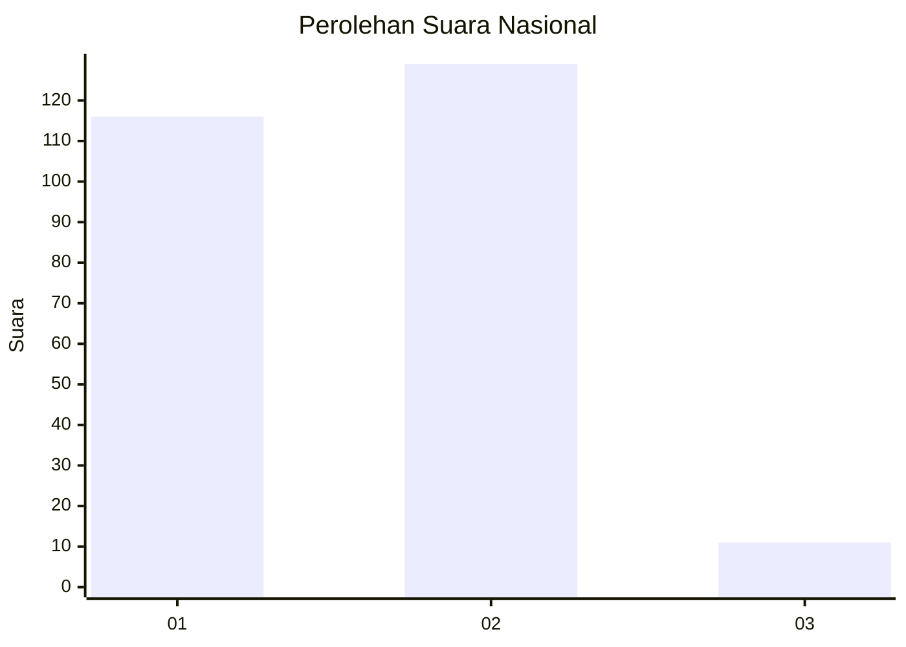
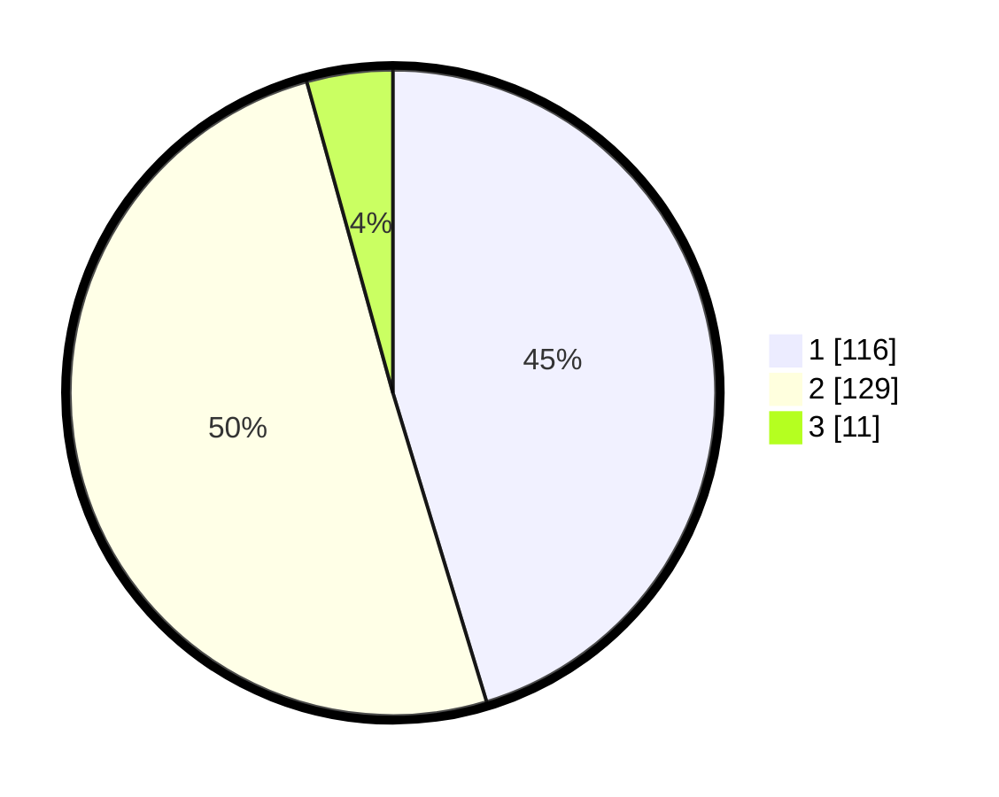

# Hasil

## Grafik

## Tabel

| No. | Nama Paslon    | Suara | Suara (raw) | Persentase |
|:--- |:-------------- | -----:| -----------:| ----------:|
| 1   | ANIES MUHAIMIN | 116   | [116][p-1]  | 45,31      |
| 2   | PRABOWO GIBRAN | 129   | [129][p-2]  | 50,39      |
| 3   | GANJAR MAHFUD  | 11    | [11][p-3]   | 4,30       |

[p-1]: https://github.com/gigit-pemilu/pemilu-2024/blob/main/pilpres/hitung-suara/sub/61-kalimantan-barat/sub/01-sambas/sub/11-galing/sub/2010-sijang/sub/003-tps/sub/paslon-1.txt
[p-2]: https://github.com/gigit-pemilu/pemilu-2024/blob/main/pilpres/hitung-suara/sub/61-kalimantan-barat/sub/01-sambas/sub/11-galing/sub/2010-sijang/sub/003-tps/sub/paslon-2.txt
[p-3]: https://github.com/gigit-pemilu/pemilu-2024/blob/main/pilpres/hitung-suara/sub/61-kalimantan-barat/sub/01-sambas/sub/11-galing/sub/2010-sijang/sub/003-tps/sub/paslon-3.txt

## Foto C Plano

https://sirekap-obj-formc.kpu.go.id/34ab/pemilu/ppwp/61/01/11/20/10/6101112010003-20240214-190703--f8918477-2cc0-4861-b318-850661c06e47.jpg

https://sirekap-obj-formc.kpu.go.id/34ab/pemilu/ppwp/61/01/11/20/10/6101112010003-20240224-171618--92656138-c9d4-433b-a8a2-9726f7ee76db.jpg

https://sirekap-obj-formc.kpu.go.id/34ab/pemilu/ppwp/61/01/11/20/10/6101112010003-20240214-194222--e6281fa5-c3ac-487c-bdd1-5cf6dec21131.jpg

## Metadata

| Key        | Value               |
| ---------- | ------------------- |
| Time Stamp | 2024-02-24 22:31:28 |

