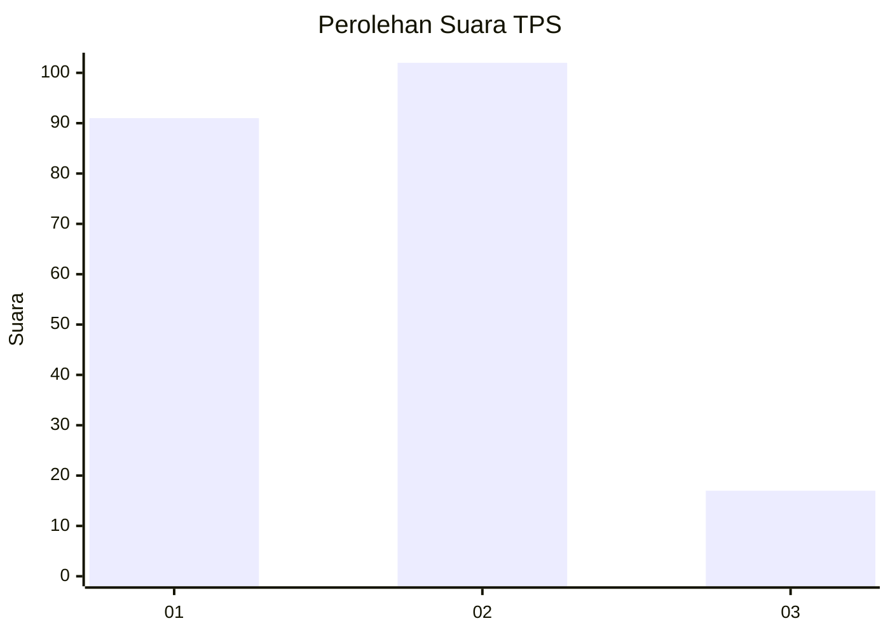
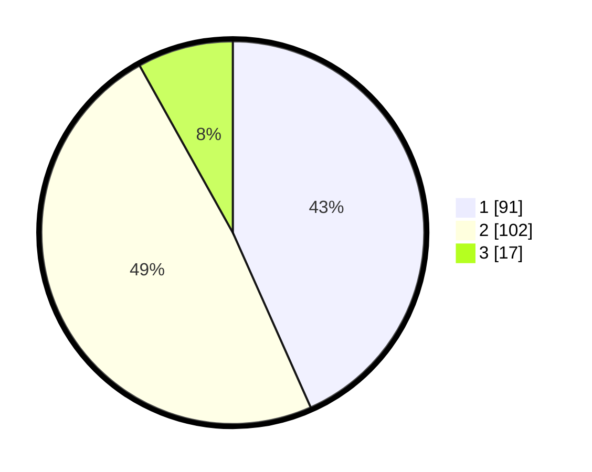

# Hasil

## Grafik

## Tabel

| No. | Nama Paslon    | Suara | Suara (raw) | Persentase |
|:--- |:-------------- | -----:| -----------:| ----------:|
| 1   | ANIES MUHAIMIN | 91    | [91][p-1]   | 43,33      |
| 2   | PRABOWO GIBRAN | 102   | [102][p-2]  | 48,57      |
| 3   | GANJAR MAHFUD  | 17    | [17][p-3]   | 8,10       |

[p-1]: https://github.com/gigit-pemilu/pemilu-2024-61-kalimantan-barat/blob/main/pilpres/hitung-suara/sub/61-kalimantan-barat/sub/01-sambas/sub/14-sajad/sub/2001-jirak/sub/002-tps/sub/paslon-1.txt
[p-2]: https://github.com/gigit-pemilu/pemilu-2024-61-kalimantan-barat/blob/main/pilpres/hitung-suara/sub/61-kalimantan-barat/sub/01-sambas/sub/14-sajad/sub/2001-jirak/sub/002-tps/sub/paslon-2.txt
[p-3]: https://github.com/gigit-pemilu/pemilu-2024-61-kalimantan-barat/blob/main/pilpres/hitung-suara/sub/61-kalimantan-barat/sub/01-sambas/sub/14-sajad/sub/2001-jirak/sub/002-tps/sub/paslon-3.txt

## Foto C Plano

https://sirekap-obj-formc.kpu.go.id/6c48/pemilu/ppwp/61/01/14/20/01/6101142001002-20240217-094639--63be9d90-a747-47a7-a658-a12644a68059.jpg

https://sirekap-obj-formc.kpu.go.id/6c48/pemilu/ppwp/61/01/14/20/01/6101142001002-20240217-094824--31faad13-3403-49a5-9d35-c0dcdd57e57e.jpg

https://sirekap-obj-formc.kpu.go.id/6c48/pemilu/ppwp/61/01/14/20/01/6101142001002-20240217-095030--d3066f93-7016-4331-93eb-298c4bdd80c1.jpg

## Metadata

| Key        | Value               |
| ---------- | ------------------- |
| Time Stamp | 2024-02-24 22:31:28 |

