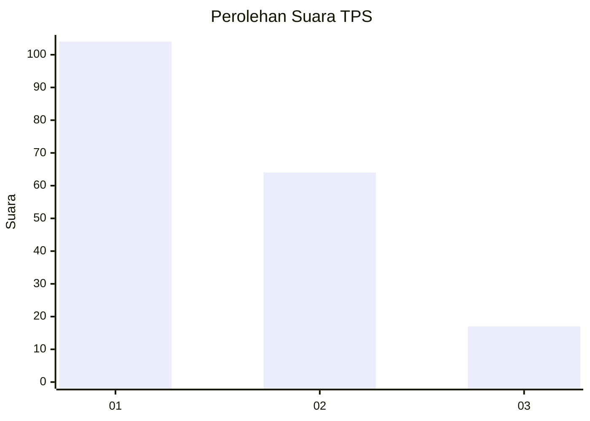
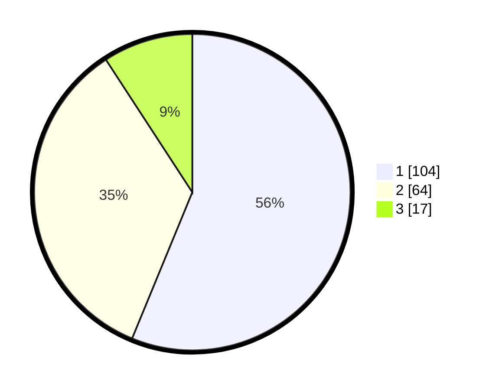

# Hasil

## Grafik

## Tabel

| No. | Nama Paslon    | Suara | Suara (raw) | Persentase |
|:--- |:-------------- | -----:| -----------:| ----------:|
| 1   | ANIES MUHAIMIN | 104   | [104][p-1]  | 56,22      |
| 2   | PRABOWO GIBRAN | 64    | [64][p-2]   | 34,59      |
| 3   | GANJAR MAHFUD  | 17    | [17][p-3]   | 9,19       |

[p-1]: https://github.com/gigit-pemilu/pemilu-2024-61-kalimantan-barat/blob/main/pilpres/hitung-suara/sub/61-kalimantan-barat/sub/01-sambas/sub/14-sajad/sub/2001-jirak/sub/004-tps/sub/paslon-1.txt
[p-2]: https://github.com/gigit-pemilu/pemilu-2024-61-kalimantan-barat/blob/main/pilpres/hitung-suara/sub/61-kalimantan-barat/sub/01-sambas/sub/14-sajad/sub/2001-jirak/sub/004-tps/sub/paslon-2.txt
[p-3]: https://github.com/gigit-pemilu/pemilu-2024-61-kalimantan-barat/blob/main/pilpres/hitung-suara/sub/61-kalimantan-barat/sub/01-sambas/sub/14-sajad/sub/2001-jirak/sub/004-tps/sub/paslon-3.txt

## Foto C Plano

https://sirekap-obj-formc.kpu.go.id/225f/pemilu/ppwp/61/01/14/20/01/6101142001004-20240217-095714--6ebf0917-d81b-415b-b19c-e9f68f8324ea.jpg

https://sirekap-obj-formc.kpu.go.id/225f/pemilu/ppwp/61/01/14/20/01/6101142001004-20240217-095810--2e59ee18-57c2-4840-a712-73f043254ee8.jpg

https://sirekap-obj-formc.kpu.go.id/225f/pemilu/ppwp/61/01/14/20/01/6101142001004-20240217-095845--fff4c45e-396f-4b00-9cf5-0bf0f2a3b263.jpg

## Metadata

| Key        | Value               |
| ---------- | ------------------- |
| Time Stamp | 2024-02-24 22:31:28 |

