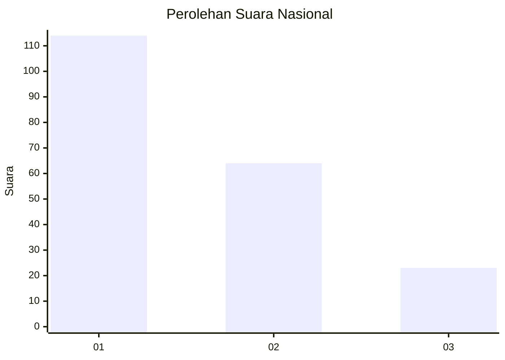
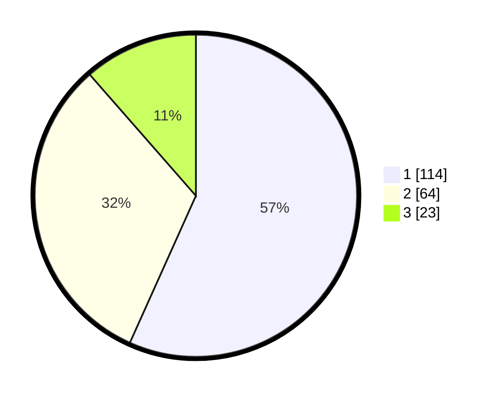

# Hasil

## Grafik

## Tabel

| No. | Nama Paslon    | Suara | Suara (raw) | Persentase |
|:--- |:-------------- | -----:| -----------:| ----------:|
| 1   | ANIES MUHAIMIN | 114   | [114][p-1]  | 56,72      |
| 2   | PRABOWO GIBRAN | 64    | [64][p-2]   | 31,84      |
| 3   | GANJAR MAHFUD  | 23    | [23][p-3]   | 11,44      |

[p-1]: https://github.com/gigit-pemilu/pemilu-2024/blob/main/pilpres/hitung-suara/sub/61-kalimantan-barat/sub/01-sambas/sub/14-sajad/sub/2002-tengguli/sub/011-tps/sub/paslon-1.txt
[p-2]: https://github.com/gigit-pemilu/pemilu-2024/blob/main/pilpres/hitung-suara/sub/61-kalimantan-barat/sub/01-sambas/sub/14-sajad/sub/2002-tengguli/sub/011-tps/sub/paslon-2.txt
[p-3]: https://github.com/gigit-pemilu/pemilu-2024/blob/main/pilpres/hitung-suara/sub/61-kalimantan-barat/sub/01-sambas/sub/14-sajad/sub/2002-tengguli/sub/011-tps/sub/paslon-3.txt

## Foto C Plano

https://sirekap-obj-formc.kpu.go.id/541b/pemilu/ppwp/61/01/14/20/02/6101142002011-20240217-113025--00912b0e-95e5-4f85-9229-3199d194bc79.jpg

https://sirekap-obj-formc.kpu.go.id/541b/pemilu/ppwp/61/01/14/20/02/6101142002011-20240217-113113--a8b81ea3-08be-4124-a791-97055b4fba55.jpg

https://sirekap-obj-formc.kpu.go.id/541b/pemilu/ppwp/61/01/14/20/02/6101142002011-20240217-113209--b1ce3b00-f84e-4623-a0af-d7d76f7d9911.jpg

## Metadata

| Key        | Value               |
| ---------- | ------------------- |
| Time Stamp | 2024-02-24 22:31:28 |

