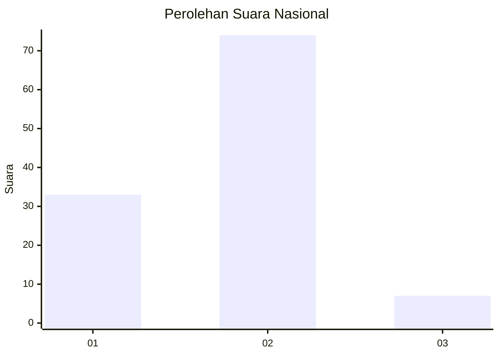
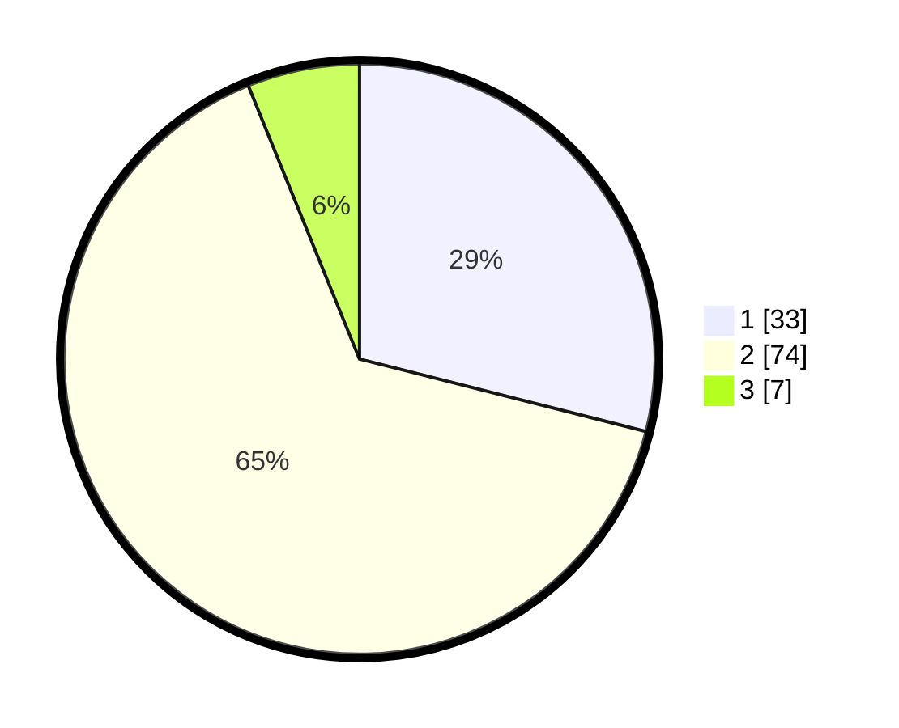

# Hasil

## Grafik

## Tabel

| No. | Nama Paslon    | Suara | Suara (raw) | Persentase |
|:--- |:-------------- | -----:| -----------:| ----------:|
| 1   | ANIES MUHAIMIN | 33    | [33][p-1]   | 28,95      |
| 2   | PRABOWO GIBRAN | 74    | [74][p-2]   | 64,91      |
| 3   | GANJAR MAHFUD  | 7     | [7][p-3]    | 6,14       |

[p-1]: https://github.com/gigit-pemilu/pemilu-2024/blob/main/pilpres/hitung-suara/sub/61-kalimantan-barat/sub/01-sambas/sub/14-sajad/sub/2002-tengguli/sub/013-tps/sub/paslon-1.txt
[p-2]: https://github.com/gigit-pemilu/pemilu-2024/blob/main/pilpres/hitung-suara/sub/61-kalimantan-barat/sub/01-sambas/sub/14-sajad/sub/2002-tengguli/sub/013-tps/sub/paslon-2.txt
[p-3]: https://github.com/gigit-pemilu/pemilu-2024/blob/main/pilpres/hitung-suara/sub/61-kalimantan-barat/sub/01-sambas/sub/14-sajad/sub/2002-tengguli/sub/013-tps/sub/paslon-3.txt

## Foto C Plano

https://sirekap-obj-formc.kpu.go.id/4fc4/pemilu/ppwp/61/01/14/20/02/6101142002013-20240217-113809--0c3a943e-d13e-4edf-8883-f7802feaae30.jpg

https://sirekap-obj-formc.kpu.go.id/4fc4/pemilu/ppwp/61/01/14/20/02/6101142002013-20240217-113836--dff04ee1-c3ad-4d3f-9f39-629bdd0924b9.jpg

https://sirekap-obj-formc.kpu.go.id/4fc4/pemilu/ppwp/61/01/14/20/02/6101142002013-20240217-114028--37493892-6539-496b-816b-0de93ff43b85.jpg

## Metadata

| Key        | Value               |
| ---------- | ------------------- |
| Time Stamp | 2024-02-24 22:31:28 |

