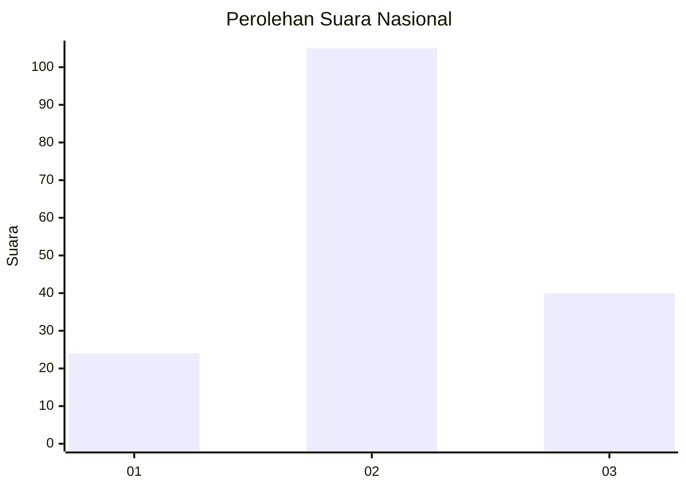
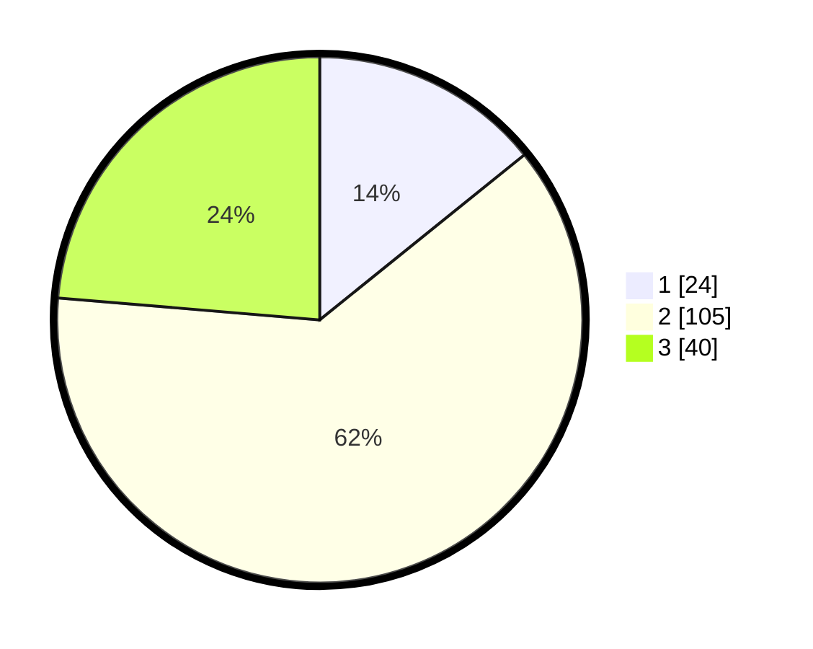

# Hasil

## Grafik

## Tabel

| No. | Nama Paslon    | Suara | Suara (raw) | Persentase |
|:--- |:-------------- | -----:| -----------:| ----------:|
| 1   | ANIES MUHAIMIN | 24    | [24][p-1]   | 14,20      |
| 2   | PRABOWO GIBRAN | 105   | [105][p-2]  | 62,13      |
| 3   | GANJAR MAHFUD  | 40    | [40][p-3]   | 23,67      |

[p-1]: https://github.com/gigit-pemilu/pemilu-2024/blob/main/pilpres/hitung-suara/sub/61-kalimantan-barat/sub/01-sambas/sub/18-salatiga/sub/2001-parit-baru/sub/001-tps/sub/paslon-1.txt
[p-2]: https://github.com/gigit-pemilu/pemilu-2024/blob/main/pilpres/hitung-suara/sub/61-kalimantan-barat/sub/01-sambas/sub/18-salatiga/sub/2001-parit-baru/sub/001-tps/sub/paslon-2.txt
[p-3]: https://github.com/gigit-pemilu/pemilu-2024/blob/main/pilpres/hitung-suara/sub/61-kalimantan-barat/sub/01-sambas/sub/18-salatiga/sub/2001-parit-baru/sub/001-tps/sub/paslon-3.txt

## Foto C Plano

https://sirekap-obj-formc.kpu.go.id/47b1/pemilu/ppwp/61/01/18/20/01/6101182001001-20240215-143050--04092e9c-343a-48c8-b931-ab63f6e21a33.jpg

https://sirekap-obj-formc.kpu.go.id/47b1/pemilu/ppwp/61/01/18/20/01/6101182001001-20240215-143234--05c44a3e-5500-403b-a77e-ecb36bdf3294.jpg

https://sirekap-obj-formc.kpu.go.id/47b1/pemilu/ppwp/61/01/18/20/01/6101182001001-20240215-143407--74fcc531-0dd0-48b3-8b4d-954982b4f942.jpg

## Metadata

| Key        | Value               |
| ---------- | ------------------- |
| Time Stamp | 2024-02-15 20:30:46 |

