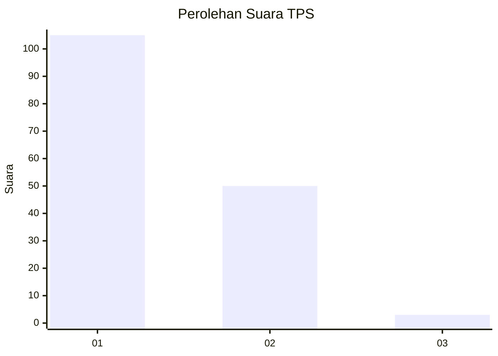
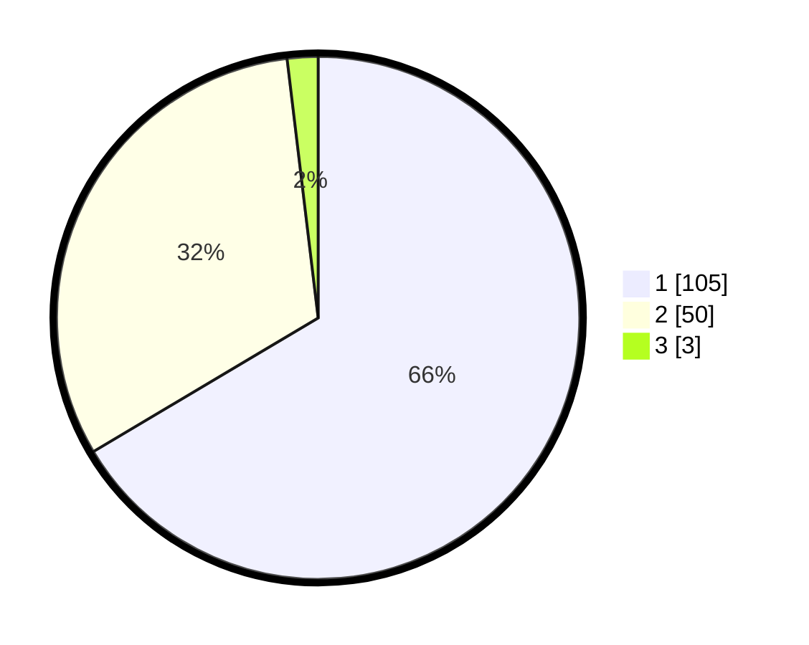

# Hasil

## Grafik

## Tabel

| No. | Nama Paslon    | Suara | Suara (raw) | Persentase |
|:--- |:-------------- | -----:| -----------:| ----------:|
| 1   | ANIES MUHAIMIN | 105   | [105][p-1]  | 66,46      |
| 2   | PRABOWO GIBRAN | 50    | [50][p-2]   | 31,65      |
| 3   | GANJAR MAHFUD  | 3     | [3][p-3]    | 1,90       |

[p-1]: https://github.com/gigit-pemilu/pemilu-2024-61-kalimantan-barat/blob/main/pilpres/hitung-suara/sub/61-kalimantan-barat/sub/02-mempawah/sub/01-mempawah-hilir/sub/1009-terusan/sub/012-tps/sub/paslon-1.txt
[p-2]: https://github.com/gigit-pemilu/pemilu-2024-61-kalimantan-barat/blob/main/pilpres/hitung-suara/sub/61-kalimantan-barat/sub/02-mempawah/sub/01-mempawah-hilir/sub/1009-terusan/sub/012-tps/sub/paslon-2.txt
[p-3]: https://github.com/gigit-pemilu/pemilu-2024-61-kalimantan-barat/blob/main/pilpres/hitung-suara/sub/61-kalimantan-barat/sub/02-mempawah/sub/01-mempawah-hilir/sub/1009-terusan/sub/012-tps/sub/paslon-3.txt

## Foto C Plano

https://sirekap-obj-formc.kpu.go.id/3a72/pemilu/ppwp/61/02/01/10/09/6102011009012-20240215-011841--97f17d8a-8c37-470c-9064-dea7c67d4128.jpg

https://sirekap-obj-formc.kpu.go.id/3a72/pemilu/ppwp/61/02/01/10/09/6102011009012-20240215-011847--148355e7-cec1-43fc-848a-141491cba1ff.jpg

https://sirekap-obj-formc.kpu.go.id/3a72/pemilu/ppwp/61/02/01/10/09/6102011009012-20240214-214252--9eb57a27-22e6-4093-a684-85ab9a79a801.jpg

## Metadata

| Key        | Value               |
| ---------- | ------------------- |
| Time Stamp | 2024-02-15 17:00:25 |

