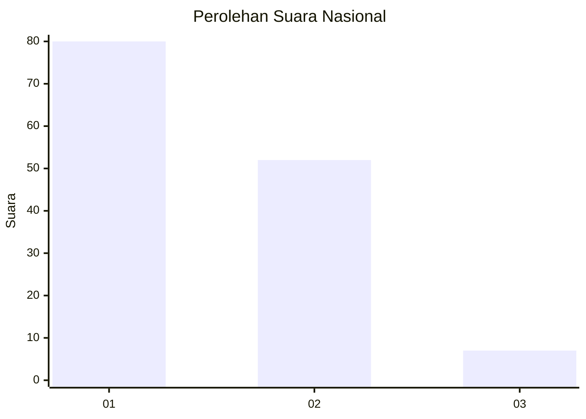
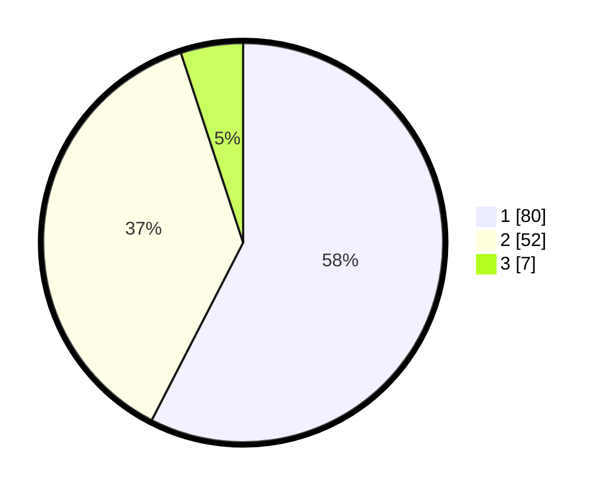

# Hasil

## Grafik

## Tabel

| No. | Nama Paslon    | Suara | Suara (raw) | Persentase |
|:--- |:-------------- | -----:| -----------:| ----------:|
| 1   | ANIES MUHAIMIN | 80    | [80][p-1]   | 57,55      |
| 2   | PRABOWO GIBRAN | 52    | [52][p-2]   | 37,41      |
| 3   | GANJAR MAHFUD  | 7     | [7][p-3]    | 5,04       |

[p-1]: https://github.com/gigit-pemilu/pemilu-2024/blob/main/pilpres/hitung-suara/sub/61-kalimantan-barat/sub/02-mempawah/sub/01-mempawah-hilir/sub/1009-terusan/sub/036-tps/sub/paslon-1.txt
[p-2]: https://github.com/gigit-pemilu/pemilu-2024/blob/main/pilpres/hitung-suara/sub/61-kalimantan-barat/sub/02-mempawah/sub/01-mempawah-hilir/sub/1009-terusan/sub/036-tps/sub/paslon-2.txt
[p-3]: https://github.com/gigit-pemilu/pemilu-2024/blob/main/pilpres/hitung-suara/sub/61-kalimantan-barat/sub/02-mempawah/sub/01-mempawah-hilir/sub/1009-terusan/sub/036-tps/sub/paslon-3.txt

## Foto C Plano

https://sirekap-obj-formc.kpu.go.id/d6b4/pemilu/ppwp/61/02/01/10/09/6102011009036-20240225-165827--8f1bcc03-5610-4c88-a8ca-cf1315a928ce.jpg

https://sirekap-obj-formc.kpu.go.id/d6b4/pemilu/ppwp/61/02/01/10/09/6102011009036-20240225-165956--4fd78800-e9f8-4867-99a0-67546f3ec1af.jpg

https://sirekap-obj-formc.kpu.go.id/d6b4/pemilu/ppwp/61/02/01/10/09/6102011009036-20240225-170106--84c21807-45a6-4e17-97fa-b0d8c8fb75cd.jpg

## Metadata

| Key        | Value               |
| ---------- | ------------------- |
| Time Stamp | 2024-02-25 18:00:00 |

## DATA PEMILIH TETAP

Jumlah pemilih dalam DPT: **500**.
 * L: **557**.
 * P: **557**.

## DATA PENGGUNA HAK PILIH

Jumlah pengguna hak pilih dalam DPT: **535**.
 * L: **555**.
 * P: **555**.

Jumlah pengguna hak pilih dalam DPTb: **0**.
 * L: **223**.
 * P: **0**.

Jumlah pengguna hak pilih dalam DPK: **0**.
 * L: **222**.
 * P: **0**.

Jumlah pengguna hak pilih: **0**.
 * L: **10**.
 * P: **200**.

## JUMLAH SUARA SAH DAN TIDAK SAH

JUMLAH SELURUH SUARA SAH: **139**.

JUMLAH SUARA TIDAK SAH: **1**.

JUMLAH SELURUH SUARA SAH DAN SUARA TIDAK SAH: **140**.

